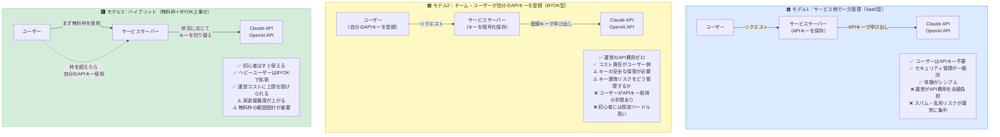
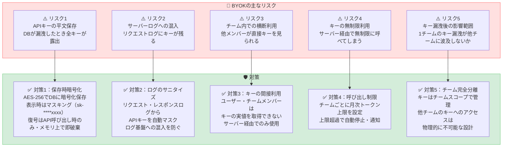
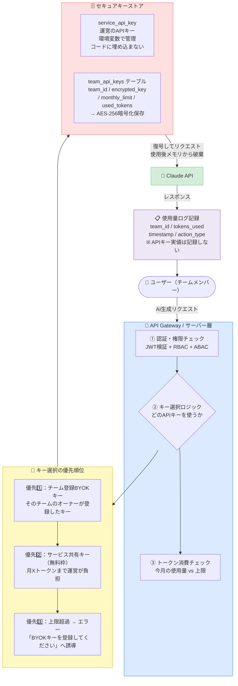
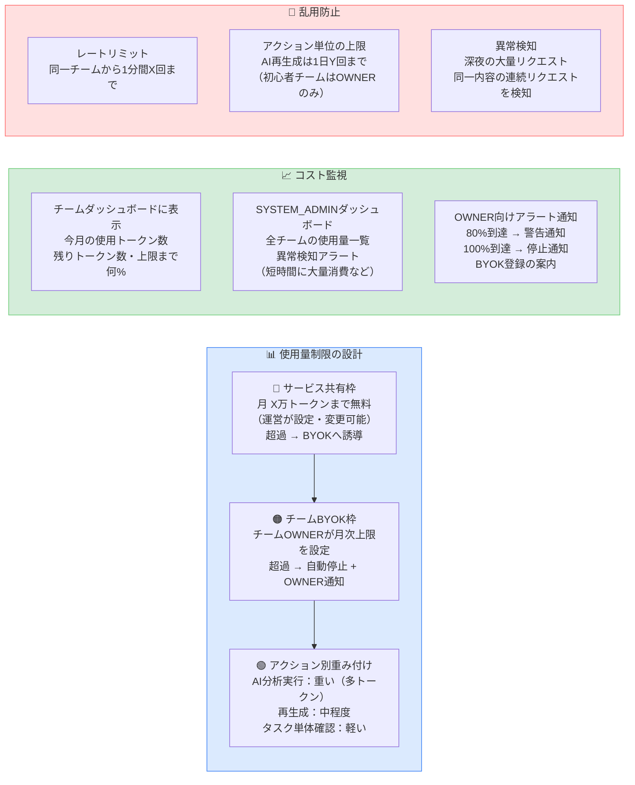
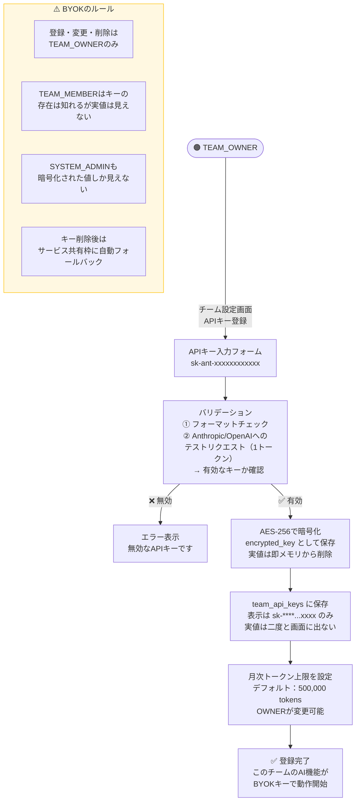
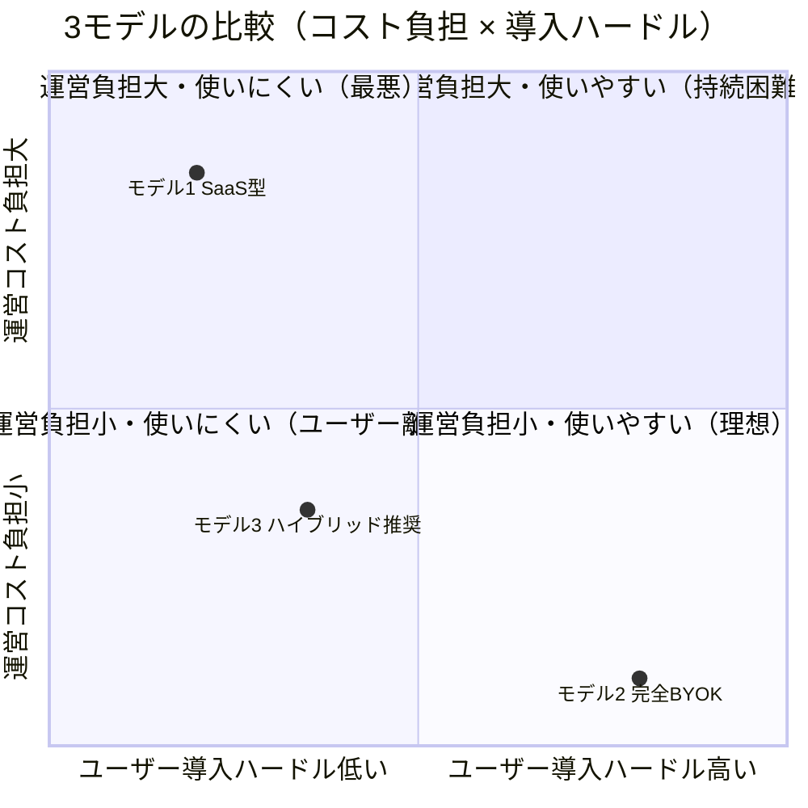
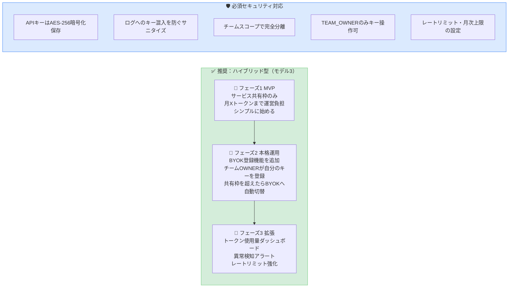

# AI API コスト・セキュリティ設計

---

## 1. APIキー管理の3モデル比較

---

## 2. BYOK（Bring Your Own Key）採用時のセキュリティリスクと対策

---

## 3. 推奨アーキテクチャ：ハイブリッド型の詳細設計

---

## 4. トークン使用量管理・コスト制御

---

## 5. BYOKキー登録フロー（TEAM_OWNERのみ）

---

## 6. モデル比較サマリー

---

## 7. 結論・推奨設計

