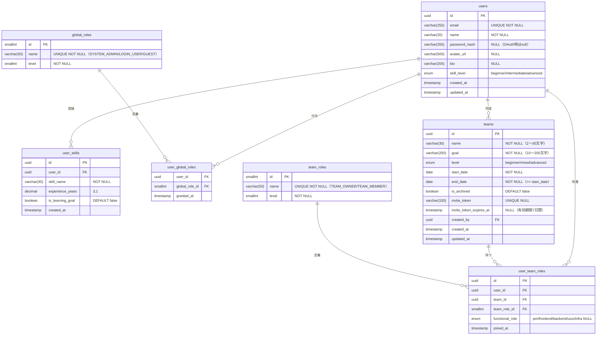
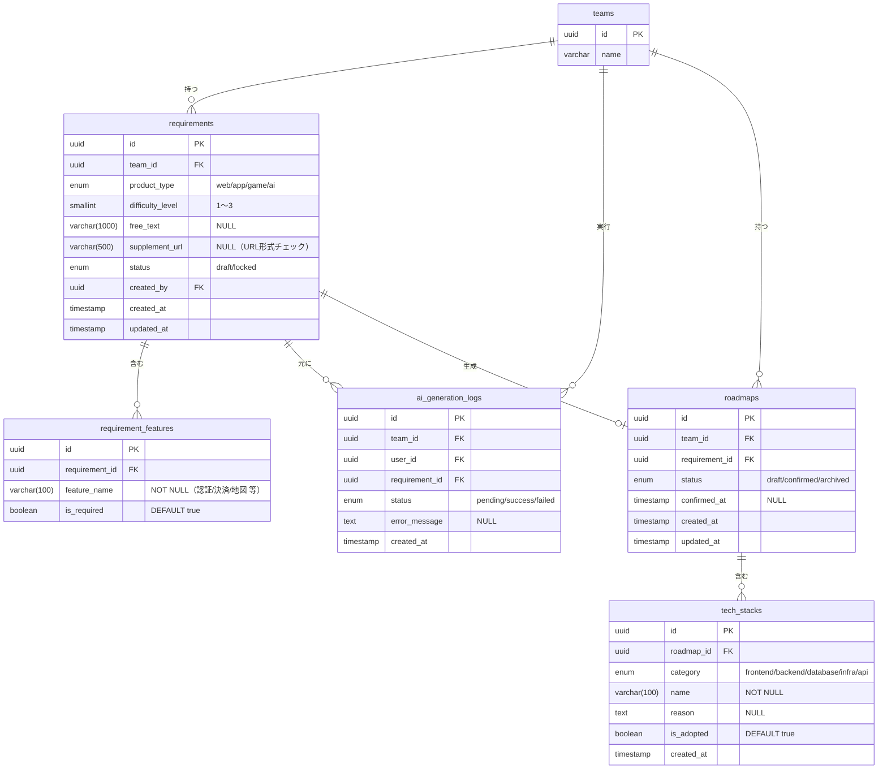
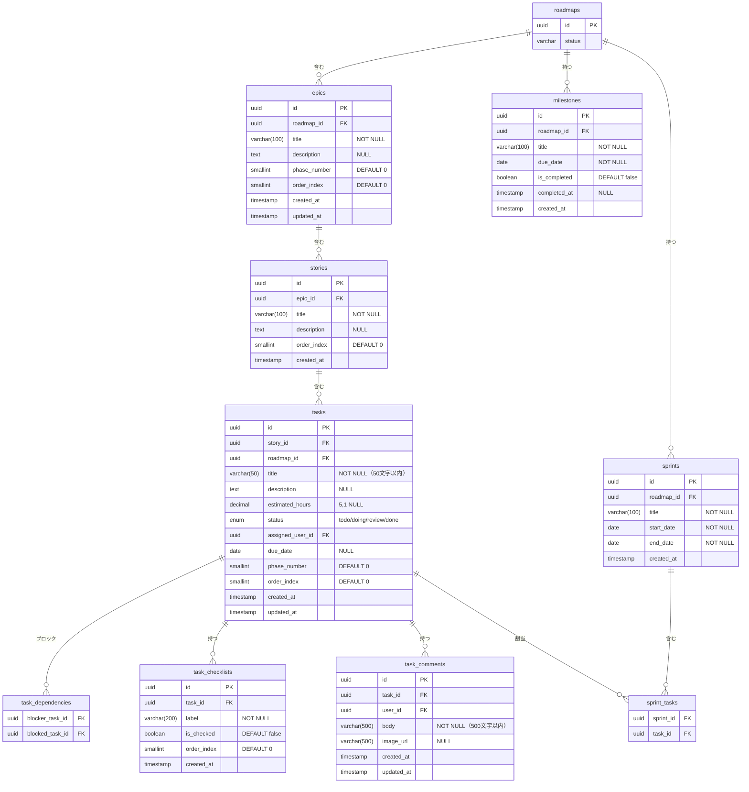
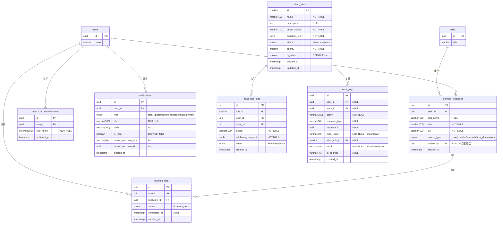

# DB 設計書

> 参照元：`feature-list.md` / `permission-design-v6.md` / `roadmap-dashboard-system.md`
> 設計方針：RBAC + ABAC ハイブリッド権限対応 / Phase 0（MVP）優先

---

## テーブル一覧

| ドメイン | テーブル名 | 概要 | Phase |
|----------|------------|------|-------|
| 認証・ユーザー | `users` | ユーザーアカウント | P0 |
| 認証・ユーザー | `user_skills` | スキル・技術登録 | P0 |
| 認証・ユーザー | `global_roles` | システムロールマスタ | P0 |
| 認証・ユーザー | `user_global_roles` | ユーザーとシステムロールの紐づけ | P0 |
| チーム管理 | `teams` | チーム情報 | P0 |
| チーム管理 | `team_roles` | チームロールマスタ | P0 |
| チーム管理 | `user_team_roles` | ユーザーとチームロールの紐づけ | P0 |
| 要件定義 | `requirements` | 要件定義データ | P0 |
| 要件定義 | `requirement_features` | 機能チェックリスト選択結果 | P0 |
| AI生成 | `ai_generation_logs` | AI生成リクエストログ | P0 |
| ロードマップ | `roadmaps` | 生成されたロードマップ | P0 |
| ロードマップ | `tech_stacks` | 推薦技術スタック | P0 |
| ロードマップ | `epics` | Epic（大分類） | P0 |
| ロードマップ | `stories` | Story（中分類） | P0 |
| タスク管理 | `tasks` | タスク | P0 |
| タスク管理 | `task_checklists` | タスク内チェックリスト | P0 |
| タスク管理 | `task_dependencies` | タスク間依存関係 | P2 |
| タスク管理 | `task_comments` | タスクコメント | P1 |
| 学習リソース | `learning_resources` | 推薦教材 | P0 |
| 学習リソース | `learning_logs` | 学習ログ | P1 |
| 学習リソース | `user_skill_achievements` | スキル習得記録 | P1 |
| ロードマップ | `milestones` | マイルストーン | P1 |
| ロードマップ | `sprints` | スプリント | P2 |
| ロードマップ | `sprint_tasks` | スプリントとタスクの紐づけ | P2 |
| 通知 | `notifications` | アプリ内通知 | P1 |
| 権限管理 | `abac_rules` | ABACルール定義 | P0 |
| 権限管理 | `abac_rule_logs` | ABACルール適用ログ | P0 |
| 権限管理 | `audit_logs` | 監査ログ | P0 |

---

## ERD（ドメイン別）

### 1. 認証・ユーザー・チーム管理



---

### 2. 要件定義 → AI生成 → ロードマップ



---

### 3. タスク管理（Epic / Story / Task）



---

### 4. 学習リソース・通知・権限管理



---

## 全テーブル定義

### users

| カラム名 | 型 | 制約 | 説明 |
|----------|----|------|------|
| id | UUID | PK | |
| email | VARCHAR(255) | UNIQUE NOT NULL | |
| name | VARCHAR(20) | NOT NULL | 最大20文字 |
| password_hash | VARCHAR(255) | NULL | OAuthユーザーはnull |
| avatar_url | VARCHAR(500) | NULL | 5MB以下の画像URL |
| bio | VARCHAR(200) | NULL | 自己紹介 |
| skill_level | ENUM | NOT NULL DEFAULT 'beginner' | beginner/intermediate/advanced |
| created_at | TIMESTAMP | NOT NULL DEFAULT NOW() | |
| updated_at | TIMESTAMP | NOT NULL DEFAULT NOW() | |

---

### user_skills

| カラム名 | 型 | 制約 | 説明 |
|----------|----|------|------|
| id | UUID | PK | |
| user_id | UUID | FK → users NOT NULL | |
| skill_name | VARCHAR(30) | NOT NULL | スキル名（30文字以内）|
| experience_years | DECIMAL(3,1) | NULL | 経験年数 |
| is_learning_goal | BOOLEAN | NOT NULL DEFAULT false | 学習したい技術フラグ |
| created_at | TIMESTAMP | NOT NULL DEFAULT NOW() | |

---

### global_roles

| カラム名 | 型 | 制約 | 説明 |
|----------|----|------|------|
| id | SMALLINT | PK | |
| name | VARCHAR(50) | UNIQUE NOT NULL | SYSTEM_ADMIN / LOGIN_USER / GUEST |
| level | SMALLINT | NOT NULL | 数値が大きいほど権限強 |

**初期データ：**

| id | name | level |
|----|------|-------|
| 1 | GUEST | 10 |
| 2 | LOGIN_USER | 20 |
| 3 | SYSTEM_ADMIN | 99 |

---

### user_global_roles

| カラム名 | 型 | 制約 | 説明 |
|----------|----|------|------|
| user_id | UUID | FK → users / PK(複合) | |
| global_role_id | SMALLINT | FK → global_roles / PK(複合) | |
| granted_at | TIMESTAMP | NOT NULL DEFAULT NOW() | |

---

### teams

| カラム名 | 型 | 制約 | 説明 |
|----------|----|------|------|
| id | UUID | PK | |
| name | VARCHAR(30) | NOT NULL | 2〜30文字 |
| goal | VARCHAR(200) | NOT NULL | 10〜200文字 |
| level | ENUM | NOT NULL | beginner/mixed/advanced |
| start_date | DATE | NOT NULL | |
| end_date | DATE | NOT NULL CHECK(end_date >= start_date) | |
| is_archived | BOOLEAN | NOT NULL DEFAULT false | |
| invite_token | VARCHAR(100) | UNIQUE NULL | 招待トークン |
| invite_token_expires_at | TIMESTAMP | NULL | トークン有効期限（7日間） |
| created_by | UUID | FK → users NOT NULL | チーム作成者 |
| created_at | TIMESTAMP | NOT NULL DEFAULT NOW() | |
| updated_at | TIMESTAMP | NOT NULL DEFAULT NOW() | |

---

### team_roles

| カラム名 | 型 | 制約 | 説明 |
|----------|----|------|------|
| id | SMALLINT | PK | |
| name | VARCHAR(50) | UNIQUE NOT NULL | TEAM_OWNER / TEAM_MEMBER |
| level | SMALLINT | NOT NULL | 数値が大きいほど権限強 |

**初期データ：**

| id | name | level |
|----|------|-------|
| 1 | TEAM_MEMBER | 10 |
| 2 | TEAM_OWNER | 20 |

---

### user_team_roles

| カラム名 | 型 | 制約 | 説明 |
|----------|----|------|------|
| id | UUID | PK | |
| user_id | UUID | FK → users NOT NULL | |
| team_id | UUID | FK → teams NOT NULL | |
| team_role_id | SMALLINT | FK → team_roles NOT NULL | |
| functional_role | ENUM | NULL | pm/frontend/backend/uiux/infra |
| joined_at | TIMESTAMP | NOT NULL DEFAULT NOW() | |

**インデックス：** UNIQUE (user_id, team_id)

---

### requirements

| カラム名 | 型 | 制約 | 説明 |
|----------|----|------|------|
| id | UUID | PK | |
| team_id | UUID | FK → teams NOT NULL | |
| product_type | ENUM | NOT NULL | web/app/game/ai |
| difficulty_level | SMALLINT | NOT NULL CHECK(1〜3) | 難易度スライダー |
| free_text | VARCHAR(1000) | NULL | 自由記述（補足） |
| supplement_url | VARCHAR(500) | NULL | URL形式チェック |
| status | ENUM | NOT NULL DEFAULT 'draft' | draft/locked |
| created_by | UUID | FK → users NOT NULL | |
| created_at | TIMESTAMP | NOT NULL DEFAULT NOW() | |
| updated_at | TIMESTAMP | NOT NULL DEFAULT NOW() | |

---

### requirement_features

| カラム名 | 型 | 制約 | 説明 |
|----------|----|------|------|
| id | UUID | PK | |
| requirement_id | UUID | FK → requirements NOT NULL | |
| feature_name | VARCHAR(100) | NOT NULL | 認証/決済/地図 等 |
| is_required | BOOLEAN | NOT NULL DEFAULT true | 必須/任意フラグ |

---

### ai_generation_logs

| カラム名 | 型 | 制約 | 説明 |
|----------|----|------|------|
| id | UUID | PK | |
| team_id | UUID | FK → teams NOT NULL | |
| user_id | UUID | FK → users NOT NULL | 実行者 |
| requirement_id | UUID | FK → requirements NOT NULL | |
| status | ENUM | NOT NULL | pending/success/failed |
| error_message | TEXT | NULL | 失敗時のエラー詳細 |
| created_at | TIMESTAMP | NOT NULL DEFAULT NOW() | |

---

### roadmaps

| カラム名 | 型 | 制約 | 説明 |
|----------|----|------|------|
| id | UUID | PK | |
| team_id | UUID | FK → teams NOT NULL | |
| requirement_id | UUID | FK → requirements NOT NULL | |
| status | ENUM | NOT NULL DEFAULT 'draft' | draft/confirmed/archived |
| confirmed_at | TIMESTAMP | NULL | ロードマップ確定日時 |
| created_at | TIMESTAMP | NOT NULL DEFAULT NOW() | |
| updated_at | TIMESTAMP | NOT NULL DEFAULT NOW() | |

---

### tech_stacks

| カラム名 | 型 | 制約 | 説明 |
|----------|----|------|------|
| id | UUID | PK | |
| roadmap_id | UUID | FK → roadmaps NOT NULL | |
| category | ENUM | NOT NULL | frontend/backend/database/infra/api |
| name | VARCHAR(100) | NOT NULL | 技術名（例: React, NestJS） |
| reason | TEXT | NULL | AI推薦理由 |
| is_adopted | BOOLEAN | NOT NULL DEFAULT true | 採用/却下フラグ |
| created_at | TIMESTAMP | NOT NULL DEFAULT NOW() | |

---

### epics

| カラム名 | 型 | 制約 | 説明 |
|----------|----|------|------|
| id | UUID | PK | |
| roadmap_id | UUID | FK → roadmaps NOT NULL | |
| title | VARCHAR(100) | NOT NULL | |
| description | TEXT | NULL | |
| phase_number | SMALLINT | NOT NULL DEFAULT 0 | フェーズ番号（0〜3） |
| order_index | SMALLINT | NOT NULL DEFAULT 0 | 表示順 |
| created_at | TIMESTAMP | NOT NULL DEFAULT NOW() | |
| updated_at | TIMESTAMP | NOT NULL DEFAULT NOW() | |

---

### stories

| カラム名 | 型 | 制約 | 説明 |
|----------|----|------|------|
| id | UUID | PK | |
| epic_id | UUID | FK → epics NOT NULL | |
| title | VARCHAR(100) | NOT NULL | |
| description | TEXT | NULL | |
| order_index | SMALLINT | NOT NULL DEFAULT 0 | |
| created_at | TIMESTAMP | NOT NULL DEFAULT NOW() | |

---

### tasks

| カラム名 | 型 | 制約 | 説明 |
|----------|----|------|------|
| id | UUID | PK | |
| story_id | UUID | FK → stories NULL | 手動作成タスクはnull可 |
| roadmap_id | UUID | FK → roadmaps NOT NULL | |
| title | VARCHAR(50) | NOT NULL | 50文字以内 |
| description | TEXT | NULL | |
| estimated_hours | DECIMAL(5,1) | NULL | AI工数見積もり |
| status | ENUM | NOT NULL DEFAULT 'todo' | todo/doing/review/done |
| assigned_user_id | UUID | FK → users NULL | |
| due_date | DATE | NULL | |
| phase_number | SMALLINT | NOT NULL DEFAULT 0 | |
| order_index | SMALLINT | NOT NULL DEFAULT 0 | カンバン内表示順 |
| created_at | TIMESTAMP | NOT NULL DEFAULT NOW() | |
| updated_at | TIMESTAMP | NOT NULL DEFAULT NOW() | |

---

### task_dependencies

| カラム名 | 型 | 制約 | 説明 |
|----------|----|------|------|
| blocker_task_id | UUID | FK → tasks / PK(複合) | ブロックするタスク |
| blocked_task_id | UUID | FK → tasks / PK(複合) | ブロックされるタスク |

**CHECK：** blocker_task_id <> blocked_task_id（自己参照不可）

---

### task_checklists

| カラム名 | 型 | 制約 | 説明 |
|----------|----|------|------|
| id | UUID | PK | |
| task_id | UUID | FK → tasks NOT NULL | |
| label | VARCHAR(200) | NOT NULL | チェック項目文言 |
| is_checked | BOOLEAN | NOT NULL DEFAULT false | |
| order_index | SMALLINT | NOT NULL DEFAULT 0 | |
| created_at | TIMESTAMP | NOT NULL DEFAULT NOW() | |

---

### task_comments

| カラム名 | 型 | 制約 | 説明 |
|----------|----|------|------|
| id | UUID | PK | |
| task_id | UUID | FK → tasks NOT NULL | |
| user_id | UUID | FK → users NOT NULL | |
| body | VARCHAR(500) | NOT NULL | 500文字以内 |
| image_url | VARCHAR(500) | NULL | 画像添付 |
| created_at | TIMESTAMP | NOT NULL DEFAULT NOW() | |
| updated_at | TIMESTAMP | NOT NULL DEFAULT NOW() | |

---

### learning_resources

| カラム名 | 型 | 制約 | 説明 |
|----------|----|------|------|
| id | UUID | PK | |
| task_id | UUID | FK → tasks NULL | タスクに紐づく教材（NULLは汎用） |
| skill_name | VARCHAR(100) | NULL | スキルタグ |
| title | VARCHAR(200) | NOT NULL | |
| url | VARCHAR(500) | NOT NULL | |
| source_type | ENUM | NOT NULL | zenn/youtube/udemy/official_doc/custom |
| added_by | UUID | FK → users NULL | NULLはAI自動追加 |
| created_at | TIMESTAMP | NOT NULL DEFAULT NOW() | |

---

### learning_logs

| カラム名 | 型 | 制約 | 説明 |
|----------|----|------|------|
| id | UUID | PK | |
| user_id | UUID | FK → users NOT NULL | |
| resource_id | UUID | FK → learning_resources NOT NULL | |
| status | ENUM | NOT NULL DEFAULT 'not_done' | done/not_done |
| completed_at | TIMESTAMP | NULL | |
| created_at | TIMESTAMP | NOT NULL DEFAULT NOW() | |

**インデックス：** UNIQUE (user_id, resource_id)

---

### user_skill_achievements

| カラム名 | 型 | 制約 | 説明 |
|----------|----|------|------|
| id | UUID | PK | |
| user_id | UUID | FK → users NOT NULL | |
| skill_name | VARCHAR(100) | NOT NULL | |
| achieved_at | TIMESTAMP | NOT NULL DEFAULT NOW() | |

**インデックス：** UNIQUE (user_id, skill_name)

---

### milestones

| カラム名 | 型 | 制約 | 説明 |
|----------|----|------|------|
| id | UUID | PK | |
| roadmap_id | UUID | FK → roadmaps NOT NULL | |
| title | VARCHAR(100) | NOT NULL | |
| due_date | DATE | NOT NULL | |
| is_completed | BOOLEAN | NOT NULL DEFAULT false | |
| completed_at | TIMESTAMP | NULL | |
| created_at | TIMESTAMP | NOT NULL DEFAULT NOW() | |

---

### sprints

| カラム名 | 型 | 制約 | 説明 |
|----------|----|------|------|
| id | UUID | PK | |
| roadmap_id | UUID | FK → roadmaps NOT NULL | |
| title | VARCHAR(100) | NOT NULL | |
| start_date | DATE | NOT NULL | |
| end_date | DATE | NOT NULL CHECK(end_date >= start_date) | |
| created_at | TIMESTAMP | NOT NULL DEFAULT NOW() | |

---

### sprint_tasks

| カラム名 | 型 | 制約 | 説明 |
|----------|----|------|------|
| sprint_id | UUID | FK → sprints / PK(複合) | |
| task_id | UUID | FK → tasks / PK(複合) | |

---

### notifications

| カラム名 | 型 | 制約 | 説明 |
|----------|----|------|------|
| id | UUID | PK | |
| user_id | UUID | FK → users NOT NULL | 通知受信者 |
| type | ENUM | NOT NULL | task_update/comment/deadline/assignment |
| title | VARCHAR(100) | NOT NULL | |
| body | VARCHAR(300) | NULL | |
| is_read | BOOLEAN | NOT NULL DEFAULT false | |
| related_resource_type | VARCHAR(50) | NULL | task/comment 等 |
| related_resource_id | UUID | NULL | 関連リソースID |
| created_at | TIMESTAMP | NOT NULL DEFAULT NOW() | |

---

### abac_rules（`permission-design-v6.md` 対応）

| カラム名 | 型 | 制約 | 説明 |
|----------|----|------|------|
| id | SMALLINT | PK | |
| name | VARCHAR(100) | NOT NULL | ルール名（例: ルール1_要件定義ロック） |
| description | TEXT | NULL | |
| target_action | VARCHAR(100) | NOT NULL | 対象アクション（例: requirement:update） |
| condition_json | JSONB | NOT NULL | 条件定義（例: `{"user.role":"TEAM_MEMBER","resource.roadmap_status":"confirmed"}`） |
| effect | ENUM | NOT NULL | allow/deny/warn |
| priority | SMALLINT | NOT NULL | 低いほど先に評価 |
| is_active | BOOLEAN | NOT NULL DEFAULT true | |
| created_at | TIMESTAMP | NOT NULL DEFAULT NOW() | |
| updated_at | TIMESTAMP | NOT NULL DEFAULT NOW() | |

**初期データ（v6設計より）：**

| id | name | target_action | effect | priority |
|----|------|---------------|--------|----------|
| 1 | 要件定義ロック | requirement:update | deny | 10 |
| 2 | 自タスクのみ更新 | task:update | deny | 20 |
| 3 | 初心者チームAI制限 | ai:regenerate | deny | 30 |
| 4 | タスク過負荷警告 | task:assign | warn | 40 |
| 5 | チームスコープ境界 | *:any | deny | 5 |

---

### abac_rule_logs

| カラム名 | 型 | 制約 | 説明 |
|----------|----|------|------|
| id | UUID | PK | |
| rule_id | SMALLINT | FK → abac_rules NULL（未マッチ時） | |
| user_id | UUID | FK → users NOT NULL | |
| team_id | UUID | FK → teams NULL | |
| action | VARCHAR(100) | NOT NULL | 実行されたアクション |
| attributes_snapshot | JSONB | NOT NULL | 評価時の属性値スナップショット |
| result | ENUM | NOT NULL | allow/deny/warn |
| created_at | TIMESTAMP | NOT NULL DEFAULT NOW() | |

---

### audit_logs

| カラム名 | 型 | 制約 | 説明 |
|----------|----|------|------|
| id | UUID | PK | |
| user_id | UUID | FK → users NULL | 未認証リクエストはnull |
| team_id | UUID | FK → teams NULL | |
| action | VARCHAR(100) | NOT NULL | WHO WHAT |
| resource_type | VARCHAR(50) | NULL | 操作対象リソース種別 |
| resource_id | UUID | NULL | 操作対象ID |
| rbac_result | VARCHAR(10) | NOT NULL | allow/deny |
| abac_rule_id | SMALLINT | FK → abac_rules NULL | ABACが適用された場合 |
| result | VARCHAR(10) | NOT NULL | allow/deny/warn |
| ip_address | VARCHAR(45) | NULL | IPv6対応 |
| created_at | TIMESTAMP | NOT NULL DEFAULT NOW() | |

---

## 設計メモ

### ABAC 属性マッピング（`permission-design-v6.md` ルール対応）

| ルール | 参照テーブル・カラム |
|--------|---------------------|
| ルール1 ロードマップ確定後ロック | `roadmaps.status = 'confirmed'` |
| ルール2 自タスクのみ更新 | `tasks.assigned_user_id = 操作ユーザーのid` |
| ルール3 初心者チームAI制限 | `teams.level = 'beginner'` |
| ルール4 タスク過負荷警告 | `tasks WHERE assigned_user_id = X AND status != 'done' >= 5` |
| ルール5 チームスコープ境界 | `user_team_roles WHERE user_id = X AND team_id = リクエストのteam_id` |

### インデックス推奨（パフォーマンス）

```sql
-- カンバン表示（チーム別タスク一覧）
CREATE INDEX idx_tasks_roadmap_status ON tasks(roadmap_id, status);

-- 個人ビュー（自分のタスク）
CREATE INDEX idx_tasks_assigned_user ON tasks(assigned_user_id, status);

-- チームメンバー確認（ABAC ルール5）
CREATE INDEX idx_user_team_roles_lookup ON user_team_roles(user_id, team_id);

-- 学習ログ
CREATE INDEX idx_learning_logs_user ON learning_logs(user_id, status);

-- 通知未読
CREATE INDEX idx_notifications_user_unread ON notifications(user_id, is_read);

-- 監査ログ（時系列参照）
CREATE INDEX idx_audit_logs_created ON audit_logs(created_at DESC);
```
