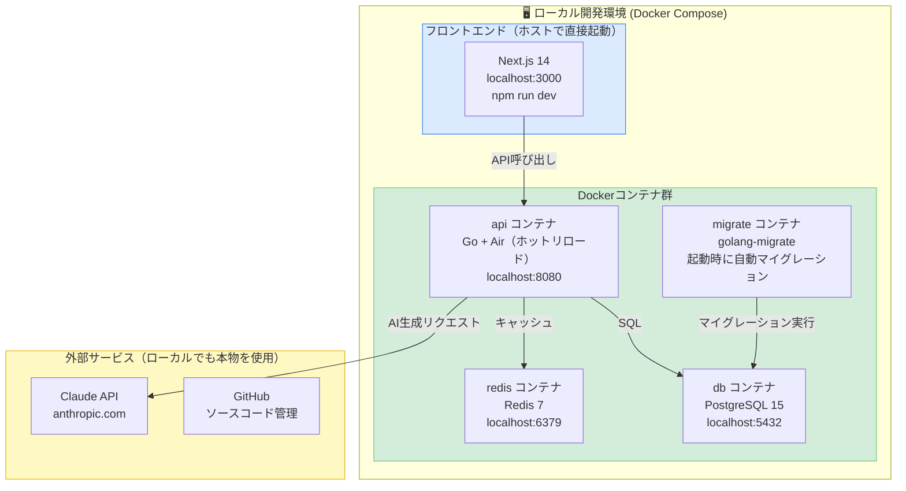
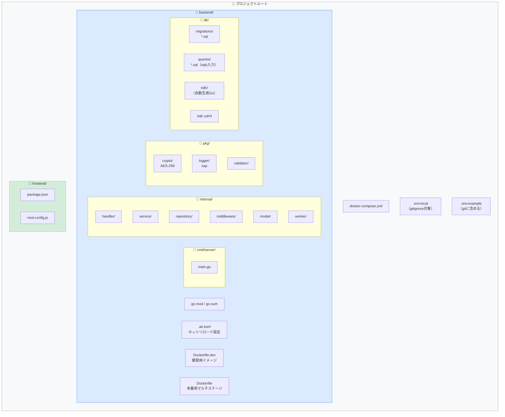
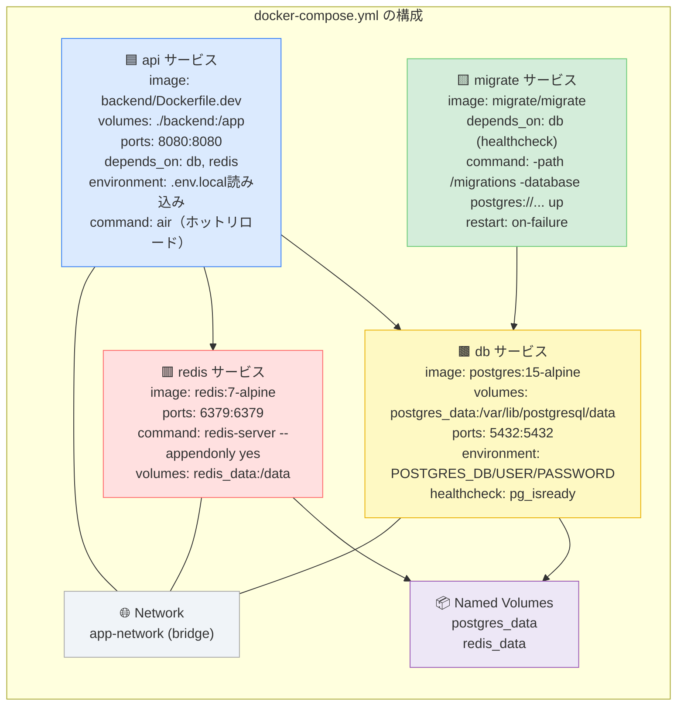
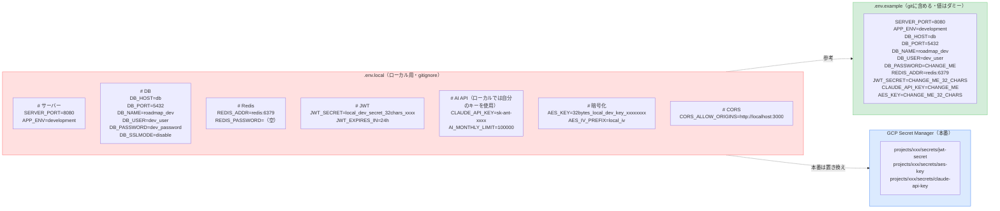
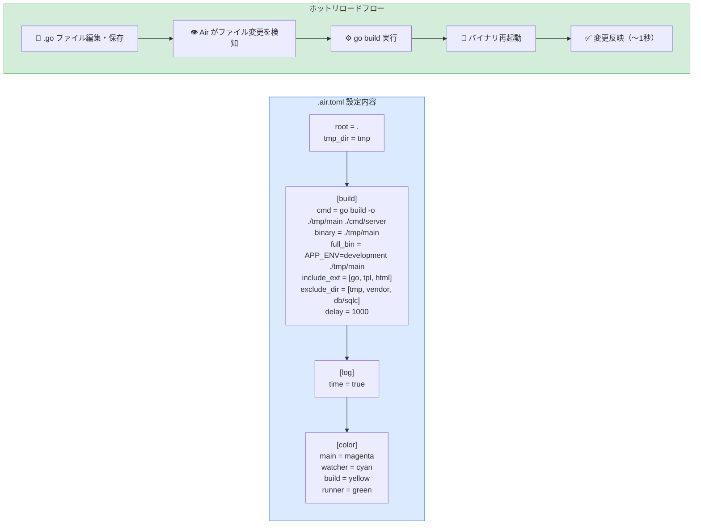
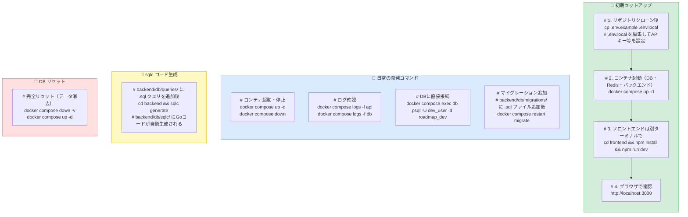
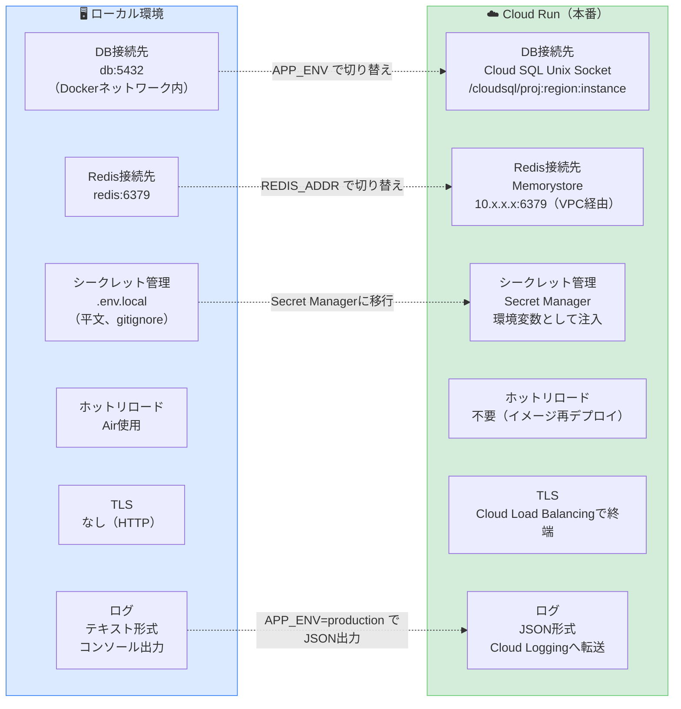
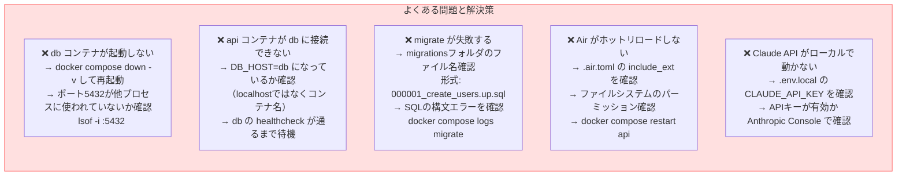

# ローカル開発環境設計（Docker Compose）

> Go + PostgreSQL + Redis のローカル環境構築ガイド
> **前提：** Docker Desktop がインストール済みであること

---

## 1. ローカル環境アーキテクチャ



---

## 2. ディレクトリ構成



---

## 3. docker-compose.yml 全体設計



---

## 4. 環境変数設計



---

## 5. Air（ホットリロード）設定



---

## 6. よく使うコマンド



---

## 7. Dockerfile.dev（開発用）

```mermaid
flowchart TD
    subgraph DEV_DOCKER["backend/Dockerfile.dev"]
        direction TB
        D1["FROM golang:1.22-alpine\n\n# ビルドツールインストール\nRUN apk add --no-cache git make\n\n# Air（ホットリロード）インストール\nRUN go install github.com/air-verse/air@latest"]

        D2["WORKDIR /app\n\n# 依存関係を先にキャッシュ（レイヤーキャッシュ最適化）\nCOPY go.mod go.sum ./\nRUN go mod download"]

        D3["# ソースはvolumeマウントで反映\n# COPYは不要\n\nEXPOSE 8080\n\nCMD [\"air\", \"-c\", \".air.toml\"]"]

        D1 --> D2 --> D3
    end

    subgraph PROD_DOCKER["backend/Dockerfile（本番・参考）"]
        direction TB
        P1["# Stage 1: ビルド\nFROM golang:1.22-alpine AS builder\nWORKDIR /app\nCOPY go.mod go.sum ./\nRUN go mod download\nCOPY . .\nRUN CGO_ENABLED=0 GOOS=linux go build\n  -ldflags='-w -s'\n  -o /app/server ./cmd/server"]

        P2["# Stage 2: 実行（最小イメージ）\nFROM gcr.io/distroless/static-debian12\nCOPY --from=builder /app/server /server\nUSER nonroot:nonroot\nEXPOSE 8080\nENTRYPOINT [\"/server\"]"]

        P1 --> P2
    end

    style DEV_DOCKER  fill:#dbeafe,stroke:#3b82f6
    style PROD_DOCKER fill:#d4edda,stroke:#6bcb77
```

---

## 8. ローカル vs Cloud Run の環境差分



---

## 9. トラブルシューティング



