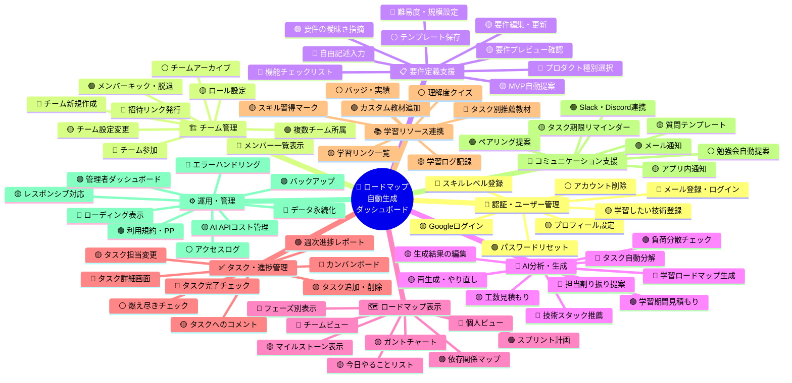
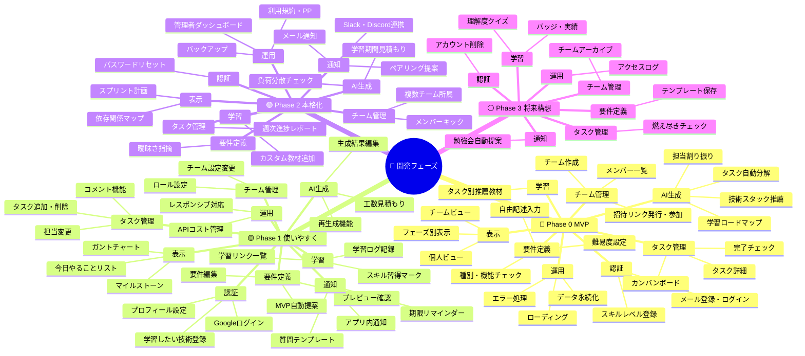
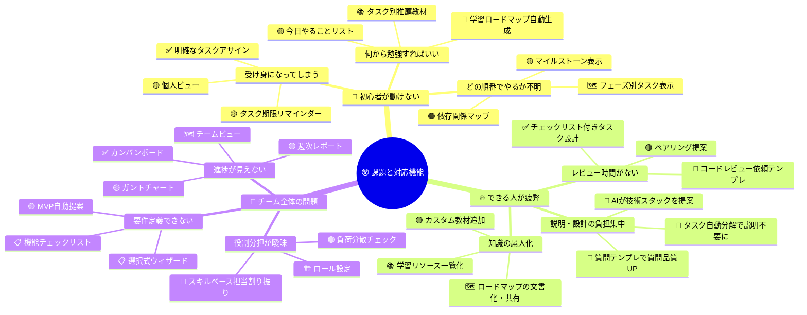

# 機能一覧 マインドマップ

## 全機能・優先度マップ

```mermaid
mindmap
  root((🧭 ロードマップ<br/>自動生成<br/>ダッシュボード))
    🔐 認証・ユーザー管理
      🔴 メール登録・ログイン
      🔴 スキルレベル登録
      🟡 Googleログイン
      🟡 プロフィール設定
      🟡 学習したい技術登録
      🟢 パスワードリセット
      ⚪ アカウント削除

    🏗️ チーム管理
      🔴 チーム新規作成
      🔴 招待リンク発行
      🔴 チーム参加
      🔴 メンバー一覧表示
      🟡 ロール設定
      🟡 チーム設定変更
      🟢 メンバーキック・脱退
      🟢 複数チーム所属
      ⚪ チームアーカイブ

    📋 要件定義支援
      🔴 プロダクト種別選択
      🔴 機能チェックリスト
      🔴 難易度・規模設定
      🔴 自由記述入力
      🟡 要件プレビュー確認
      🟡 要件編集・更新
      🟡 MVP自動提案
      🟢 要件の曖昧さ指摘
      ⚪ テンプレート保存

    🤖 AI分析・生成
      🔴 技術スタック推薦
      🔴 タスク自動分解
      🔴 学習ロードマップ生成
      🔴 担当割り振り提案
      🟡 工数見積もり
      🟡 生成結果の編集
      🟡 再生成・やり直し
      🟢 負荷分散チェック
      🟢 学習期間見積もり

    🗺️ ロードマップ表示
      🔴 フェーズ別表示
      🔴 個人ビュー
      🔴 チームビュー
      🟡 今日やることリスト
      🟡 ガントチャート
      🟡 マイルストーン表示
      🟢 依存関係マップ
      🟢 スプリント計画

    ✅ タスク・進捗管理
      🔴 カンバンボード
      🔴 タスク詳細画面
      🔴 タスク完了チェック
      🟡 タスクへのコメント
      🟡 タスク担当変更
      🟡 タスク追加・削除
      🟢 週次進捗レポート
      ⚪ 燃え尽きチェック

    📚 学習リソース連携
      🔴 タスク別推薦教材
      🟡 学習リンク一覧
      🟡 学習ログ記録
      🟡 スキル習得マーク
      🟢 カスタム教材追加
      ⚪ 理解度クイズ
      ⚪ バッジ・実績

    💬 コミュニケーション支援
      🟡 質問テンプレート
      🟡 アプリ内通知
      🟡 タスク期限リマインダー
      🟢 Slack・Discord連携
      🟢 ペアリング提案
      🟢 メール通知
      ⚪ 勉強会自動提案

    ⚙️ 運用・管理
      🔴 エラーハンドリング
      🔴 ローディング表示
      🔴 データ永続化
      🟡 レスポンシブ対応
      🟡 AI APIコスト管理
      🟢 管理者ダッシュボード
      🟢 利用規約・PP
      🟢 バックアップ
      ⚪ アクセスログ
```

---

## 開発フェーズ別マインドマップ

```mermaid
mindmap
  root((📅 開発フェーズ))
    🔴 Phase 0 MVP
      認証
        メール登録・ログイン
        スキルレベル登録
      チーム管理
        チーム作成
        招待リンク発行・参加
        メンバー一覧
      要件定義
        種別・機能チェック
        難易度設定
        自由記述入力
      AI生成
        技術スタック推薦
        タスク自動分解
        学習ロードマップ
        担当割り振り
      表示
        フェーズ別表示
        個人ビュー
        チームビュー
      タスク管理
        カンバンボード
        タスク詳細
        完了チェック
      学習
        タスク別推薦教材
      運用
        エラー処理
        ローディング
        データ永続化

    🟡 Phase 1 使いやすく
      認証
        Googleログイン
        プロフィール設定
        学習したい技術登録
      チーム管理
        ロール設定
        チーム設定変更
      要件定義
        プレビュー確認
        要件編集
        MVP自動提案
      AI生成
        工数見積もり
        生成結果編集
        再生成機能
      表示
        今日やることリスト
        ガントチャート
        マイルストーン
      タスク管理
        コメント機能
        担当変更
        タスク追加・削除
      学習
        学習リンク一覧
        学習ログ記録
        スキル習得マーク
      通知
        質問テンプレート
        アプリ内通知
        期限リマインダー
      運用
        レスポンシブ対応
        APIコスト管理

    🟢 Phase 2 本格化
      認証
        パスワードリセット
      チーム管理
        メンバーキック
        複数チーム所属
      要件定義
        曖昧さ指摘
      AI生成
        負荷分散チェック
        学習期間見積もり
      表示
        依存関係マップ
        スプリント計画
      タスク管理
        週次進捗レポート
      学習
        カスタム教材追加
      通知
        Slack・Discord連携
        ペアリング提案
        メール通知
      運用
        管理者ダッシュボード
        利用規約・PP
        バックアップ

    ⚪ Phase 3 将来構想
      認証
        アカウント削除
      チーム管理
        チームアーカイブ
      要件定義
        テンプレート保存
      タスク管理
        燃え尽きチェック
      学習
        理解度クイズ
        バッジ・実績
      通知
        勉強会自動提案
      運用
        アクセスログ
```

---

## 課題→機能 対応マインドマップ

```mermaid
mindmap
  root((😵 課題と対応機能))
    👶 初心者が動けない
      何から勉強すればいい
        🤖 学習ロードマップ自動生成
        📚 タスク別推薦教材
        🟡 今日やることリスト
      どの順番でやるか不明
        🗺️ フェーズ別タスク表示
        🟢 依存関係マップ
        🟡 マイルストーン表示
      受け身になってしまう
        ✅ 明確なタスクアサイン
        🟡 タスク期限リマインダー
        🟡 個人ビュー

    🔥 できる人が疲弊
      説明・設計の負担集中
        🤖 AIが技術スタックを提案
        🤖 タスク自動分解で説明不要に
        💬 質問テンプレで質問品質UP
      知識の属人化
        🗺️ ロードマップの文書化・共有
        📚 学習リソース一覧化
        🟢 カスタム教材追加
      レビュー時間がない
        ✅ チェックリスト付きタスク設計
        💬 コードレビュー依頼テンプレ
        🟢 ペアリング提案

    👥 チーム全体の問題
      進捗が見えない
        ✅ カンバンボード
        🗺️ チームビュー
        🟡 ガントチャート
        🟢 週次レポート
      役割分担が曖昧
        🏗️ ロール設定
        🤖 スキルベース担当割り振り
        🟢 負荷分散チェック
      要件定義できない
        📋 選択式ウィザード
        📋 機能チェックリスト
        🟡 MVP自動提案
```
