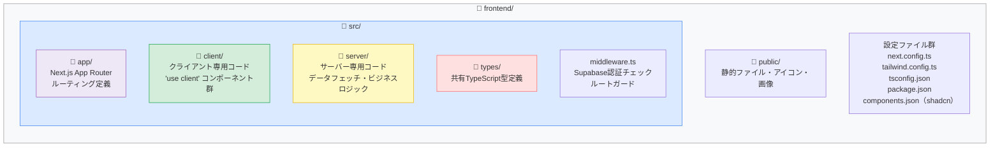
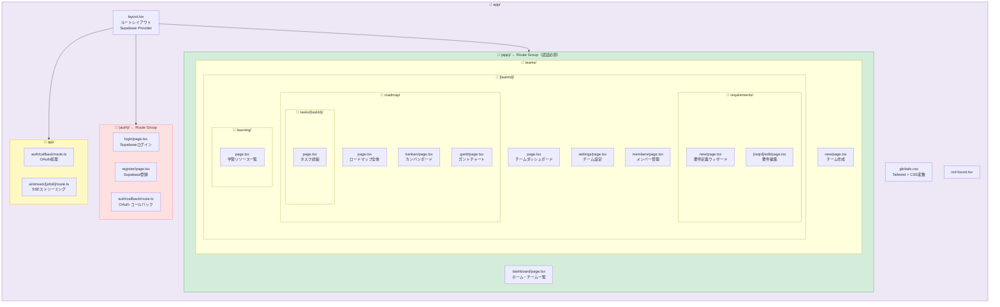
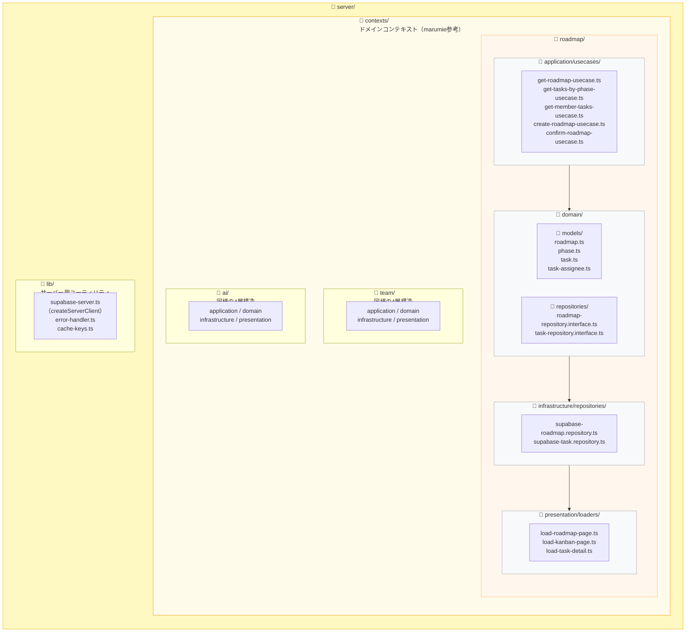
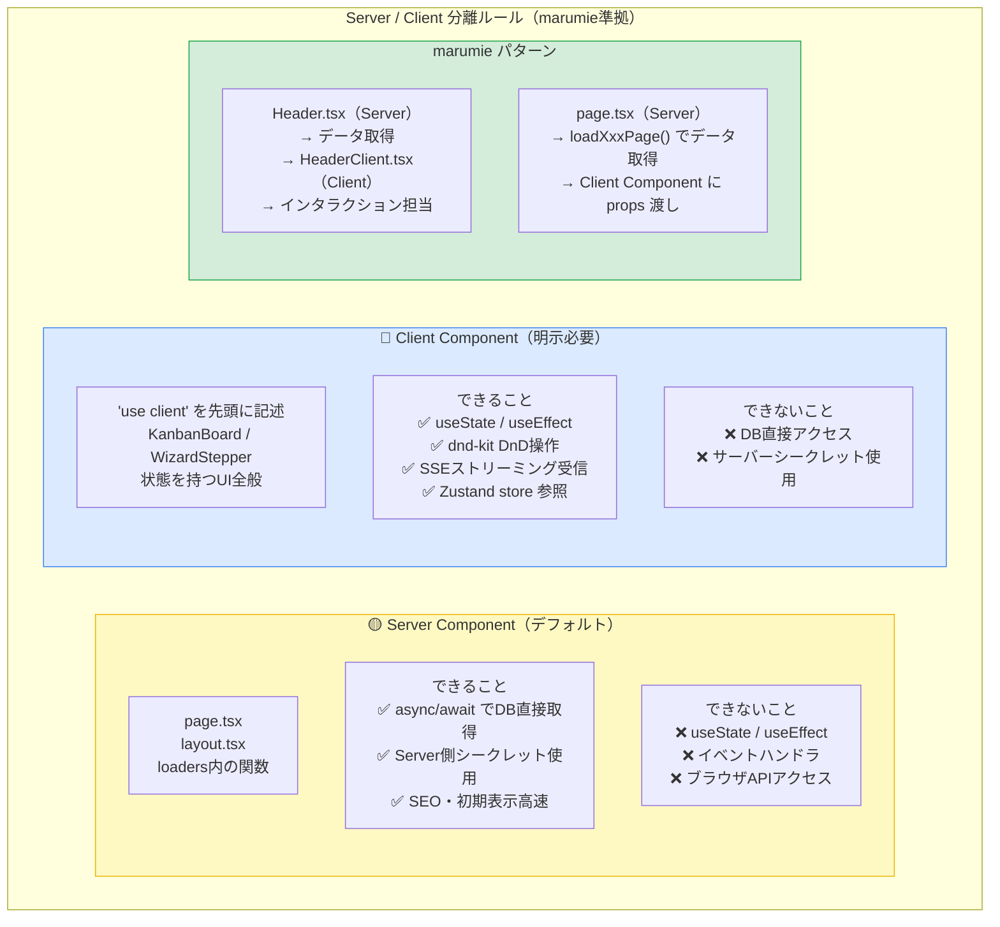

# フロントエンド ディレクトリ構造設計

> 参考：[team-mirai/marumie](https://github.com/team-mirai/marumie)
> 採用パターン：**Feature-Based Architecture + Server/Client 明示分離**
> スタック：Next.js 14 App Router / TypeScript / Tailwind CSS v4 / shadcn/ui / Supabase / Zustand

---

## 1. 全体ディレクトリ構造



---

## 2. app/ ルーティング構成



---

## 3. client/ 構成（コンポーネント詳細）

```mermaid
flowchart TB
    subgraph CLIENT["📁 client/"]
        direction TB

        subgraph COMPONENTS["📁 components/"]
            direction TB

            subgraph UI["📁 ui/\nshadcn/ui + カスタム基本UI"]
                UI1["button.tsx\nbadge.tsx\ncard.tsx\ninput.tsx\ndialog.tsx\nselect.tsx\ntable.tsx\ntoast.tsx\n...（shadcn生成）"]
            end

            subgraph LAYOUT["📁 layout/\nページ骨格コンポーネント"]
                LY1["Header.tsx（Server）\nHeaderClient.tsx（Client）\nSidebar.tsx\nFooter.tsx\nPageContainer.tsx\nTeamSelector.tsx"]
            end

            subgraph COMMON["📁 common/\nページ横断で使う汎用部品"]
                CM1["LoadingSpinner.tsx\nErrorBoundary.tsx\nEmptyState.tsx\nConfirmDialog.tsx\nAvatarGroup.tsx\nSkillBadge.tsx\nRoleBadge.tsx\nStatusBadge.tsx"]
            end

            subgraph DASHBOARD["📁 dashboard/\nホーム画面"]
                DA1["TeamCardList.tsx\nTeamCard.tsx\nTodayTaskList.tsx\nTodayTaskItem.tsx\nActivityFeed.tsx"]
            end

            subgraph TEAM["📁 team/\nチーム管理"]
                TE1["📁 features/"]
                TE2["  MemberList.tsx\n  MemberRow.tsx\n  MemberRoleBadge.tsx\n  InviteLinkPanel.tsx\n  TeamSettingsForm.tsx\n  TeamLevelSelector.tsx"]
            end

            subgraph REQUIREMENTS["📁 requirements/\n要件定義ウィザード"]
                RQ1["📁 wizard/"]
                RQ2["  WizardStepper.tsx\n  Step1ProductType.tsx\n  Step2Features.tsx\n  Step3Difficulty.tsx\n  Step4FreeText.tsx\n  Step5Preview.tsx"]
                RQ3["RequirementCard.tsx\nRequirementStatusBadge.tsx"]
            end

            subgraph AI["📁 ai/\nAI生成UI"]
                AI1["GenerateButton.tsx\nGeneratingProgress.tsx\nStreamingText.tsx\nResultPreview.tsx\nRetryButton.tsx"]
            end

            subgraph ROADMAP["📁 roadmap/\nロードマップ・タスク"]
                RM1["📁 kanban/"]
                RM2["  KanbanBoard.tsx\n  KanbanColumn.tsx\n  KanbanCard.tsx\n  DraggableCard.tsx"]
                RM3["📁 gantt/"]
                RM4["  GanttChart.tsx\n  GanttRow.tsx\n  GanttTimeline.tsx"]
                RM5["📁 task/"]
                RM6["  TaskDetailPanel.tsx\n  TaskChecklist.tsx\n  TaskCommentList.tsx\n  TaskStatusSelector.tsx\n  TaskAssigneeSelector.tsx"]
                RM7["PhaseSection.tsx\nRoadmapHeader.tsx\nConfirmRoadmapButton.tsx"]
            end

            subgraph LEARNING2["📁 learning/\n学習リソース"]
                LN1["ResourceList.tsx\nResourceCard.tsx\nResourceLinkButton.tsx\nLearningLogButton.tsx"]
            end

            subgraph API_KEY["📁 api-key/\nBYOKキー管理"]
                AK1["ApiKeyForm.tsx\nApiKeyMaskedInput.tsx\nTokenUsageBar.tsx"]
            end
        end

        subgraph HOOKS["📁 hooks/\nカスタムフック"]
            HK1["useTeam.ts\nuseRoadmap.ts\nuseTasks.ts\nuseMembers.ts\nuseAiGenerate.ts\nuseSSE.ts\nuseSupabaseUser.ts\nuseToast.ts\nuseDebounce.ts\nuseMobileDetection.ts"]
        end

        subgraph LIB["📁 lib/\nクライアント用ユーティリティ"]
            LB1["supabase.ts\n（createBrowserClient）\nformat-date.ts\nformat-number.ts\ncn.ts\n（clsxラッパー）\napi-client.ts\n（fetch wrapper + JWT付与）"]
        end

        subgraph STORE["📁 store/\nZustand グローバル状態"]
            ST1["teamStore.ts\n（選択中チーム）\nuiStore.ts\n（サイドバー開閉等）"]
        end
    end

    style CLIENT      fill:#d4edda,stroke:#16a34a
    style COMPONENTS  fill:#ecfdf5,stroke:#6ee7b7
    style UI          fill:#f0fdf4,stroke:#86efac
    style LAYOUT      fill:#f0fdf4,stroke:#86efac
    style COMMON      fill:#f0fdf4,stroke:#86efac
    style DASHBOARD   fill:#f0fdf4,stroke:#86efac
    style TEAM        fill:#f0fdf4,stroke:#86efac
    style REQUIREMENTS fill:#f0fdf4,stroke:#86efac
    style AI          fill:#f0fdf4,stroke:#86efac
    style ROADMAP     fill:#f0fdf4,stroke:#86efac
    style LEARNING2   fill:#f0fdf4,stroke:#86efac
    style API_KEY     fill:#f0fdf4,stroke:#86efac
    style HOOKS       fill:#dbeafe,stroke:#3b82f6
    style LIB         fill:#dbeafe,stroke:#3b82f6
    style STORE       fill:#dbeafe,stroke:#3b82f6
```



---

## 4. server/ 構成（データフェッチ・ビジネスロジック）



---

## 5. types/ と tsconfig パス設計

```mermaid
flowchart LR
    subgraph TYPES["📁 types/"]
        direction TB
        T1["user.ts\nsupabase.ts（自動生成）\nteam.ts\nroadmap.ts\ntask.ts\nrequirement.ts\nai-result.ts\napi-key.ts\napi.ts（共通API型）"]
    end

    subgraph TSCONFIG["tsconfig.json パスエイリアス"]
        direction TB
        P1["\"@/*\": [\"./src/*\"]\n\n使用例：\n@/client/components/ui/button\n@/server/contexts/roadmap/...\n@/types/task\n@/client/hooks/useTasks\n@/client/store/teamStore\n@/client/lib/api-client"]
    end

    style TYPES    fill:#ffe0e0,stroke:#ff6b6b
    style TSCONFIG fill:#dbeafe,stroke:#3b82f6
```

---

## 6. Server / Client コンポーネント分離ルール



---

## 7. ファイル命名規則

```mermaid
flowchart TB
    subgraph NAMING["📝 ファイル命名規則"]
        direction TB

        subgraph COMPONENTS_RULE["コンポーネント"]
            CR1["PascalCase.tsx\nKanbanBoard.tsx\nTaskDetailPanel.tsx\nTeamSelector.tsx"]
        end

        subgraph HOOKS_RULE["カスタムフック"]
            HR1["camelCase.ts（use プレフィックス）\nuseTeam.ts\nuseSSE.ts\nuseRoadmap.ts"]
        end

        subgraph UTILS_RULE["ユーティリティ / ライブラリ"]
            UR1["kebab-case.ts\nformat-date.ts\napi-client.ts\ncache-keys.ts"]
        end

        subgraph USECASE_RULE["ユースケース（marumie準拠）"]
            USE1["kebab-case-usecase.ts\nget-roadmap-usecase.ts\ncreate-team-usecase.ts\nconfirm-roadmap-usecase.ts"]
        end

        subgraph REPO_RULE["リポジトリ（marumie準拠）"]
            REPO1["kebab-case.repository.ts\nsupabase-task.repository.ts\ntask-repository.interface.ts"]
        end

        subgraph LOADER_RULE["データローダー（marumie準拠）"]
            LDR1["load-*.ts\nload-roadmap-page.ts\nload-kanban-page.ts"]
        end

        subgraph STORE_RULE["Zustand ストア"]
            STR1["camelCase Store.ts\nteamStore.ts\nuiStore.ts"]
        end

        subgraph TYPE_RULE["型定義"]
            TYP1["kebab-case.ts\ntask.ts / roadmap.ts / team.ts"]
        end
    end

    style NAMING          fill:#f8f9fa,stroke:#999
    style COMPONENTS_RULE fill:#ede7f6,stroke:#9b59b6
    style HOOKS_RULE      fill:#dbeafe,stroke:#3b82f6
    style UTILS_RULE      fill:#d4edda,stroke:#16a34a
    style USECASE_RULE    fill:#fef9c3,stroke:#eab308
    style REPO_RULE       fill:#ffe0e0,stroke:#ff6b6b
    style LOADER_RULE     fill:#fef9c3,stroke:#eab308
    style STORE_RULE      fill:#dbeafe,stroke:#3b82f6
    style TYPE_RULE       fill:#ffe0e0,stroke:#ff6b6b
```



---

## 8. 完全ディレクトリツリー

```
frontend/
├── src/
│   ├── app/                                # Next.js App Router
│   │   ├── layout.tsx                      # ルートレイアウト（Supabase Provider）
│   │   ├── globals.css                     # Tailwind + CSS変数定義
│   │   ├── not-found.tsx
│   │   │
│   │   ├── (auth)/                         # 認証不要グループ
│   │   │   ├── login/
│   │   │   │   └── page.tsx
│   │   │   ├── register/
│   │   │   │   └── page.tsx
│   │   │   └── auth/
│   │   │       └── callback/
│   │   │           └── route.ts            # Supabase OAuthコールバック
│   │   │
│   │   ├── (app)/                          # 認証必須グループ
│   │   │   ├── layout.tsx                  # 共通レイアウト（Sidebar + Header）
│   │   │   ├── dashboard/
│   │   │   │   └── page.tsx                # ホーム・チーム一覧
│   │   │   └── teams/
│   │   │       ├── new/
│   │   │       │   └── page.tsx            # チーム作成
│   │   │       └── [teamId]/
│   │   │           ├── page.tsx            # チームダッシュボード
│   │   │           ├── settings/
│   │   │           │   └── page.tsx        # チーム設定
│   │   │           ├── members/
│   │   │           │   └── page.tsx        # メンバー管理
│   │   │           ├── requirements/
│   │   │           │   ├── new/
│   │   │           │   │   └── page.tsx    # 要件定義ウィザード
│   │   │           │   └── [reqId]/
│   │   │           │       └── edit/
│   │   │           │           └── page.tsx
│   │   │           ├── roadmap/
│   │   │           │   ├── page.tsx        # ロードマップ全体表示
│   │   │           │   ├── kanban/
│   │   │           │   │   └── page.tsx    # カンバンボード
│   │   │           │   ├── gantt/
│   │   │           │   │   └── page.tsx    # ガントチャート
│   │   │           │   └── tasks/
│   │   │           │       └── [taskId]/
│   │   │           │           └── page.tsx # タスク詳細
│   │   │           └── learning/
│   │   │               └── page.tsx        # 学習リソース
│   │   │
│   │   └── api/
│   │       └── ai/
│   │           └── stream/
│   │               └── [jobId]/
│   │                   └── route.ts        # SSEストリーミング
│   │
│   ├── client/                             # クライアント専用コード
│   │   ├── components/
│   │   │   ├── ui/                         # shadcn/ui 自動生成
│   │   │   │   ├── button.tsx
│   │   │   │   ├── card.tsx
│   │   │   │   ├── dialog.tsx
│   │   │   │   ├── input.tsx
│   │   │   │   ├── select.tsx
│   │   │   │   ├── table.tsx
│   │   │   │   ├── toast.tsx
│   │   │   │   └── ...
│   │   │   │
│   │   │   ├── layout/                     # ページ骨格
│   │   │   │   ├── Header.tsx              # Server Component
│   │   │   │   ├── HeaderClient.tsx        # Client（インタラクション）
│   │   │   │   ├── Sidebar.tsx
│   │   │   │   ├── SidebarItem.tsx
│   │   │   │   ├── Footer.tsx
│   │   │   │   ├── PageContainer.tsx
│   │   │   │   └── TeamSelector.tsx
│   │   │   │
│   │   │   ├── common/                     # 汎用パーツ
│   │   │   │   ├── LoadingSpinner.tsx
│   │   │   │   ├── ErrorBoundary.tsx
│   │   │   │   ├── EmptyState.tsx
│   │   │   │   ├── ConfirmDialog.tsx
│   │   │   │   ├── SkillBadge.tsx
│   │   │   │   ├── RoleBadge.tsx
│   │   │   │   └── StatusBadge.tsx
│   │   │   │
│   │   │   ├── dashboard/
│   │   │   │   ├── TeamCardList.tsx
│   │   │   │   ├── TeamCard.tsx
│   │   │   │   ├── TodayTaskList.tsx
│   │   │   │   └── TodayTaskItem.tsx
│   │   │   │
│   │   │   ├── team/
│   │   │   │   ├── MemberList.tsx
│   │   │   │   ├── MemberRow.tsx
│   │   │   │   ├── InviteLinkPanel.tsx
│   │   │   │   └── TeamSettingsForm.tsx
│   │   │   │
│   │   │   ├── requirements/
│   │   │   │   ├── wizard/
│   │   │   │   │   ├── WizardStepper.tsx
│   │   │   │   │   ├── Step1ProductType.tsx
│   │   │   │   │   ├── Step2Features.tsx
│   │   │   │   │   ├── Step3Difficulty.tsx
│   │   │   │   │   ├── Step4FreeText.tsx
│   │   │   │   │   └── Step5Preview.tsx
│   │   │   │   └── RequirementCard.tsx
│   │   │   │
│   │   │   ├── ai/
│   │   │   │   ├── GenerateButton.tsx
│   │   │   │   ├── GeneratingProgress.tsx
│   │   │   │   ├── StreamingText.tsx       # SSE受信テキスト表示
│   │   │   │   └── ResultPreview.tsx
│   │   │   │
│   │   │   ├── roadmap/
│   │   │   │   ├── kanban/
│   │   │   │   │   ├── KanbanBoard.tsx     # dnd-kit
│   │   │   │   │   ├── KanbanColumn.tsx
│   │   │   │   │   └── KanbanCard.tsx
│   │   │   │   ├── gantt/
│   │   │   │   │   ├── GanttChart.tsx
│   │   │   │   │   └── GanttRow.tsx
│   │   │   │   ├── task/
│   │   │   │   │   ├── TaskDetailPanel.tsx
│   │   │   │   │   ├── TaskChecklist.tsx
│   │   │   │   │   ├── TaskCommentList.tsx
│   │   │   │   │   └── TaskStatusSelector.tsx
│   │   │   │   ├── PhaseSection.tsx
│   │   │   │   ├── RoadmapHeader.tsx
│   │   │   │   └── ConfirmRoadmapButton.tsx
│   │   │   │
│   │   │   ├── learning/
│   │   │   │   ├── ResourceList.tsx
│   │   │   │   ├── ResourceCard.tsx
│   │   │   │   └── LearningLogButton.tsx
│   │   │   │
│   │   │   └── api-key/
│   │   │       ├── ApiKeyForm.tsx
│   │   │       ├── ApiKeyMaskedInput.tsx
│   │   │       └── TokenUsageBar.tsx
│   │   │
│   │   ├── hooks/
│   │   │   ├── useSupabaseUser.ts          # Supabase認証状態
│   │   │   ├── useTeam.ts
│   │   │   ├── useRoadmap.ts
│   │   │   ├── useTasks.ts
│   │   │   ├── useMembers.ts
│   │   │   ├── useAiGenerate.ts            # AI生成トリガー
│   │   │   ├── useSSE.ts                   # SSEストリーミング受信
│   │   │   ├── useToast.ts
│   │   │   ├── useDebounce.ts
│   │   │   └── useMobileDetection.ts
│   │   │
│   │   ├── lib/
│   │   │   ├── supabase.ts                 # createBrowserClient
│   │   │   ├── api-client.ts               # fetch wrapper（JWT自動付与）
│   │   │   ├── cn.ts                       # clsx + tailwind-merge
│   │   │   ├── format-date.ts
│   │   │   └── format-number.ts
│   │   │
│   │   └── store/
│   │       ├── teamStore.ts                # 選択中チーム（Zustand）
│   │       └── uiStore.ts                  # サイドバー開閉など
│   │
│   ├── server/                             # サーバー専用コード
│   │   ├── contexts/                       # DDDコンテキスト（marumie準拠）
│   │   │   ├── roadmap/
│   │   │   │   ├── application/
│   │   │   │   │   └── usecases/
│   │   │   │   │       ├── get-roadmap-usecase.ts
│   │   │   │   │       ├── get-tasks-by-phase-usecase.ts
│   │   │   │   │       ├── create-roadmap-usecase.ts
│   │   │   │   │       └── confirm-roadmap-usecase.ts
│   │   │   │   ├── domain/
│   │   │   │   │   ├── models/
│   │   │   │   │   │   ├── roadmap.ts
│   │   │   │   │   │   ├── phase.ts
│   │   │   │   │   │   └── task.ts
│   │   │   │   │   └── repositories/
│   │   │   │   │       ├── roadmap-repository.interface.ts
│   │   │   │   │       └── task-repository.interface.ts
│   │   │   │   ├── infrastructure/
│   │   │   │   │   └── repositories/
│   │   │   │   │       ├── supabase-roadmap.repository.ts
│   │   │   │   │       └── supabase-task.repository.ts
│   │   │   │   └── presentation/
│   │   │   │       └── loaders/
│   │   │   │           ├── load-roadmap-page.ts
│   │   │   │           ├── load-kanban-page.ts
│   │   │   │           └── load-task-detail.ts
│   │   │   │
│   │   │   ├── team/                       # 同様の4層構造
│   │   │   ├── requirement/                # 同様の4層構造
│   │   │   └── ai/                         # 同様の4層構造
│   │   │
│   │   └── lib/
│   │       ├── supabase-server.ts          # createServerClient
│   │       ├── error-handler.ts
│   │       └── cache-keys.ts
│   │
│   ├── types/
│   │   ├── supabase.ts                     # supabase gen types で自動生成
│   │   ├── user.ts
│   │   ├── team.ts
│   │   ├── roadmap.ts
│   │   ├── task.ts
│   │   ├── requirement.ts
│   │   ├── ai-result.ts
│   │   └── api.ts                          # 共通APIレスポンス型
│   │
│   └── middleware.ts                       # Supabase認証・ルートガード
│
├── public/
│   ├── icons/
│   └── images/
│
├── next.config.ts
├── tailwind.config.ts
├── tsconfig.json
├── postcss.config.js
├── components.json                         # shadcn/ui設定
└── package.json
```

---

## 9. marumie から取り入れたパターン・取り入れなかったパターン

```mermaid
flowchart TB
    subgraph ADOPTED["✅ 取り入れたパターン"]
        direction TB
        A1["client/ server/ の明示分離\n→ Server/Clientの責務が一目で分かる"]
        A2["server/contexts/ の DDD 4層構造\napplication / domain / infrastructure / presentation\n→ ビジネスロジックの独立性・テスト容易性"]
        A3["presentation/loaders/ パターン\nload-xxx-page.ts でServer Component用データ取得を集約\n→ page.tsxをシンプルに保てる"]
        A4["Header.tsx（Server）→ HeaderClient.tsx（Client）\nデータ取得とインタラクションの分離パターン"]
        A5["kebab-case命名 for ユースケース・リポジトリ\nPascalCase for コンポーネント"]
        A6["Tailwind CSS v4 + shadcn/ui\ncommon/ ui/ layout/ の3分類"]
    end

    subgraph NOT_ADOPTED["❌ 取り入れなかったパターン"]
        direction TB
        N1["Prisma → 不採用\nSupabase直接アクセス（supabase-js）に統一\nsupabase-*.repository.ts で吸収"]
        N2["グローバル状態管理なし → Zustand を採用\nカンバンDnD・チーム選択など複数画面で状態共有が必要"]
        N3["APIルートなし（SSRのみ）→ SSEルートは必要\nAI生成ストリーミング受信に /api/ai/stream/[jobId] が必要"]
        N4["monorepo（pnpm workspace）→ 採用しない\nフロントのみのリポジトリ or バックエンドと分離した2リポジトリ構成"]
    end

    style ADOPTED     fill:#d4edda,stroke:#16a34a
    style NOT_ADOPTED fill:#ffe0e0,stroke:#ff6b6b
```



