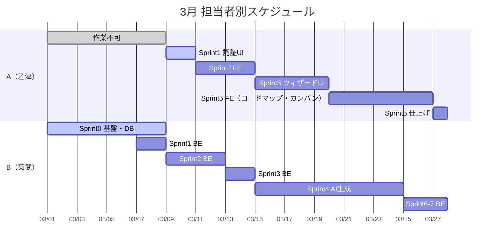
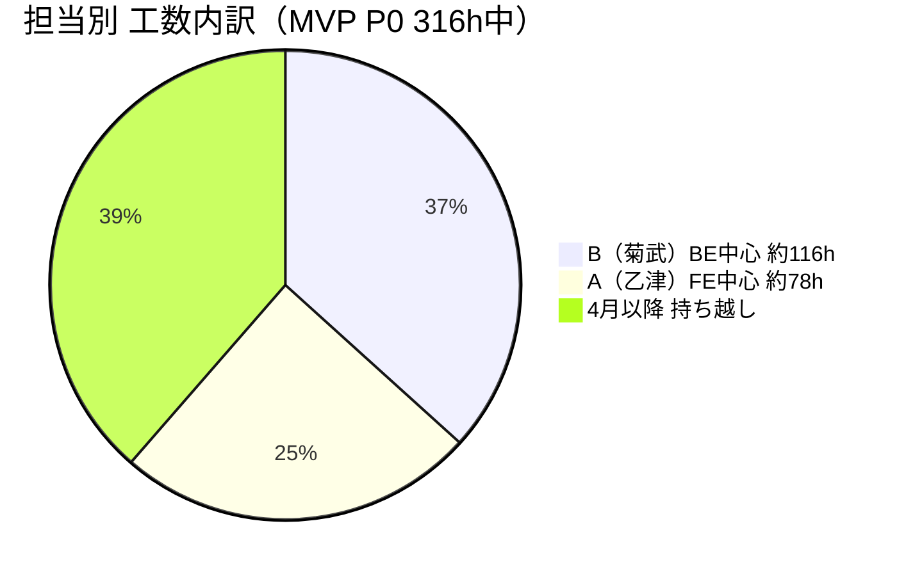
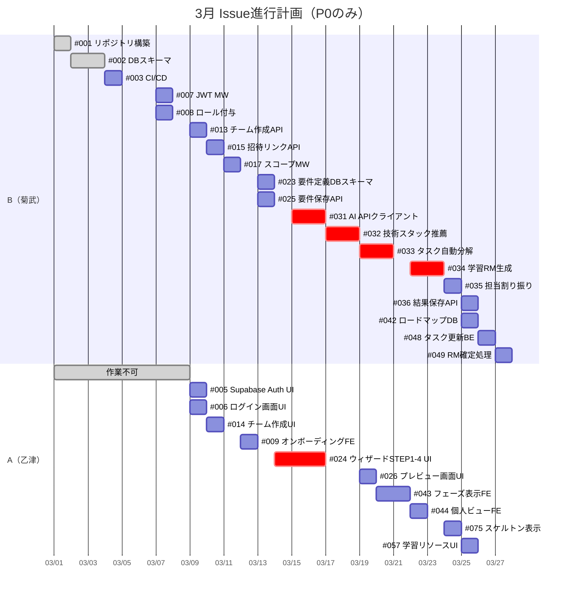
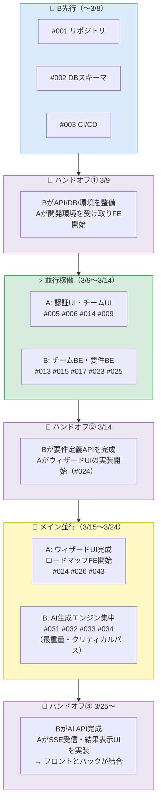

# Issue 担当者割り振り

> 参照：schedule-march.md / issues-with-hours.md
> 期間：2025年3月1日〜3月27日
> **B（菊武）: バックエンド中心 / A（乙津）: フロントエンド中心**

---

## 📅 稼働時間 集計

| | ○日数 | △日数 | 合計稼働 |
|---|---|---|---|
| **A（乙津）** | 3/9〜25（17日）, 3/22〜27 | 3/26（1日） | ○×5h×16日 + △×2.5h×1日 = **約82.5h** |
| **B（菊武）** | 3/2,3,7,8,9〜20,22〜25,27（21日） | 3/1,4,5,6,26（5日） | ○×5h×21日 + △×2.5h×5日 = **約117.5h** |

> A は 3/1〜8 が完全不可のため、3/9 以降に集中して稼働。
> B は 3/1 から稼働可能なため、Sprint 0 の基盤作業を先行して進める。

---

## 🗓️ 週別スケジュール概要

---

## 👤 担当者別 Issue割り振り

### 🔵 B（菊武）担当 ― バックエンド中心（推定 約114h）

#### Sprint 0：環境構築・基盤（3/1〜3/8）
| # | タイトル | 時間 | 開始目安 |
|---|---------|------|---------|
| #001 | リポジトリ・開発環境構築 | 8h | 3/1 |
| #002 | DBスキーマ設計・マイグレーション基盤 | 16h | 3/2 |
| #003 | CI/CDパイプライン構築 | 8h | 3/4 |
| #004 | 共通エラーハンドリング基盤（BE部分） | 2h | 3/6 |

#### Sprint 1：認証 BE（3/7〜3/8）
| # | タイトル | 時間 | 開始目安 |
|---|---------|------|---------|
| #007 | Supabase JWT検証ミドルウェア（Go） | 2h | 3/7 |
| #008 | グローバルロール自動付与 | 2h | 3/7 |

#### Sprint 2：チーム管理 BE（3/9〜3/12）
| # | タイトル | 時間 | 開始目安 |
|---|---------|------|---------|
| #013 | チーム作成API | 8h | 3/9 |
| #015 | 招待リンク発行・参加API | 8h | 3/10 |
| #017 | チームスコープ権限チェックMW | 8h | 3/11 |
| #016 | メンバー一覧API（BE部分） | 2h | 3/12 |

#### Sprint 3：要件定義 BE（3/13〜3/14）
| # | タイトル | 時間 | 開始目安 |
|---|---------|------|---------|
| #023 | 要件定義DBスキーマ | 4h | 3/13 |
| #025 | 要件定義保存API | 4h | 3/13 |
| #061 | サービス共有APIキー管理（環境構築と並行） | 4h | 3/14 |

#### Sprint 4：AI生成エンジン（3/15〜3/24）← **メイン担当**
| # | タイトル | 時間 | 開始目安 |
|---|---------|------|---------|
| #031 | AI APIクライアント基盤 | 16h | 3/15 |
| #032 | 技術スタック推薦 | 16h | 3/17 |
| #033 | タスク自動分解 | 16h | 3/19 |
| #034 | 学習ロードマップ生成 | 16h | 3/21（3/21休→3/22〜） |
| #035 | 担当割り振り提案 | 8h | 3/24 |
| #036 | AI生成結果の保存・表示API | 8h | 3/25 |

#### Sprint 5〜7：追加 BE（3/25〜3/27）
| # | タイトル | 時間 | 開始目安 |
|---|---------|------|---------|
| #042 | ロードマップ・タスクDBスキーマ | 8h | 3/25（A FE着手前に先行） |
| #048 | 自タスクステータス更新（ABAC Rule2） | 4h | 3/26 |
| #049 | ロードマップ確定処理 | 4h | 3/27 |

**B 合計：約 116h**

---

### 🟠 A（乙津）担当 ― フロントエンド中心（推定 約77h）

> ⚠️ 3/1〜8 は作業不可。3/9〜 本格稼働。
> B が先行してDB・API・環境を整えた状態で FE 開発に集中できる構成。

#### Sprint 1：認証 FE（3/9）
| # | タイトル | 時間 | 開始目安 |
|---|---------|------|---------|
| #005 | Supabase Auth セットアップ・ログインUI連携 | 2h | 3/9 |
| #006 | 登録・ログイン画面UI | 4h | 3/9 |
| #004 | 共通エラーハンドリング基盤（FE部分） | 2h | 3/9 |

#### Sprint 2：チーム管理 FE（3/10〜3/13）
| # | タイトル | 時間 | 開始目安 |
|---|---------|------|---------|
| #014 | チーム作成画面UI | 4h | 3/10 |
| #016 | メンバー一覧表示（FE部分） | 2h | 3/11 |
| #009 | スキルレベル・技術登録（オンボーディング）FE | 4h | 3/12 |
| #020 | チームダッシュボード画面（P1先行） | 8h | 3/13 |

#### Sprint 3：要件定義ウィザード UI（3/14〜3/19）← **メイン担当**
| # | タイトル | 時間 | 開始目安 |
|---|---------|------|---------|
| #024 | ウィザードSTEP1〜4 UI | 24h | 3/14 |
| #026 | STEP5 確認・プレビュー画面 | 8h | 3/19 |

#### Sprint 5：ロードマップ FE（3/20〜3/27）
| # | タイトル | 時間 | 開始目安 |
|---|---------|------|---------|
| #043 | フェーズ別ロードマップ表示 | 16h | 3/20 |
| #044 | 個人ビュー | 8h | 3/22 |
| #075 | ローディング・スケルトン表示 | 4h | 3/24 |
| #057 | 学習リソース表示UI | 4h | 3/25 |

> #046 カンバンボード（24h）/ #045 チームビュー（16h）は4月以降 P1フェーズで対応。

**A 合計：約 78h**

---

## 📊 割り振りサマリー

---

## 🔗 依存関係とハンドオフポイント

---

## 📋 3月末時点 完了見込みIssue（P0のみ）

| Sprint | 完了見込み（3月末） | 4月持ち越し |
|---|---|---|
| Sprint 0 基盤 | #001 #002 #003 #004 ✅ | なし |
| Sprint 1 認証 | #005 #006 #007 #008 #009 ✅ | なし |
| Sprint 2 チーム | #013 #014 #015 #016 #017 ✅ | なし |
| Sprint 3 要件定義 | #023 #024 #025 #026 ✅ | なし |
| Sprint 4 AI生成 | #031 #032 #033 #034 #035 #036 ✅ | なし |
| Sprint 5 RM/タスク | #042 #043 #044 #048 #049 | **#045 #046 #047** → 4月 |
| Sprint 6 学習 | #057（UI） | **#056**（API）→ 4月 |
| Sprint 7 APIキー | #061（環境変数のみ） | #062 #063 → 4月 |
| Sprint 9 UX | #075 | — |

> **3月末P0完了率：約 25/32件（78%）**
> 残り7件（カンバン・チームビュー・タスク詳細・学習API等）は4月第1週に集中対応。

---

## 💡 注意点・リスク

| リスク | 対策 |
|---|---|
| AI生成（#031〜036）が80hと集中しBがボトルネック | 3/15〜24の10日間をAI集中週として確保。AのFEと並行するので影響最小 |
| A が 3/1〜8 不在のため Sprint0 は B 単独 | Bのスキルがインフラ・BE向きなので問題なし。環境整備に集中 |
| #024 ウィザードUI（24h）がAの最大工数 | 3/14〜18の5日間をウィザード集中週に確保 |
| 3/21 B が作業不可 | AI生成の途中日。前後で工数調整済み |
| 3/26 両者△ | バッファ日として軽作業・レビューに充てる |

