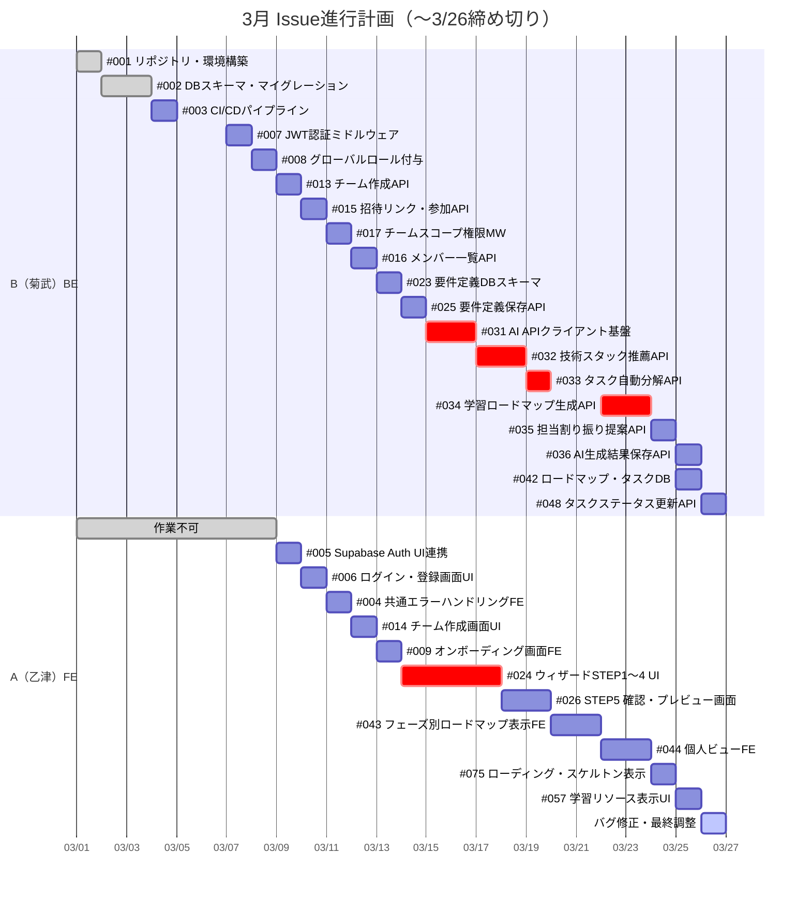
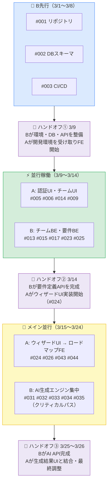

# Issue 担当者割り振り

> 参照：schedule-march.md / feature-list.md
> 期間：2026年3月1日〜3月26日
> **B（菊武）: バックエンド中心 / A（乙津）: フロントエンド中心**
> ⚠️ **3月26日（△）を最終締め切りとする**

---

## 📅 稼働日まとめ

| | 稼働可能日 | 合計 |
|---|---|---|
| **A（乙津）** | 3/9〜3/25（○）、3/26（△） | 約17日 |
| **B（菊武）** | 3/1〜3/3（○△）、3/4〜6（△）、3/7〜3/20（○）、3/22〜3/25（○）、3/26（△） | 約24日 |

> A は 3/1〜8 が完全不可のため 3/9 以降に集中稼働
> B は 3/1 から稼働可能なため Sprint 0 の基盤作業を先行

---

## 🗓️ 全体スケジュール

---

## 👤 担当者別 Issue一覧

### 🔵 B（菊武）担当 ― バックエンド

#### Sprint 0：環境構築・基盤（3/1〜3/6）
| # | タイトル | 期間 |
|---|---------|------|
| #001 | リポジトリ・開発環境構築（Go + Echo + Supabase） | 3/1 |
| #002 | DBスキーマ設計・マイグレーション（Supabase） | 3/2〜3/3 |
| #003 | CI/CDパイプライン構築（GitHub Actions + Cloud Run） | 3/4 |
| #004 | 共通エラーハンドリング基盤（BE） | 3/5 |

#### Sprint 1：認証 BE（3/7〜3/8）
| # | タイトル | 期間 |
|---|---------|------|
| #007 | Supabase JWT検証ミドルウェア（Go） | 3/7 |
| #008 | グローバルロール自動付与 | 3/8 |

#### Sprint 2：チーム管理 BE（3/9〜3/12）
| # | タイトル | 期間 |
|---|---------|------|
| #013 | チーム作成API | 3/9 |
| #015 | 招待リンク発行・参加API | 3/10 |
| #017 | チームスコープ権限チェックMW | 3/11 |
| #016 | メンバー一覧API | 3/12 |

#### Sprint 3：要件定義 BE（3/13〜3/14）
| # | タイトル | 期間 |
|---|---------|------|
| #023 | 要件定義DBスキーマ | 3/13 |
| #025 | 要件定義保存API | 3/14 |

#### Sprint 4：AI生成エンジン（3/15〜3/25）← メイン担当
| # | タイトル | 期間 |
|---|---------|------|
| #031 | AI APIクライアント基盤（Gemini連携） | 3/15〜3/16 |
| #032 | 技術スタック推薦API | 3/17〜3/18 |
| #033 | タスク自動分解API | 3/19〜3/20 |
| #034 | 学習ロードマップ生成API（3/21はB休み） | 3/22〜3/23 |
| #035 | 担当割り振り提案API | 3/24 |
| #036 | AI生成結果保存・取得API | 3/25 |

#### Sprint 5：ロードマップ・タスク BE（3/25〜3/26）
| # | タイトル | 期間 |
|---|---------|------|
| #042 | ロードマップ・タスクDBスキーマ | 3/25 |
| #048 | タスクステータス更新API（ABAC Rule2対応） | 3/26 |

---

### 🟠 A（乙津）担当 ― フロントエンド

> ⚠️ 3/1〜8 は作業不可。3/9 から本格稼働

#### Sprint 1：認証 FE（3/9〜3/11）
| # | タイトル | 期間 |
|---|---------|------|
| #005 | Supabase Auth セットアップ・ログインUI連携 | 3/9 |
| #006 | ログイン・新規登録画面UI | 3/10 |
| #004 | 共通エラーハンドリング基盤（FE） | 3/11 |

#### Sprint 2：チーム管理・オンボーディング FE（3/12〜3/13）
| # | タイトル | 期間 |
|---|---------|------|
| #014 | チーム作成画面UI | 3/12 |
| #009 | オンボーディング（スキル登録）画面FE | 3/13 |

#### Sprint 3：要件定義ウィザード UI（3/14〜3/19）← メイン担当
| # | タイトル | 期間 |
|---|---------|------|
| #024 | ウィザードSTEP1〜4 UI（種別・チェックリスト・難易度・自由記述） | 3/14〜3/17 |
| #026 | STEP5 確認・プレビュー画面 | 3/18〜3/19 |

#### Sprint 4：ロードマップ・学習 FE（3/20〜3/25）
| # | タイトル | 期間 |
|---|---------|------|
| #043 | フェーズ別ロードマップ表示FE | 3/20〜3/21 |
| #044 | 個人ビューFE | 3/22〜3/23 |
| #075 | ローディング・スケルトン表示 | 3/24 |
| #057 | 学習リソース表示UI | 3/25 |

#### Sprint 5：最終調整（3/26）
| # | タイトル | 期間 |
|---|---------|------|
| — | バグ修正・UI調整・レスポンシブ確認 | 3/26 |

---

## 🔗 依存関係・ハンドオフポイント

---

## 📋 3/26時点 完了見込みIssue

| Sprint | 完了見込み（3/26まで） | 4月持ち越し |
|---|---|---|
| Sprint 0 基盤 | #001 #002 #003 #004 ✅ | なし |
| Sprint 1 認証 | #005 #006 #007 #008 #009 ✅ | なし |
| Sprint 2 チーム | #013 #014 #015 #016 #017 ✅ | なし |
| Sprint 3 要件定義 | #023 #024 #025 #026 ✅ | なし |
| Sprint 4 AI生成 | #031 #032 #033 #034 #035 #036 ✅ | なし |
| Sprint 5 RM/タスク | #042 #043 #044 #048 #075 #057 ✅ | #045 #046 #047 → 4月 |

---

## 💡 リスクと対策

| リスク | 対策 |
|---|---|
| AI生成（#031〜036）がBのボトルネック | 3/15〜3/24 の10日間をAI集中週として確保。Aと並行稼働 |
| A が 3/1〜8 不在 | Bが環境・DB構築を先行。Aは3/9から即開発に入れる状態にする |
| #024 ウィザードUI（4日）がAの最大工数 | 3/14〜3/17 の4日間を集中確保 |
| 3/21 Bが作業不可 | AI生成の工程間に設定。前後で工数調整済み |
| 3/26 両者△ | FEバグ修正・最終レビューのバッファ日として活用 |
