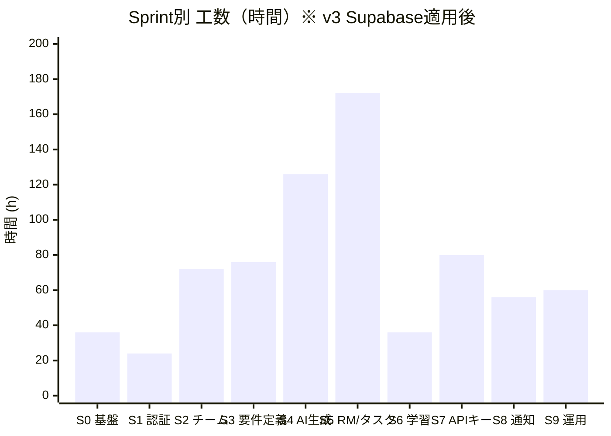
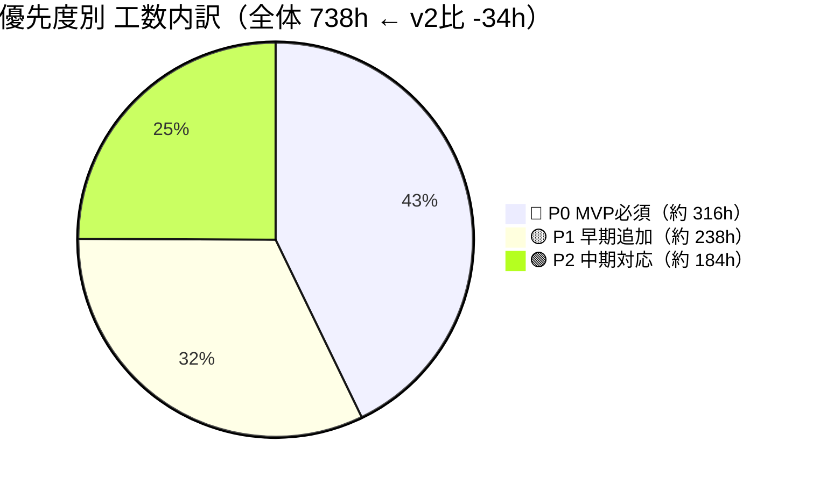
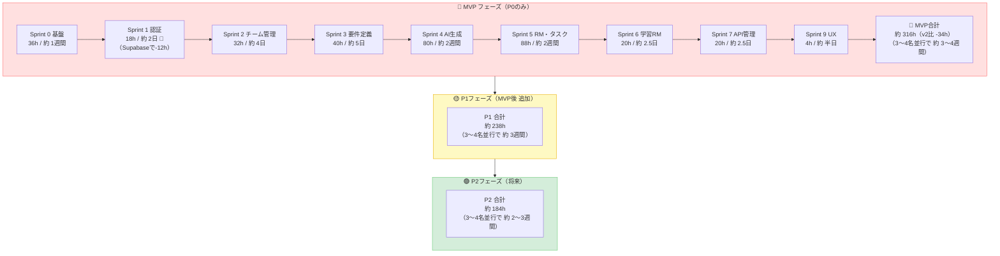

# Issue一覧（工数見積もり付き）

> 1人日 = 8時間 を基準に見積もり
> チーム構成前提：6〜8名（初心者〜中級混合）
> ラベル凡例：🔴 P0 MVP必須 ／ 🟡 P1 早期追加 ／ 🟢 P2 中期 ／ ⚪ P3 将来
> 工数凡例：XS=2h / S=4h / M=8h / L=16h / XL=24h以上
> **v3更新：認証を Supabase に移行したため Sprint 1 の工数を大幅削減**

---

## 🏃 Sprint 0：環境構築・基盤（推定合計：約 30h）

| # | タイトル | 工数 | 時間 | P | 担当 |
|---|---------|------|------|---|------|
| #001 | リポジトリ・開発環境構築 | M | 8h | 🔴 P0 | Infra |
| #002 | DBスキーマ設計・マイグレーション基盤 | L | 16h | 🔴 P0 | BE |
| #003 | CI/CDパイプライン構築 | M | 8h | 🔴 P0 | Infra |
| #004 | 共通エラーハンドリング基盤 | S | 4h | 🔴 P0 | BE/FE |
| | **Sprint 0 合計** | | **36h** | | |

---

## 🔐 Sprint 1：認証・ユーザー管理（推定合計：約 26h ← v2比 -32h 🎉）

> 🔷 **Supabase 採用による削減内訳**
> - #005 メール登録・ログインAPI：8h → **2h**（Supabaseが処理、GoはJWT検証のみ）
> - #007 JWT発行・検証MW：4h → **2h**（発行不要・検証のみ）
> - #010 Google OAuth：16h → **2h**（`signInWithOAuth` 数行で完成）
> - #012 パスワードリセット：8h → **0h**（Supabase標準機能で不要）

| # | タイトル | 工数 | 時間 | P | 担当 | 備考 |
|---|---------|------|------|---|------|------|
| #005 | Supabase Auth セットアップ・ログインUI連携 | XS | 2h | 🔴 P0 | FE | ~~8h~~ → **2h** |
| #006 | 登録・ログイン画面UI | S | 4h | 🔴 P0 | FE | 変更なし |
| #007 | Supabase JWT検証ミドルウェア（Go） | XS | 2h | 🔴 P0 | BE | ~~4h~~ → **2h** |
| #008 | グローバルロール自動付与（Supabase Webhook連携） | XS | 2h | 🔴 P0 | BE | 変更なし |
| #009 | スキルレベル・技術登録（オンボーディング） | M | 8h | 🔴 P0 | BE/FE | 変更なし |
| #010 | Google OAuth（Supabase設定のみ） | XS | 2h | 🟡 P1 | FE | ~~16h~~ → **2h** |
| #011 | プロフィール編集画面 | S | 4h | 🟡 P1 | FE | 変更なし |
| #012 | パスワードリセット機能 | — | 0h | ~~🟢 P2~~ | — | ~~8h~~ → **0h** Supabase標準機能 |
| | **Sprint 1 合計** | | **24h** | | | **v2比 -34h** |
| | **（P0のみ）** | | **18h** | | | **v2比 -12h** |

---

## 🏗️ Sprint 2：チーム管理（推定合計：約 66h）

| # | タイトル | 工数 | 時間 | P | 担当 |
|---|---------|------|------|---|------|
| #013 | チーム作成API | M | 8h | 🔴 P0 | BE |
| #014 | チーム作成画面UI | S | 4h | 🔴 P0 | FE |
| #015 | 招待リンク発行・参加API | M | 8h | 🔴 P0 | BE |
| #016 | メンバー一覧表示 | S | 4h | 🔴 P0 | BE/FE |
| #017 | チームスコープ権限チェックMW | M | 8h | 🔴 P0 | BE |
| #018 | ロール設定UI | M | 8h | 🟡 P1 | BE/FE |
| #019 | チーム設定変更 | S | 4h | 🟡 P1 | BE/FE |
| #020 | チームダッシュボード画面 | L | 16h | 🟡 P1 | FE |
| #021 | メンバーキック・脱退機能 | M | 8h | 🟢 P2 | BE/FE |
| #022 | 複数チーム所属対応UI | S | 4h | 🟢 P2 | FE |
| | **Sprint 2 合計** | | **72h** | | |
| | **（P0のみ）** | | **32h** | | |

---

## 📋 Sprint 3：要件定義ウィザード（推定合計：約 56h）

| # | タイトル | 工数 | 時間 | P | 担当 |
|---|---------|------|------|---|------|
| #023 | 要件定義DBスキーマ | S | 4h | 🔴 P0 | BE |
| #024 | ウィザードSTEP1〜4 UI | XL | 24h | 🔴 P0 | FE |
| #025 | 要件定義保存API | S | 4h | 🔴 P0 | BE |
| #026 | STEP5 確認・プレビュー画面 | M | 8h | 🔴 P0 | FE |
| #027 | 要件定義 編集・更新 | M | 8h | 🟡 P1 | BE/FE |
| #028 | ロードマップ確定後の編集ロック | S | 4h | 🟡 P1 | BE |
| #029 | MVP範囲の自動提案 | M | 8h | 🟡 P1 | BE |
| #030 | 要件の曖昧さ検出 | L | 16h | 🟢 P2 | BE |
| | **Sprint 3 合計** | | **76h** | | |
| | **（P0のみ）** | | **40h** | | |

---

## 🤖 Sprint 4：AI生成エンジン（推定合計：約 108h）

| # | タイトル | 工数 | 時間 | P | 担当 |
|---|---------|------|------|---|------|
| #031 | AI APIクライアント基盤 | L | 16h | 🔴 P0 | BE |
| #032 | 技術スタック推薦 | L | 16h | 🔴 P0 | BE |
| #033 | タスク自動分解 | L | 16h | 🔴 P0 | BE |
| #034 | 学習ロードマップ生成 | L | 16h | 🔴 P0 | BE |
| #035 | 担当割り振り提案 | M | 8h | 🔴 P0 | BE |
| #036 | AI生成結果の保存・表示API | M | 8h | 🔴 P0 | BE |
| #037 | 生成結果の編集・調整UI | L | 16h | 🟡 P1 | FE |
| #038 | 再生成・やり直し機能 | M | 8h | 🟡 P1 | BE/FE |
| #039 | 初心者チームのAI再生成制限 | XS | 2h | 🟡 P1 | BE |
| #040 | 工数・学習期間見積もり精度改善 | L | 16h | 🟢 P2 | BE |
| #041 | 負荷分散チェック（ABAC Rule4） | S | 4h | 🟢 P2 | BE |
| | **Sprint 4 合計** | | **126h** | | |
| | **（P0のみ）** | | **80h** | | |

---

## 🗺️ Sprint 5：ロードマップ表示・タスク管理（推定合計：約 128h）

| # | タイトル | 工数 | 時間 | P | 担当 |
|---|---------|------|------|---|------|
| #042 | ロードマップ・タスクDBスキーマ | M | 8h | 🔴 P0 | BE |
| #043 | フェーズ別ロードマップ表示 | L | 16h | 🔴 P0 | FE |
| #044 | 個人ビュー | M | 8h | 🔴 P0 | FE |
| #045 | チームビュー | L | 16h | 🔴 P0 | FE |
| #046 | カンバンボード（DnD） | XL | 24h | 🔴 P0 | FE |
| #047 | タスク詳細画面 | M | 8h | 🔴 P0 | FE |
| #048 | 自タスクステータス更新（ABAC Rule2） | S | 4h | 🔴 P0 | BE |
| #049 | ロードマップ確定処理 | S | 4h | 🔴 P0 | BE |
| #050 | 今日やることリスト | M | 8h | 🟡 P1 | BE/FE |
| #051 | ガントチャート表示 | XL | 24h | 🟡 P1 | FE |
| #052 | タスクコメント機能 | M | 8h | 🟡 P1 | BE/FE |
| #053 | タスク追加・削除（手動） | S | 4h | 🟡 P1 | BE/FE |
| #054 | 依存関係マップ | XL | 24h | 🟢 P2 | FE |
| #055 | 週次進捗レポート自動生成 | L | 16h | 🟢 P2 | BE/FE |
| | **Sprint 5 合計** | | **172h** | | |
| | **（P0のみ）** | | **88h** | | |

---

## 📚 Sprint 6：学習リソース連携（推定合計：約 42h）

| # | タイトル | 工数 | 時間 | P | 担当 |
|---|---------|------|------|---|------|
| #056 | タスク別推薦教材API | L | 16h | 🔴 P0 | BE |
| #057 | 学習リソース表示UI | S | 4h | 🔴 P0 | FE |
| #058 | 学習ログ記録 | M | 8h | 🟡 P1 | BE/FE |
| #059 | 学習リンク一覧画面 | S | 4h | 🟡 P1 | FE |
| #060 | カスタム教材追加 | S | 4h | 🟢 P2 | BE/FE |
| | **Sprint 6 合計** | | **36h** | | |
| | **（P0のみ）** | | **20h** | | |

---

## 🔑 Sprint 7：APIキー管理・コスト制御（推定合計：約 74h）

| # | タイトル | 工数 | 時間 | P | 担当 |
|---|---------|------|------|---|------|
| #061 | サービス共有APIキー管理 | S | 4h | 🔴 P0 | BE/Infra |
| #062 | トークン使用量記録 | M | 8h | 🔴 P0 | BE |
| #063 | レートリミット実装 | M | 8h | 🔴 P0 | BE |
| #064 | BYOKキー登録API | L | 16h | 🟡 P1 | BE |
| #065 | BYOKキー登録UI | S | 4h | 🟡 P1 | FE |
| #066 | キー選択ロジック | M | 8h | 🟡 P1 | BE |
| #067 | 上限到達時通知・自動停止 | M | 8h | 🟡 P1 | BE/FE |
| #068 | トークン使用量ダッシュボード | L | 16h | 🟢 P2 | BE/FE |
| #069 | 異常検知アラート | M | 8h | 🟢 P2 | BE |
| | **Sprint 7 合計** | | **80h** | | |
| | **（P0のみ）** | | **20h** | | |

---

## 💬 Sprint 8：通知・コミュニケーション支援（推定合計：約 54h）

| # | タイトル | 工数 | 時間 | P | 担当 |
|---|---------|------|------|---|------|
| #070 | アプリ内通知機能 | L | 16h | 🟡 P1 | BE/FE |
| #071 | タスク期限リマインダー | M | 8h | 🟡 P1 | BE |
| #072 | 質問テンプレートフォーム | M | 8h | 🟡 P1 | FE |
| #073 | Slack / Discord Webhook連携 | L | 16h | 🟢 P2 | BE |
| #074 | ペアリング提案 | M | 8h | 🟢 P2 | BE/FE |
| | **Sprint 8 合計** | | **56h** | | |

---

## ⚙️ Sprint 9：運用・管理機能（推定合計：約 60h）

| # | タイトル | 工数 | 時間 | P | 担当 |
|---|---------|------|------|---|------|
| #075 | ローディング・スケルトン表示 | S | 4h | 🔴 P0 | FE |
| #076 | レスポンシブ対応 | L | 16h | 🟡 P1 | FE |
| #077 | 監査ログ記録基盤 | M | 8h | 🟡 P1 | BE |
| #078 | SYSTEM_ADMIN管理画面 | XL | 24h | 🟢 P2 | BE/FE |
| #079 | 利用規約・プライバシーポリシーページ | S | 4h | 🟢 P2 | FE |
| #080 | DBバックアップ設定 | S | 4h | 🟢 P2 | Infra |
| | **Sprint 9 合計** | | **60h** | | |
| | **（P0のみ）** | | **4h** | | |

---

## 📊 工数サマリー

---

## 🗓️ フェーズ別 工数・期間まとめ

---

## ⏱️ Issue別 工数一覧（全80件）

```mermaid
gantt
    title Issue工数（クリティカルパス中心）
    dateFormat X
    axisFormat %s h

    section Sprint0
    #001 リポジトリ構築        :0, 8
    #002 DBスキーマ            :0, 16
    #003 CI/CD                 :0, 8
    #004 エラー基盤            :0, 4

    section Sprint1
    #005 認証API               :0, 8
    #006 ログインUI            :0, 8
    #007 JWT MW                :0, 4
    #008 ロール付与            :0, 2
    #009 オンボーディング      :0, 8

    section Sprint2
    #013 チーム作成API         :0, 8
    #015 招待リンク            :0, 8
    #017 スコープMW            :0, 8
    #016 メンバー一覧          :0, 4

    section Sprint3
    #024 ウィザードUI          :0, 24
    #025 要件保存API           :0, 4
    #026 プレビュー画面        :0, 8

    section Sprint4（AI・最重要）
    #031 AI APIクライアント    :crit, 0, 16
    #032 技術スタック推薦      :crit, 0, 16
    #033 タスク自動分解        :crit, 0, 16
    #034 学習RM生成            :crit, 0, 16
    #035 担当割り振り          :0, 8
    #036 結果保存API           :0, 8

    section Sprint5
    #046 カンバンボード        :crit, 0, 24
    #043 フェーズ表示          :0, 16
    #044 個人ビュー            :0, 8
    #045 チームビュー          :0, 16
    #049 RM確定処理            :0, 4
```

---

## 🔢 規模感まとめ

| 区分 | Issue数 | 工数合計 | 3〜4名並行想定期間 |
|------|--------|---------|-----------------|
| 🔴 P0 MVP | 32件 | 約 **316h**（v2: 350h） | **3〜4週間** |
| 🟡 P1 追加 | 27件 | 約 238h | 約 3週間 |
| 🟢 P2 将来 | 13件 | 約 184h | 約 2〜3週間 |
| **全体** | **80件** | **約 738h**（v2: 772h） | **約 10週間** |

> 💡 **補足**
> - **Supabase採用で Sprint 1 が -34h**。認証まわりをほぼスキップできる
> - 上記はコーディング工数の見積もり。コードレビュー・テスト・修正込みだと **×1.3〜1.5倍** が現実的
> - AI生成系（Sprint 4）はプロンプト品質に大きく左右される。バッファを多めに取ることを推奨
> - カンバンボード（#046・24h）とウィザードUI（#024・24h）はFE最大工数。先にデザインカンプを用意すると短縮可能
> - Sprint 4（AI生成）はバックエンド専任が1〜2人いると並行開発しやすい

