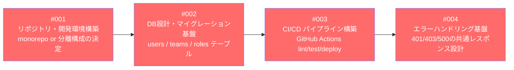
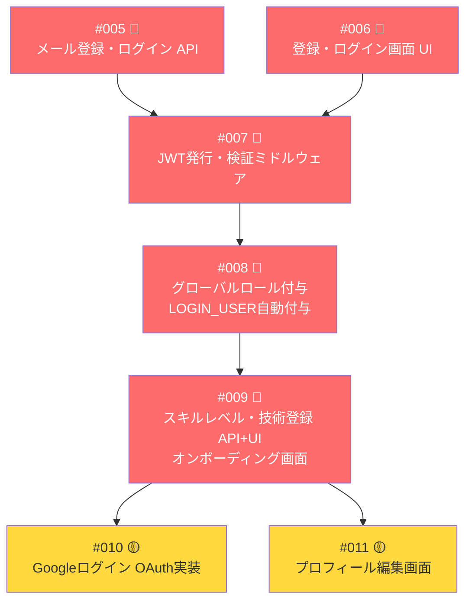
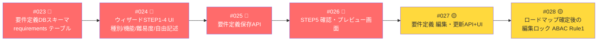
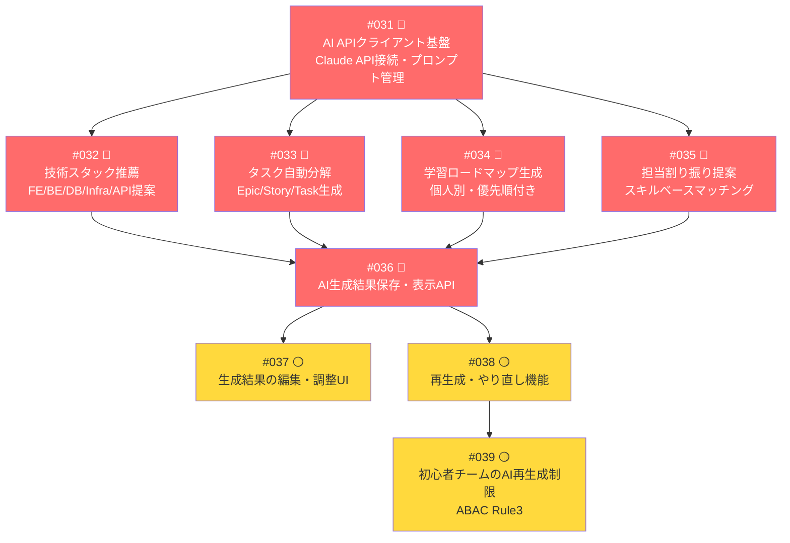
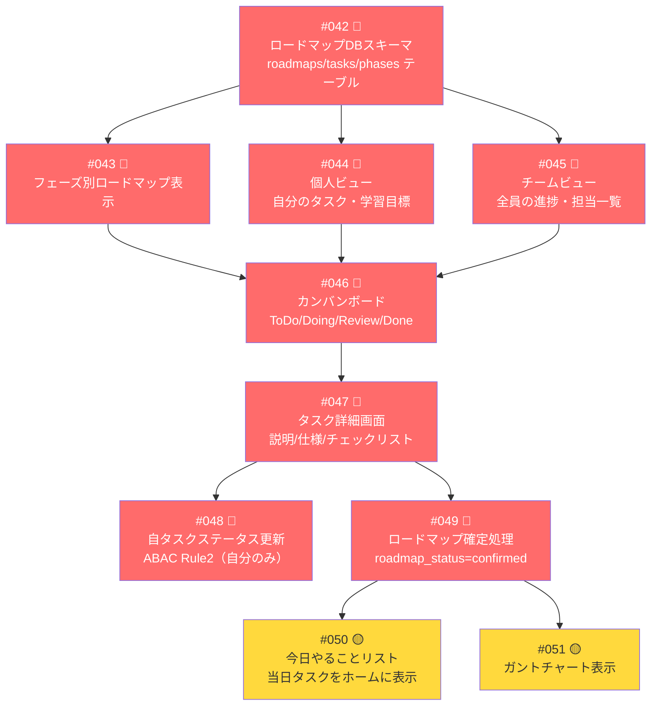
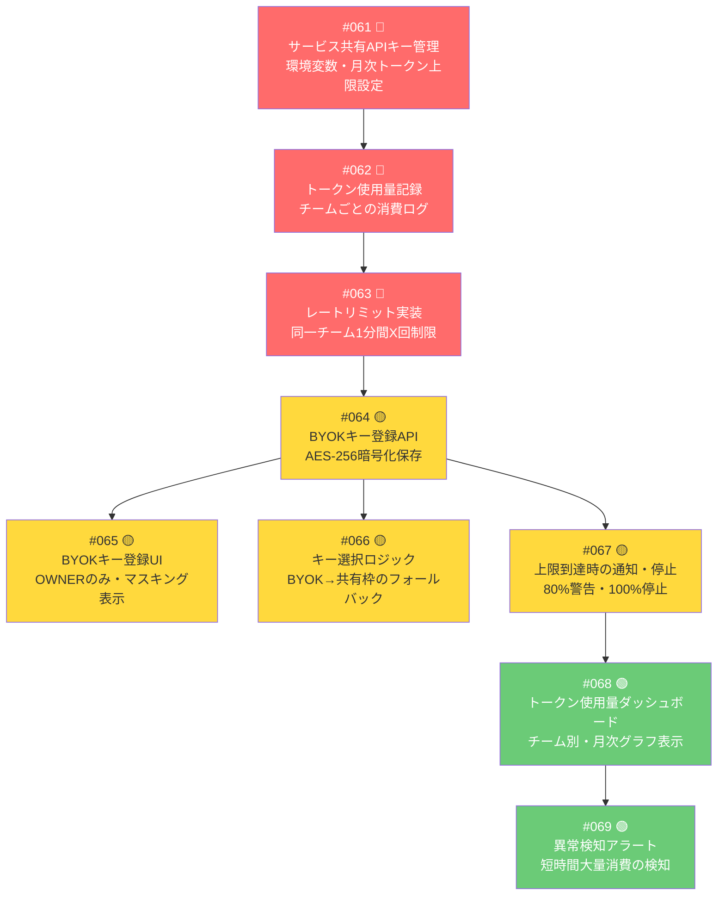
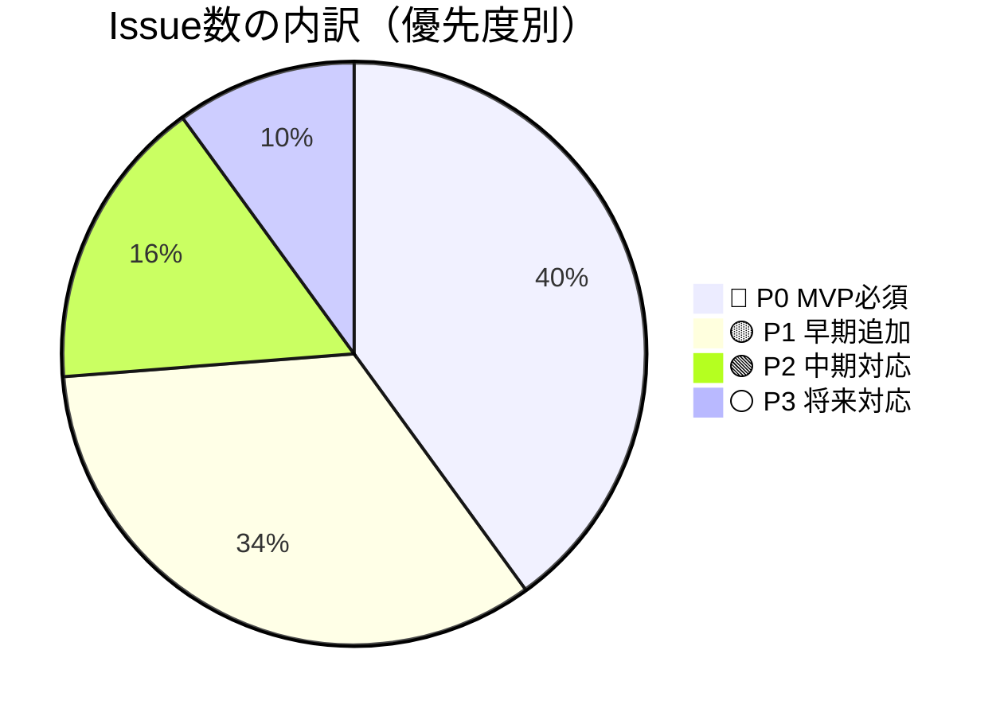
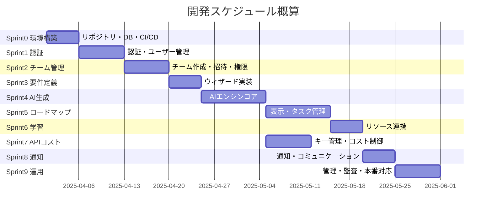
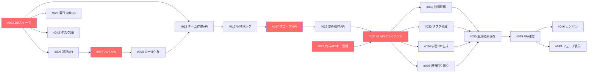

# Issue一覧（優先順位付き）

> 設計ドキュメント（機能一覧・権限設計v5/v6・APIコスト設計）をもとに作成
> ラベル凡例：🔴 P0 MVP必須 ／ 🟡 P1 早期追加 ／ 🟢 P2 中期 ／ ⚪ P3 将来

---

## 🏃 Sprint 0：環境構築・基盤（着手前に必須）

| # | タイトル | 詳細 | P | 担当 |
|---|---------|------|---|------|
| #001 | リポジトリ・開発環境構築 | monorepo構成決定、ESLint/Prettier設定、README整備 | 🔴 P0 | Infra |
| #002 | DBスキーマ設計・マイグレーション基盤 | users / global_roles / teams / team_roles / user_global_roles / user_team_roles テーブル作成 | 🔴 P0 | BE |
| #003 | CI/CDパイプライン構築 | GitHub Actions：lint・test・staging自動デプロイ | 🔴 P0 | Infra |
| #004 | 共通エラーハンドリング基盤 | 401/403/404/500の共通レスポンス形式・フロント側表示設計 | 🔴 P0 | BE/FE |

---

## 🔐 Sprint 1：認証・ユーザー管理

| # | タイトル | 詳細 | P | 担当 |
|---|---------|------|---|------|
| #005 | メール登録・ログインAPI | バリデーション・パスワードハッシュ（bcrypt）・セッション管理 | 🔴 P0 | BE |
| #006 | 登録・ログイン画面UI | フォームバリデーション・エラー表示・LP導線 | 🔴 P0 | FE |
| #007 | JWT発行・検証ミドルウェア | 全APIエンドポイントに適用・401返却処理 | 🔴 P0 | BE |
| #008 | グローバルロール自動付与 | 登録時にLOGIN_USERを自動付与・user_global_rolesへ保存 | 🔴 P0 | BE |
| #009 | スキルレベル・技術登録（オンボーディング） | 登録直後のスキル入力画面・得意技術タグ・習熟度選択 | 🔴 P0 | BE/FE |
| #010 | GoogleログインOAuth実装 | Passport.js等でOAuth2.0フロー実装 | 🟡 P1 | BE |
| #011 | プロフィール編集画面 | 名前・アイコン・自己紹介・スキル更新 | 🟡 P1 | FE |
| #012 | パスワードリセット機能 | メールリンク発行・トークン期限管理 | 🟢 P2 | BE |

---

## 🏗️ Sprint 2：チーム管理

```mermaid
flowchart TD
    I013["#013 🔴\nチーム作成API\nOWNERロール自動付与"] --> I015["#015 🔴\n招待リンク発行・参加API"]
    I014["#014 🔴\nチーム作成画面UI"] --> I015
    I015 --> I016["#016 🔴\nメンバー一覧表示"]
    I016 --> I017["#017 🔴\nチームスコープ権限チェック\nミドルウェア"]
    I017 --> I018["#018 🟡\nロール設定UI\nOWNERがMEMBERを管理"]
    I017 --> I019["#019 🟡\nチーム設定変更"]
    I016 --> I020["#020 🟡\nチームダッシュボード画面"]

    style I013 fill:#ff6b6b,color:#fff
    style I014 fill:#ff6b6b,color:#fff
    style I015 fill:#ff6b6b,color:#fff
    style I016 fill:#ff6b6b,color:#fff
    style I017 fill:#ff6b6b,color:#fff
    style I018 fill:#ffd93d,color:#333
    style I019 fill:#ffd93d,color:#333
    style I020 fill:#ffd93d,color:#333
```

| # | タイトル | 詳細 | P | 担当 |
|---|---------|------|---|------|
| #013 | チーム作成API | チーム名・期間・目標・レベル保存・TEAM_OWNER自動付与・user_team_rolesへ保存 | 🔴 P0 | BE |
| #014 | チーム作成画面UI | 入力フォーム・レベル選択・期間設定 | 🔴 P0 | FE |
| #015 | 招待リンク発行・参加API | UUIDトークン生成・有効期限設定・参加時TEAM_MEMBER付与 | 🔴 P0 | BE |
| #016 | メンバー一覧表示 | チームスコープ内メンバー・スキル・ロール表示 | 🔴 P0 | BE/FE |
| #017 | チームスコープ権限チェックミドルウェア | team_idの一致確認・他チームへの越境を403でブロック（ABAC ルール5） | 🔴 P0 | BE |
| #018 | ロール設定UI | OWNERがMEMBERのロールを変更・降格時にタスク自動未アサイン | 🟡 P1 | BE/FE |
| #019 | チーム設定変更 | チーム名・期間・目標・レベルの更新 | 🟡 P1 | BE/FE |
| #020 | チームダッシュボード画面 | 進捗サマリー・メンバー稼働状況・マイルストーン表示 | 🟡 P1 | FE |
| #021 | メンバーキック・脱退機能 | キック時に担当タスクを自動未アサイン・ロール削除 | 🟢 P2 | BE/FE |
| #022 | 複数チーム所属対応UI | ホーム画面に所属チーム一覧表示・チーム切り替え | 🟢 P2 | FE |

---

## 📋 Sprint 3：要件定義ウィザード

| # | タイトル | 詳細 | P | 担当 |
|---|---------|------|---|------|
| #023 | 要件定義DBスキーマ | requirements / requirement_features テーブル・roadmap_statusカラム追加 | 🔴 P0 | BE |
| #024 | ウィザードSTEP1〜4 UI | 種別選択・機能チェックリスト・難易度・自由記述の4ステップUI | 🔴 P0 | FE |
| #025 | 要件定義保存API | ウィザード入力データの保存・TEAM_MEMBER以上に開放 | 🔴 P0 | BE |
| #026 | STEP5 確認・プレビュー画面 | 入力内容の確認・AI分析実行ボタン | 🔴 P0 | FE |
| #027 | 要件定義 編集・更新 | TEAM_OWNER のみ編集可・変更履歴保存 | 🟡 P1 | BE/FE |
| #028 | ロードマップ確定後の編集ロック | roadmap_status=confirmedのときOWNERも編集不可（ABAC Rule1） | 🟡 P1 | BE |
| #029 | MVP範囲の自動提案 | AI生成結果にMVP推奨スコープを含める | 🟡 P1 | BE |
| #030 | 要件の曖昧さ検出 | AIが「この要件は曖昧です」を指摘して補足入力を促す | 🟢 P2 | BE |

---

## 🤖 Sprint 4：AI生成エンジン（コア）

| # | タイトル | 詳細 | P | 担当 |
|---|---------|------|---|------|
| #031 | AI APIクライアント基盤 | Claude API接続・プロンプトテンプレート管理・レスポンスパース | 🔴 P0 | BE |
| #032 | 技術スタック推薦 | 要件定義を元にFE/BE/DB/Infra/外部APIを推薦するプロンプト実装 | 🔴 P0 | BE |
| #033 | タスク自動分解 | Epic→Story→Taskへの分解・工数見積もり付き生成 | 🔴 P0 | BE |
| #034 | 学習ロードマップ生成 | メンバーのスキルレベルを加味した個人別学習順序の生成 | 🔴 P0 | BE |
| #035 | 担当割り振り提案 | スキルレベル×ロールでタスクを自動アサイン | 🔴 P0 | BE |
| #036 | AI生成結果の保存・表示API | 生成結果をDBに保存・フロントへ返却 | 🔴 P0 | BE |
| #037 | 生成結果の編集・調整UI | TEAM_OWNERがAI結果を手動修正できるUI | 🟡 P1 | FE |
| #038 | 再生成・やり直し機能 | 条件変更して再度AI分析・前回結果との差分表示 | 🟡 P1 | BE/FE |
| #039 | 初心者チームのAI再生成制限 | team_level=beginnerのときMEMBERは再生成不可（ABAC Rule3） | 🟡 P1 | BE |
| #040 | 工数・学習期間見積もり精度改善 | プロンプトチューニング・見積もり根拠の表示 | 🟢 P2 | BE |
| #041 | 負荷分散チェック | assigned_tasks_count>=5で警告（ABAC Rule4） | 🟢 P2 | BE |

---

## 🗺️ Sprint 5：ロードマップ表示・タスク管理

| # | タイトル | 詳細 | P | 担当 |
|---|---------|------|---|------|
| #042 | ロードマップ・タスクDBスキーマ | roadmaps / phases / tasks / task_assignees テーブル | 🔴 P0 | BE |
| #043 | フェーズ別ロードマップ表示 | フェーズ0〜3のタスクグループ表示 | 🔴 P0 | FE |
| #044 | 個人ビュー | 自分のアサインタスク・今週の学習目標を表示 | 🔴 P0 | FE |
| #045 | チームビュー | 全メンバーの進捗・担当をタイムライン表示 | 🔴 P0 | FE |
| #046 | カンバンボード | ドラッグ&ドロップでステータス変更 | 🔴 P0 | FE |
| #047 | タスク詳細画面 | 説明・仕様・チェックリスト・参考リンク | 🔴 P0 | FE |
| #048 | 自タスクステータス更新（ABAC Rule2） | task_owner_id=user.idのみ更新許可・BE側チェック | 🔴 P0 | BE |
| #049 | ロードマップ確定処理 | roadmap_status=confirmedへ変更・以降の編集ロック連動 | 🔴 P0 | BE |
| #050 | 今日やることリスト | 当日期限・優先タスクをホームダッシュボードに表示 | 🟡 P1 | BE/FE |
| #051 | ガントチャート表示 | マイルストーン・スプリント単位の時系列表示 | 🟡 P1 | FE |
| #052 | タスクコメント機能 | スレッド形式・他人コメント削除はOWNERのみ | 🟡 P1 | BE/FE |
| #053 | タスク追加・削除（手動） | AI生成後のOWNERによる手動微調整 | 🟡 P1 | BE/FE |
| #054 | 依存関係マップ | タスク間のブロッカー関係をビジュアル表示 | 🟢 P2 | FE |
| #055 | 週次進捗レポート自動生成 | 週の完了タスク・残タスクのサマリー | 🟢 P2 | BE/FE |

---

## 📚 Sprint 6：学習リソース連携

| # | タイトル | 詳細 | P | 担当 |
|---|---------|------|---|------|
| #056 | タスク別推薦教材API | タスク種別ごとにZenn記事・YouTube・公式Docのリンクを返す | 🔴 P0 | BE |
| #057 | 学習リソース表示UI | タスク詳細画面内に推薦教材リストを表示 | 🔴 P0 | FE |
| #058 | 学習ログ記録 | 「この教材やった」の記録・スキル習得マーク | 🟡 P1 | BE/FE |
| #059 | 学習リンク一覧画面 | 技術別に整理されたリソース集ページ | 🟡 P1 | FE |
| #060 | カスタム教材追加 | OWNERがチーム独自リンクを追加共有 | 🟢 P2 | BE/FE |

---

## 🔑 Sprint 7：APIキー管理・コスト制御

| # | タイトル | 詳細 | P | 担当 |
|---|---------|------|---|------|
| #061 | サービス共有APIキー管理 | 環境変数でのキー管理・月次トークン上限設定・上限超過時の挙動定義 | 🔴 P0 | BE/Infra |
| #062 | トークン使用量記録 | api_usage_logs テーブル・チーム別・アクション別のトークン消費記録 | 🔴 P0 | BE |
| #063 | レートリミット実装 | Redis等でチームごとに1分間Xリクエスト制限・429レスポンス | 🔴 P0 | BE |
| #064 | BYOKキー登録API | AES-256暗号化保存・登録時の有効性テスト（テストリクエスト1トークン） | 🟡 P1 | BE |
| #065 | BYOKキー登録UI | OWNERのみ表示・sk-****マスキング・月次上限入力 | 🟡 P1 | FE |
| #066 | キー選択ロジック | BYOK登録あり→BYOK優先、なし→共有枠、共有枠超過→エラー | 🟡 P1 | BE |
| #067 | 上限到達時通知・自動停止 | 80%でOWNERへ警告通知・100%でAI機能停止・BYOK登録案内表示 | 🟡 P1 | BE/FE |
| #068 | トークン使用量ダッシュボード | チーム別・月次グラフ・残トークン表示 | 🟢 P2 | BE/FE |
| #069 | 異常検知アラート | 短時間での大量消費・SYSTEM_ADMINへの通知 | 🟢 P2 | BE |

---

## 💬 Sprint 8：通知・コミュニケーション支援

| # | タイトル | 詳細 | P | 担当 |
|---|---------|------|---|------|
| #070 | アプリ内通知機能 | タスク更新・コメント・期限のリアルタイム通知 | 🟡 P1 | BE/FE |
| #071 | タスク期限リマインダー | 期限前X日にアプリ内通知・受け身メンバーへの起動装置 | 🟡 P1 | BE |
| #072 | 質問テンプレートフォーム | 「詰まった」「レビュー依頼」「設計相談」の構造化フォーム | 🟡 P1 | FE |
| #073 | Slack / Discord Webhook連携 | チームのWebhook URL登録・タスク更新を外部通知 | 🟢 P2 | BE |
| #074 | ペアリング提案 | スキル補完できるメンバーを自動提案 | 🟢 P2 | BE/FE |

---

## ⚙️ Sprint 9：運用・管理機能

| # | タイトル | 詳細 | P | 担当 |
|---|---------|------|---|------|
| #075 | ローディング・スケルトン表示 | AI処理中のUX・スケルトンスクリーン実装 | 🔴 P0 | FE |
| #076 | レスポンシブ対応 | スマホ・タブレットでの操作性確保 | 🟡 P1 | FE |
| #077 | 監査ログ記録基盤 | audit_logs テーブル・WHO/WHAT/WHEN/RESULT・改ざん不可設計 | 🟡 P1 | BE |
| #078 | SYSTEM_ADMIN管理画面 | 全チーム一覧・ユーザー管理・監査ログ閲覧 | 🟢 P2 | BE/FE |
| #079 | 利用規約・プライバシーポリシーページ | 公開前に必要な法的ページ | 🟢 P2 | FE |
| #080 | DBバックアップ設定 | 日次自動バックアップ・リストア手順整備 | 🟢 P2 | Infra |

---

## 📊 Issue全体サマリー

---

## 🔗 Issue間の依存関係（クリティカルパス）

