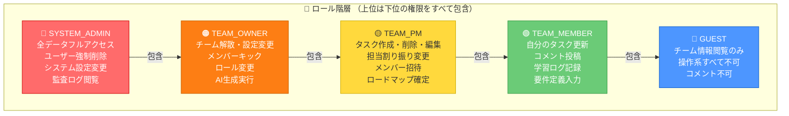
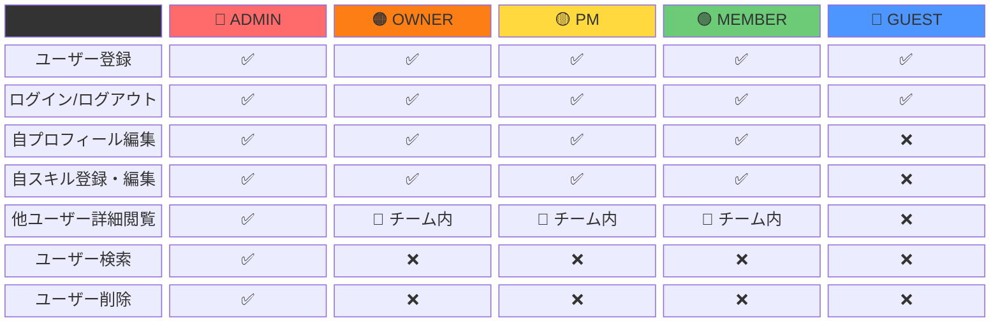
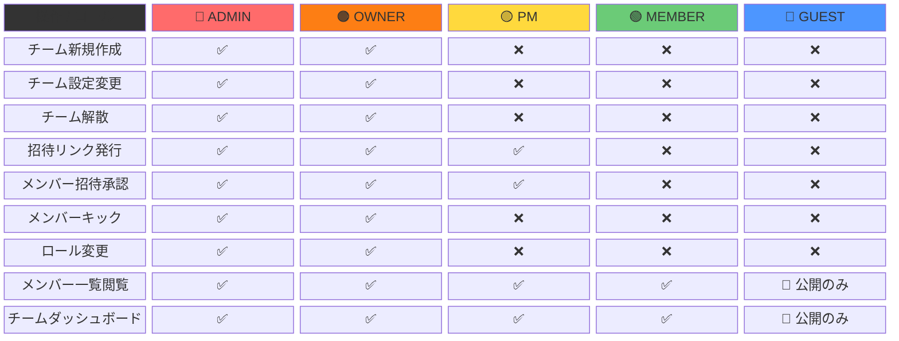
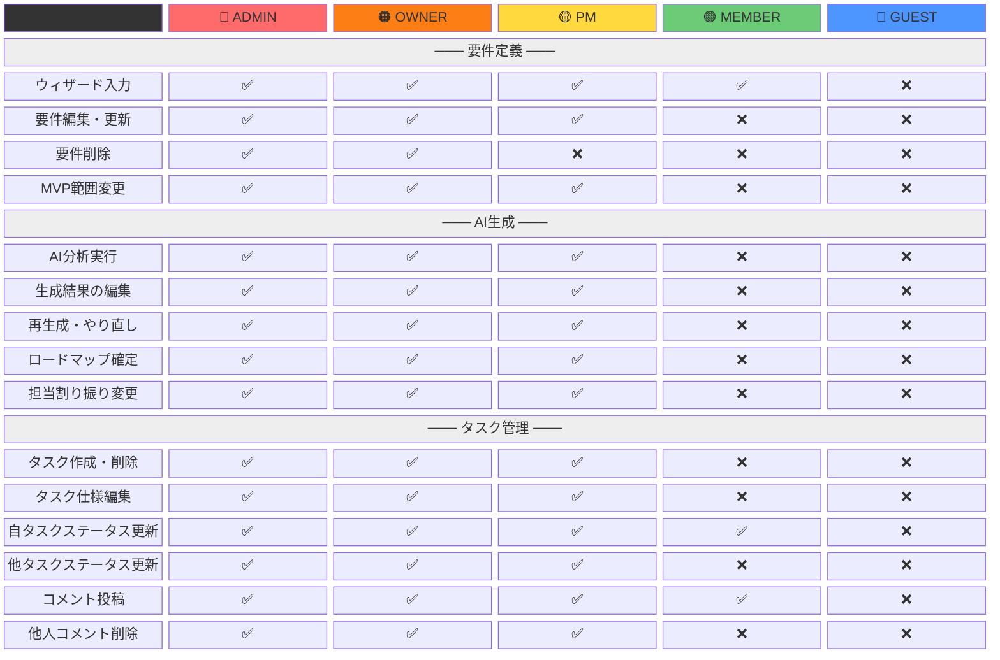
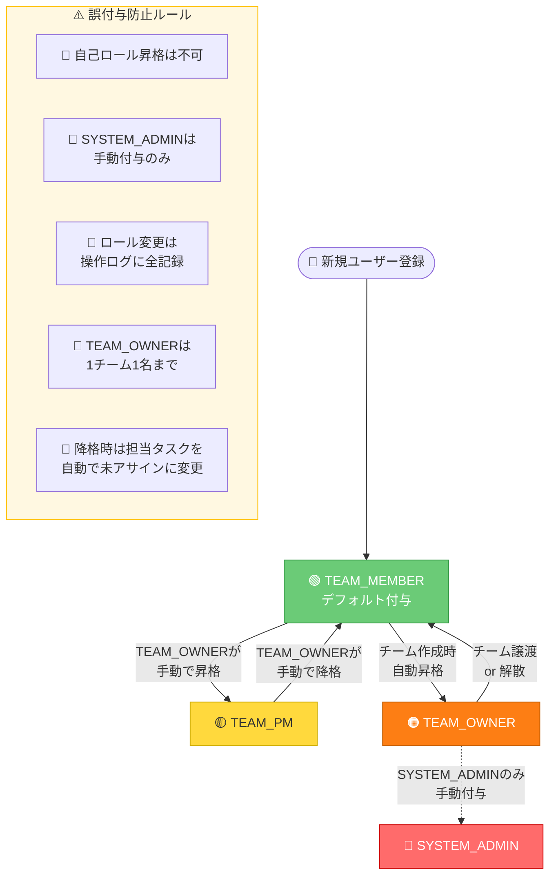
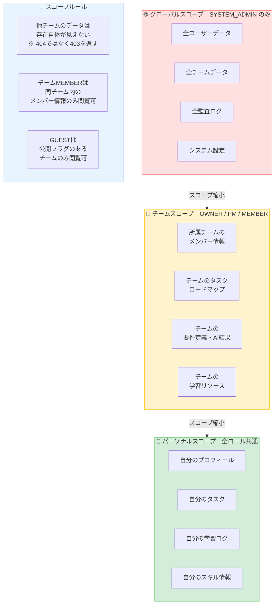
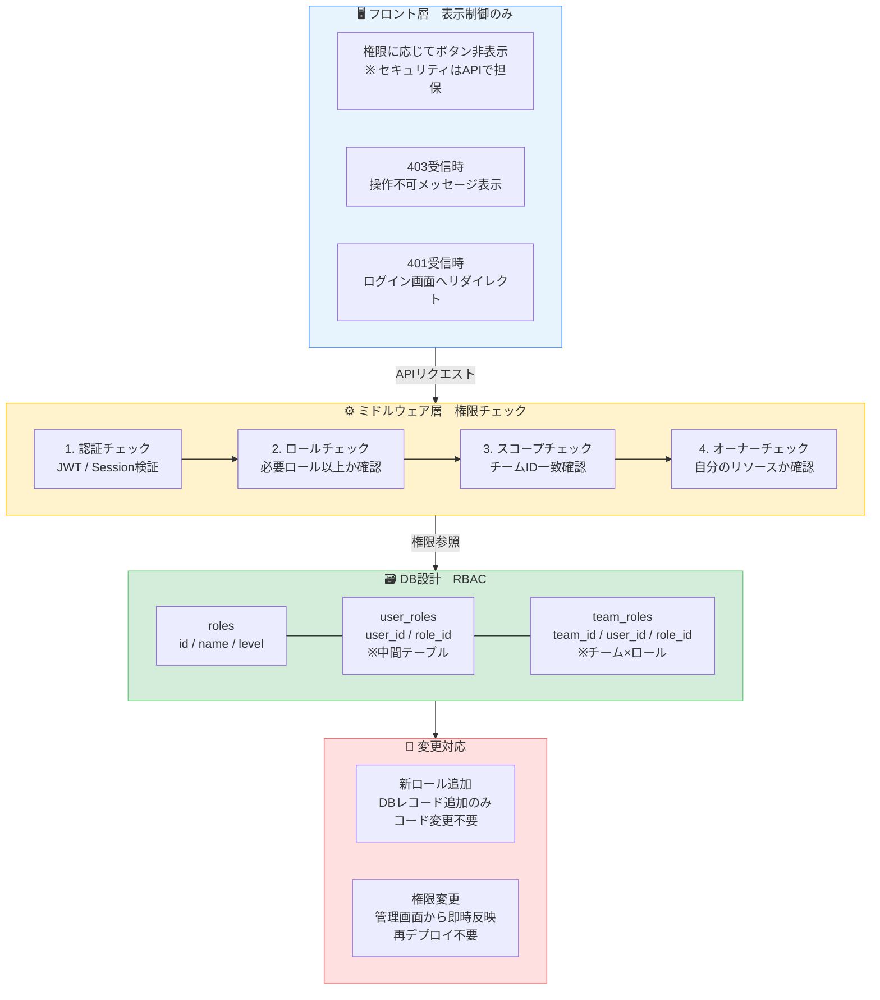
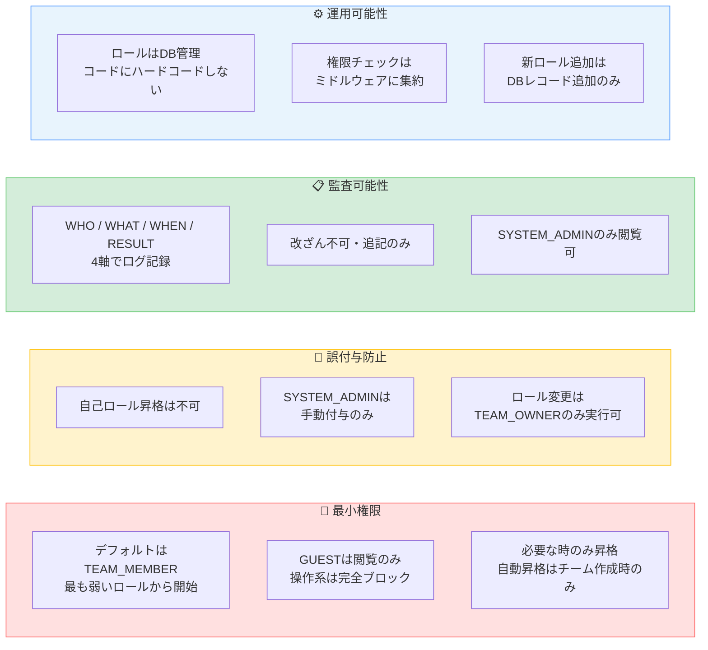

# 権限設計書

> 達成目標：最小権限 / 誤付与防止 / 監査可能性 / 運用可能性

---

## 1. ロール定義・権限概要

---

## 2. 権限マトリクス（機能別）

### 2-1. 認証・ユーザー管理

### 2-2. チーム管理

### 2-3. 要件定義 / AI生成 / タスク管理

---

## 3. ロール遷移ルール（誤付与防止）

---

## 4. スコープ設計（リソースの見える範囲）

---

## 5. 監査ログ設計

```mermaid
flowchart LR
    subgraph TRIGGER["🎯 記録トリガー（アクション）"]
        direction TB
        T1["🔐 認証系\nログイン成功・失敗\nPWリセット\nアカウント削除"]
        T2["👥 チーム系\nチーム作成・解散\nメンバー招待・キック\nロール変更"]
        T3["📋 要件・AI系\n要件定義 作成・編集・削除\nAI生成実行\nロードマップ確定・変更"]
        T4["✅ タスク系\nタスク作成・削除\nステータス変更\n担当変更"]
        T5["⚙️ 管理系\nSYSTEM_ADMIN操作全件\n権限設定変更"]
    end

    subgraph STRUCTURE["📦 ログデータ構造"]
        direction TB
        WHO["👤 WHO\nuser_id\nemail\nrole_at_the_time"]
        WHAT["🔍 WHAT\naction_type\nresource_type\nresource_id"]
        WHEN["⏰ WHEN\ntimestamp_utc\nsession_id"]
        RESULT["📊 RESULT\nsuccess / failure\nerror_code"]
    end

    subgraph POLICY["🗄️ 保持ポリシー"]
        direction TB
        P1["通常ログ\n90日間保持"]
        P2["管理者操作ログ\n1年間保持"]
        P3["セキュリティ系\n永続保持"]
    end

    subgraph ACCESS["🔒 閲覧ルール"]
        direction TB
        A1["SYSTEM_ADMINのみ閲覧可"]
        A2["ダウンロード不可"]
        A3["改ざん不可\n追記のみ"]
    end

    TRIGGER -->|"イベント発火"| STRUCTURE -->|"DB書き込み"| POLICY
    POLICY -->|"アクセス制御"| ACCESS

    style TRIGGER fill:#fff3cd,stroke:#ffc107
    style STRUCTURE fill:#d4edda,stroke:#6bcb77
    style POLICY fill:#e8f4fd,stroke:#4d96ff
    style ACCESS fill:#ffe0e0,stroke:#ff6b6b
```

---

## 6. 実装アーキテクチャ（運用可能性）

---

## 7. 権限設計サマリー

