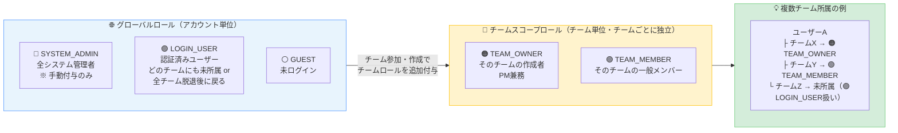
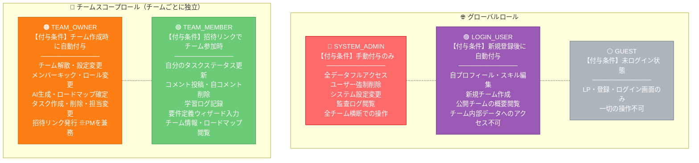
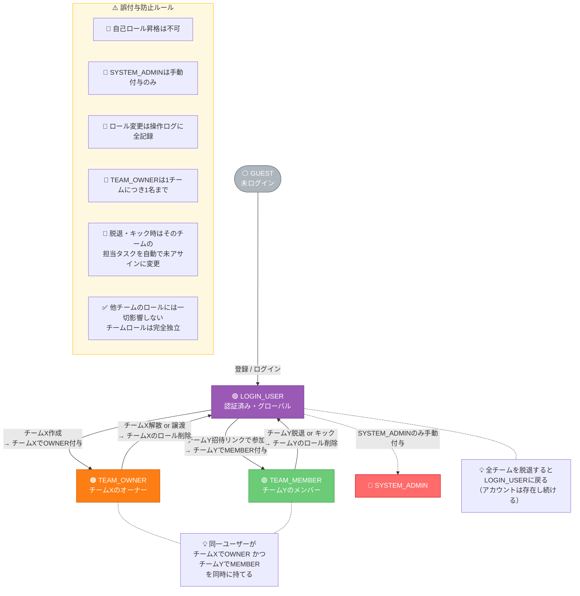
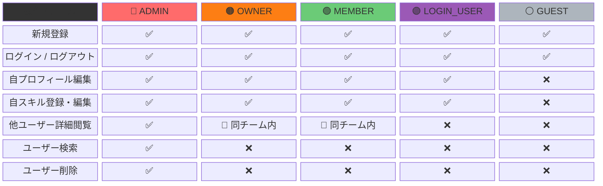
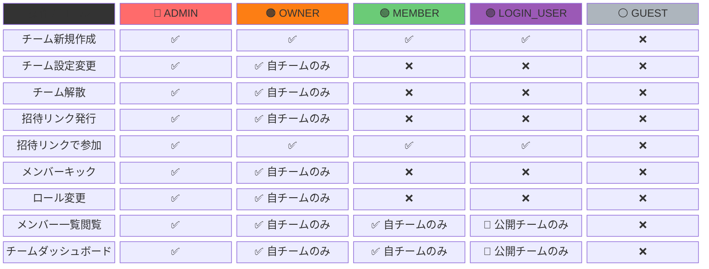
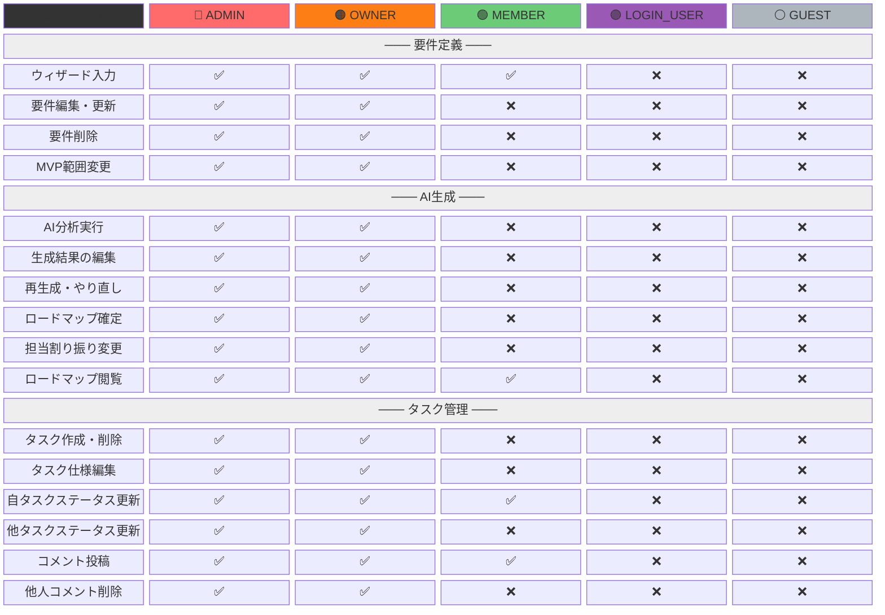
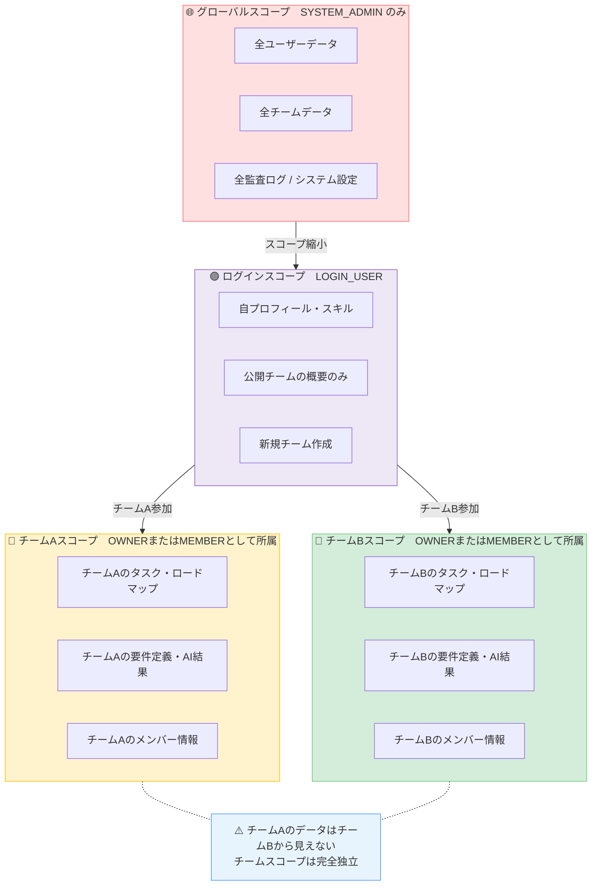
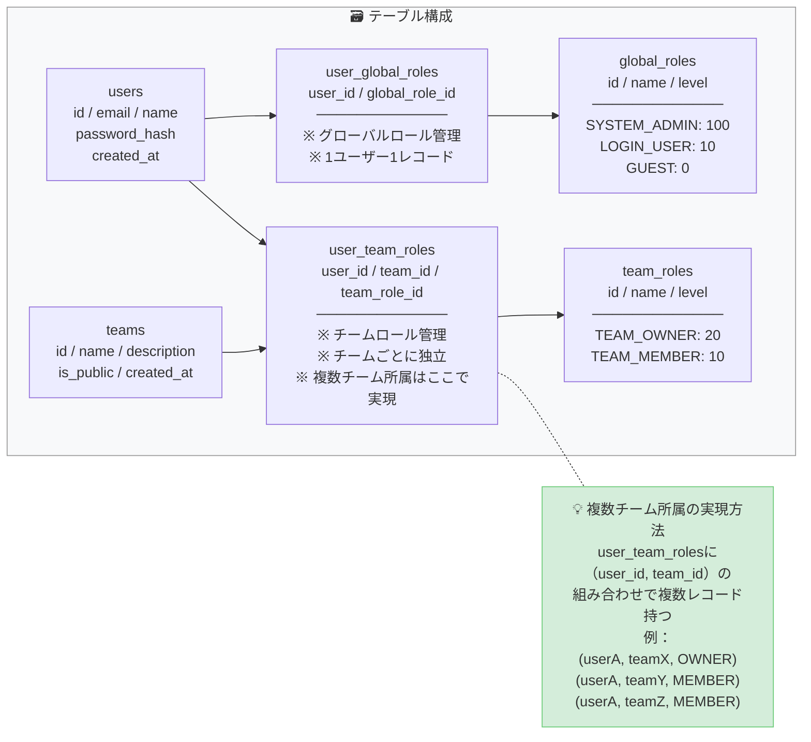
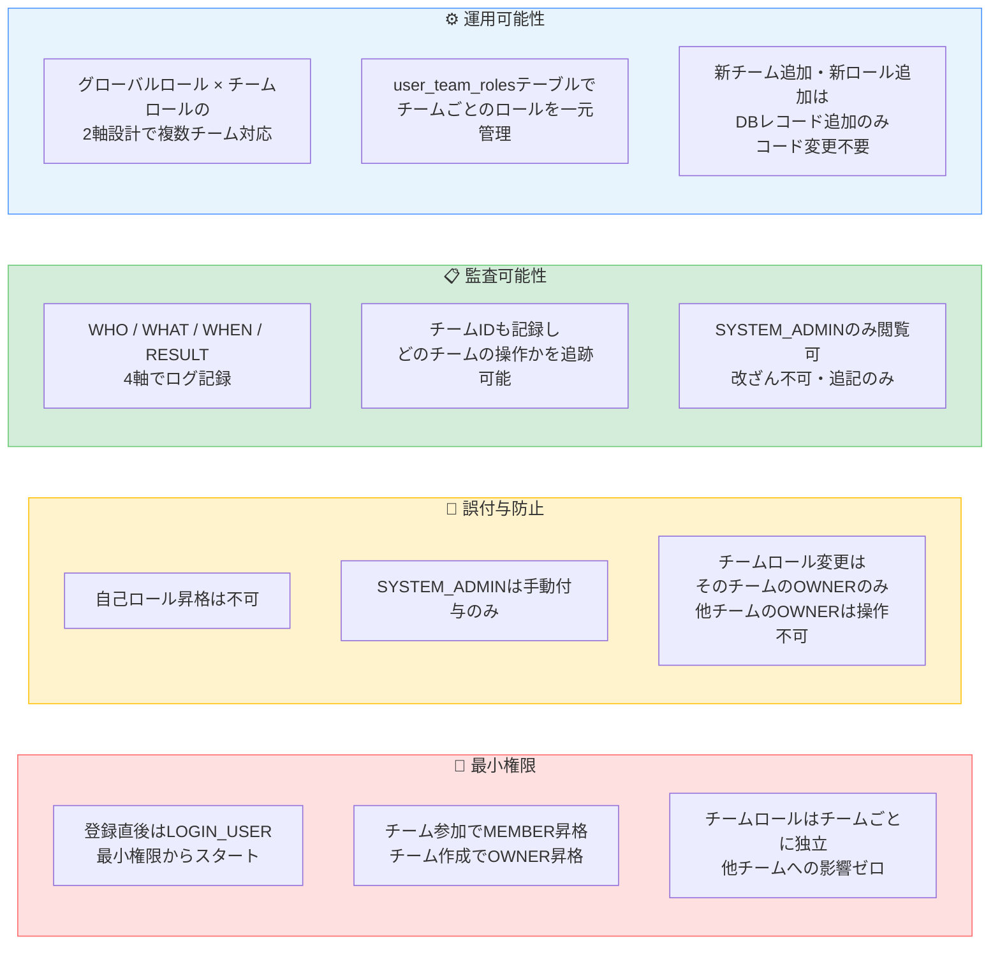

# 権限設計書 v5

> 達成目標：最小権限 / 誤付与防止 / 監査可能性 / 運用可能性
> **v5変更点：複数チーム所属に対応。グローバルロール × チームスコープロールの2軸設計に変更。**

---

## 1. ロール2軸設計の概念

---

## 2. ロール定義一覧

---

## 3. ロール取得・遷移フロー（複数チーム対応）

---

## 4. 権限マトリクス（機能別）

### 4-1. 認証・ユーザー管理

### 4-2. チーム管理

### 4-3. 要件定義 / AI生成 / タスク管理

---

## 5. スコープ設計（複数チーム対応）

---

## 6. DB設計（2軸ロール対応）

---

## 7. 権限設計サマリー

