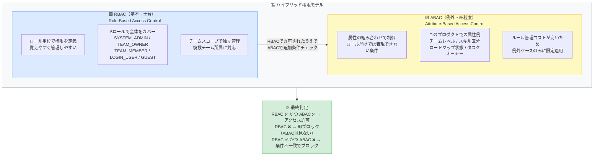
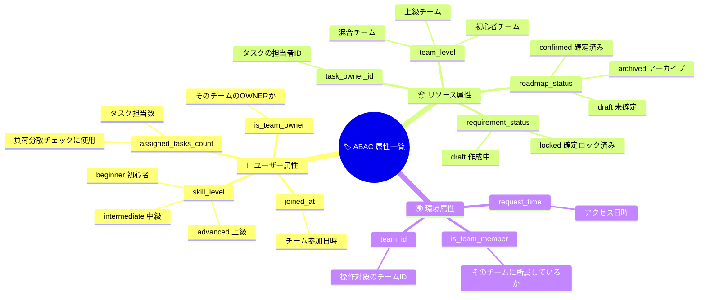
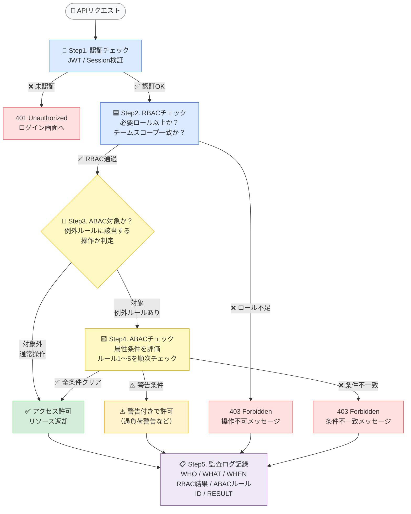
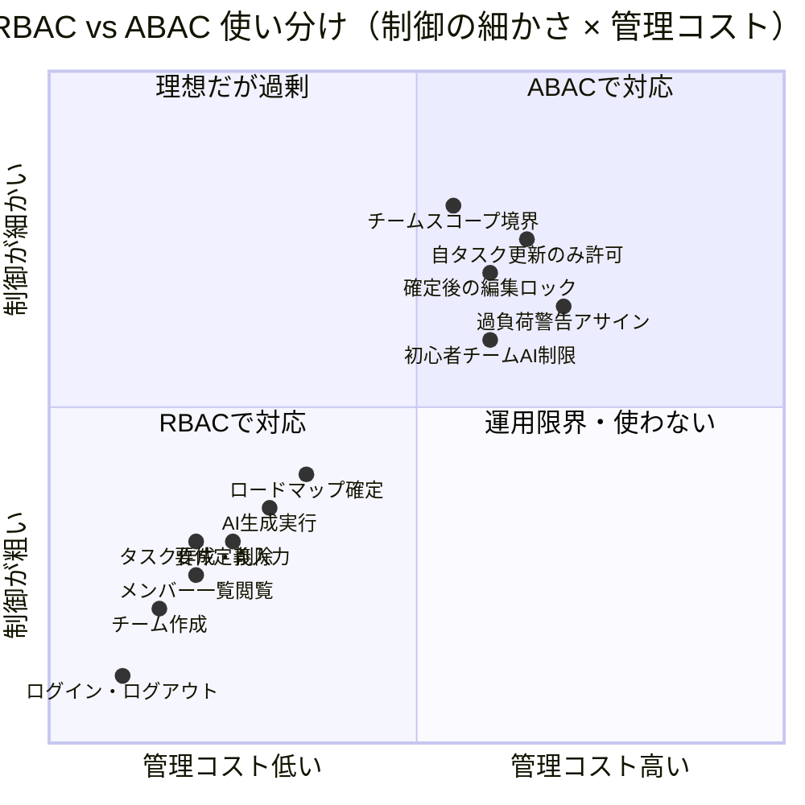
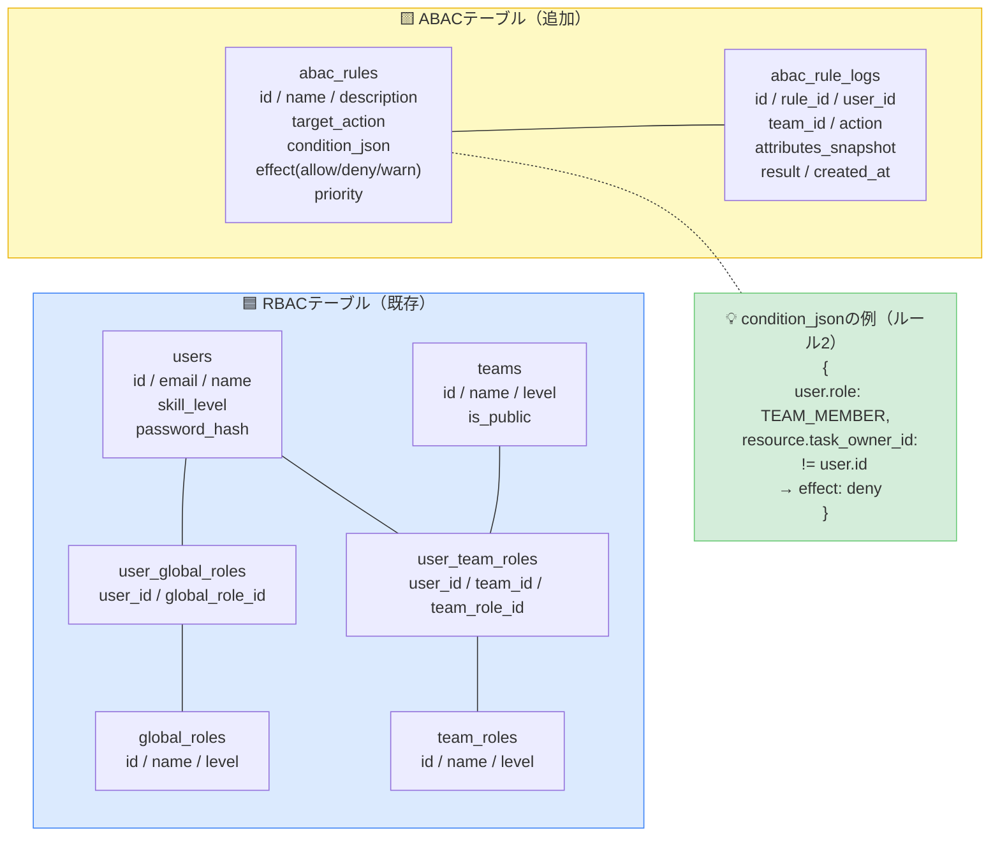
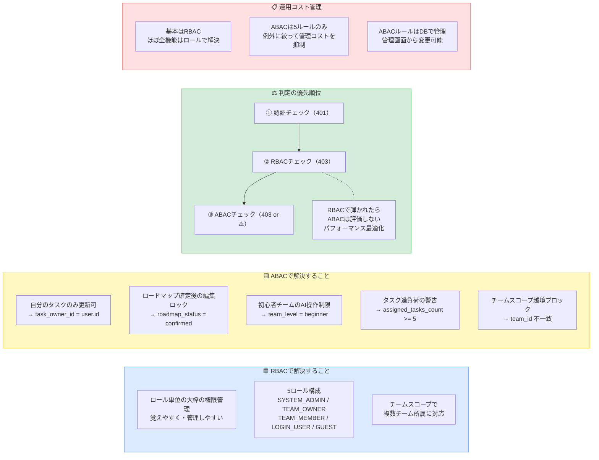

# 権限設計書 v6

> 達成目標：最小権限 / 誤付与防止 / 監査可能性 / 運用可能性
> **v6変更点：RBAC（基本）+ ABAC（例外・細粒度制御）のハイブリッド設計を追加。**

---

## 1. RBAC × ABAC ハイブリッド設計の全体像

---

## 2. このプロダクトで使う属性一覧（ABAC）

---

## 3. ABAC ルール定義（例外ケース）

```mermaid
flowchart TD
    subgraph RULE1["📌 ルール1：ロードマップ確定後の要件定義ロック"]
        R1C["条件\nroadmap_status = confirmed\nかつ\nユーザーロール = TEAM_MEMBER"]
        R1A["結果\n要件定義の編集・削除 → ❌ ブロック\n※ RBACでは TEAM_MEMBERは元々編集不可\n　 OWNERも確定後は編集不可にしたい場合に使用"]
        R1C --> R1A
    end

    subgraph RULE2["📌 ルール2：自分のタスクのみステータス変更可"]
        R2C["条件\ntask_owner_id = 操作ユーザーのuser_id\nかつ\nユーザーロール = TEAM_MEMBER"]
        R2A["結果\n自分のタスクのみ更新 → ✅ 許可\n他人のタスク更新 → ❌ ブロック\n※ RBACだけでは「自分のタスクのみ」を表現できない"]
        R2C --> R2A
    end

    subgraph RULE3["📌 ルール3：チームレベルによるAI再生成制限"]
        R3C["条件\nteam_level = beginner\nかつ\nユーザーロール = TEAM_MEMBER"]
        R3A["結果\nAI再生成 → ❌ ブロック\n（初心者チームはOWNERのみ再生成可）\n※ 初心者の誤操作・コスト爆発防止"]
        R3C --> R3A
    end

    subgraph RULE4["📌 ルール4：タスク過負荷ブロック"]
        R4C["条件\nassigned_tasks_count >= 5\nかつ\nユーザーロール = TEAM_OWNER（担当割り振り時）"]
        R4A["結果\n追加アサイン → ⚠️ 警告表示\n（強制ブロックではなく警告）\n※ できる人への負荷集中を防ぐ"]
        R4C --> R4A
    end

    subgraph RULE5["📌 ルール5：チームスコープ境界の強制"]
        R5C["条件\nrequest_team_id ≠ user所属チームID\nかつ\nユーザーロール = TEAM_OWNER or TEAM_MEMBER"]
        R5A["結果\n他チームのリソース操作 → ❌ 403ブロック\n存在自体を見せない\n※ 複数チーム所属時の越境アクセス防止"]
        R5C --> R5A
    end

    style RULE1 fill:#dbeafe,stroke:#3b82f6
    style RULE2 fill:#fef9c3,stroke:#eab308
    style RULE3 fill:#ffe0e0,stroke:#ff6b6b
    style RULE4 fill:#d4edda,stroke:#6bcb77
    style RULE5 fill:#ede7f6,stroke:#9b59b6
```

---

## 4. 権限判定フロー（リクエストごとの処理）

---

## 5. RBAC vs ABAC 使い分けマップ

---

## 6. DB設計（ABAC対応追加）

---

## 7. 設計サマリー（RBAC + ABAC）

