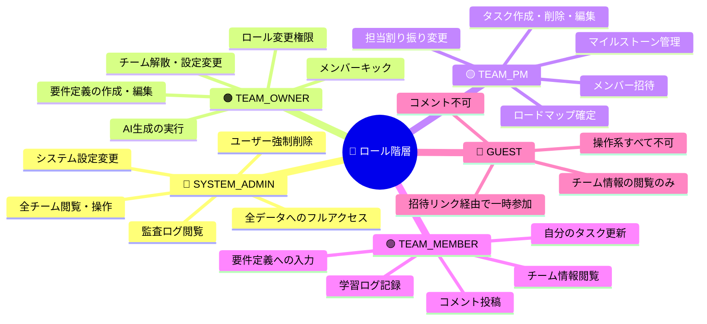
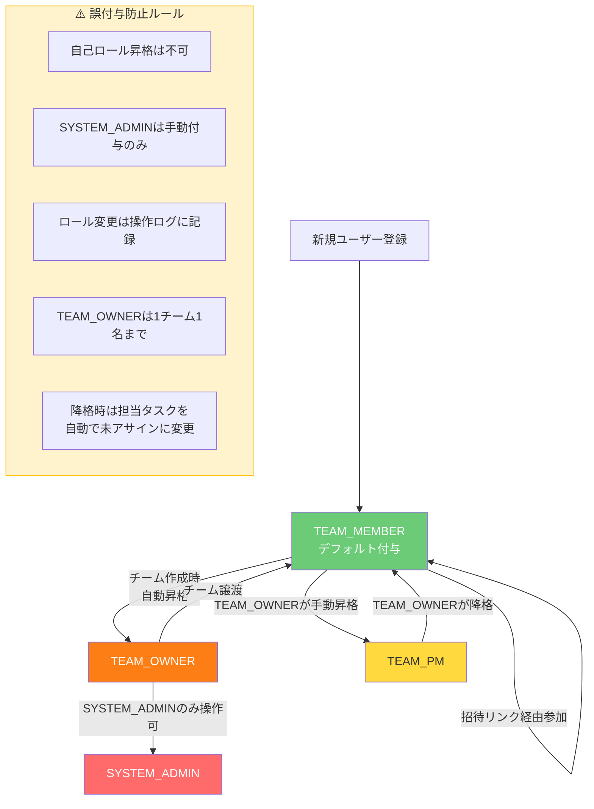
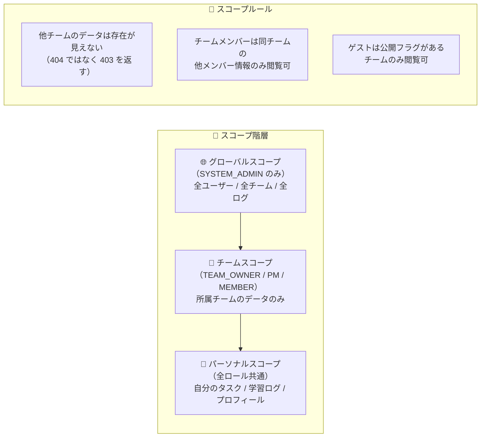
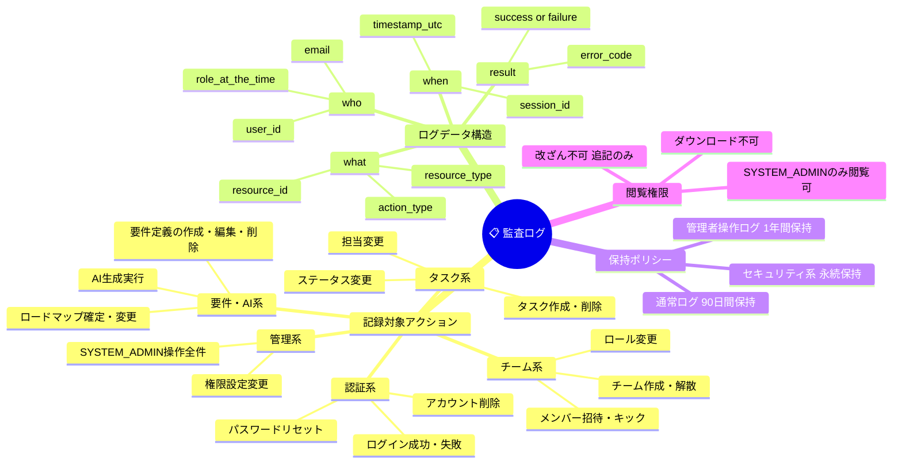
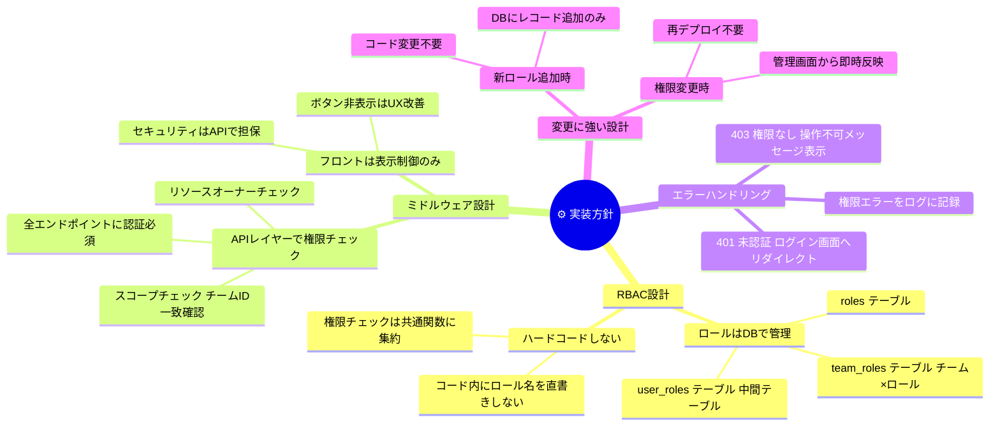

# 権限設計書

> 達成目標：最小権限 / 誤付与防止 / 監査可能性 / 運用可能性

---

## 1. ロール定義

---

## 2. 画面 × ロール 権限マトリクス

### 2-1. 認証・ユーザー管理

| 画面・操作 | SYSTEM_ADMIN | TEAM_OWNER | TEAM_PM | TEAM_MEMBER | GUEST |
|-----------|:---:|:---:|:---:|:---:|:---:|
| ユーザー登録 | ✅ | ✅ | ✅ | ✅ | ✅ |
| ログイン / ログアウト | ✅ | ✅ | ✅ | ✅ | ✅ |
| 自分のプロフィール編集 | ✅ | ✅ | ✅ | ✅ | ❌ |
| 自分のスキル登録・編集 | ✅ | ✅ | ✅ | ✅ | ❌ |
| 他ユーザー詳細閲覧 | ✅ | 🔶チーム内のみ | 🔶チーム内のみ | 🔶チーム内のみ | ❌ |
| ユーザー検索 | ✅ | ❌ | ❌ | ❌ | ❌ |
| ユーザー削除 | ✅ | ❌ | ❌ | ❌ | ❌ |

### 2-2. チーム管理

| 画面・操作 | SYSTEM_ADMIN | TEAM_OWNER | TEAM_PM | TEAM_MEMBER | GUEST |
|-----------|:---:|:---:|:---:|:---:|:---:|
| チーム新規作成 | ✅ | ✅ | ❌ | ❌ | ❌ |
| チーム設定変更 | ✅ | ✅ | ❌ | ❌ | ❌ |
| チーム解散 | ✅ | ✅ | ❌ | ❌ | ❌ |
| 招待リンク発行 | ✅ | ✅ | ✅ | ❌ | ❌ |
| メンバー招待承認 | ✅ | ✅ | ✅ | ❌ | ❌ |
| メンバーキック | ✅ | ✅ | ❌ | ❌ | ❌ |
| ロール変更 | ✅ | ✅ | ❌ | ❌ | ❌ |
| メンバー一覧閲覧 | ✅ | ✅ | ✅ | ✅ | 🔶公開チームのみ |
| チームダッシュボード閲覧 | ✅ | ✅ | ✅ | ✅ | 🔶公開チームのみ |

### 2-3. 要件定義

| 画面・操作 | SYSTEM_ADMIN | TEAM_OWNER | TEAM_PM | TEAM_MEMBER | GUEST |
|-----------|:---:|:---:|:---:|:---:|:---:|
| 要件定義ウィザード入力 | ✅ | ✅ | ✅ | ✅ | ❌ |
| 要件定義の編集・更新 | ✅ | ✅ | ✅ | ❌ | ❌ |
| 要件定義の削除 | ✅ | ✅ | ❌ | ❌ | ❌ |
| 要件定義の閲覧 | ✅ | ✅ | ✅ | ✅ | ❌ |
| MVP範囲の変更 | ✅ | ✅ | ✅ | ❌ | ❌ |

### 2-4. AI生成・ロードマップ

| 画面・操作 | SYSTEM_ADMIN | TEAM_OWNER | TEAM_PM | TEAM_MEMBER | GUEST |
|-----------|:---:|:---:|:---:|:---:|:---:|
| AI分析実行 | ✅ | ✅ | ✅ | ❌ | ❌ |
| AI生成結果の編集 | ✅ | ✅ | ✅ | ❌ | ❌ |
| AI再生成（やり直し） | ✅ | ✅ | ✅ | ❌ | ❌ |
| ロードマップ確定 | ✅ | ✅ | ✅ | ❌ | ❌ |
| ロードマップ閲覧 | ✅ | ✅ | ✅ | ✅ | ❌ |
| 担当割り振り変更 | ✅ | ✅ | ✅ | ❌ | ❌ |

### 2-5. タスク管理

| 画面・操作 | SYSTEM_ADMIN | TEAM_OWNER | TEAM_PM | TEAM_MEMBER | GUEST |
|-----------|:---:|:---:|:---:|:---:|:---:|
| タスク作成 | ✅ | ✅ | ✅ | ❌ | ❌ |
| タスク削除 | ✅ | ✅ | ✅ | ❌ | ❌ |
| タスク編集（仕様・説明） | ✅ | ✅ | ✅ | ❌ | ❌ |
| 自分のタスクステータス更新 | ✅ | ✅ | ✅ | ✅ | ❌ |
| 他人のタスクステータス更新 | ✅ | ✅ | ✅ | ❌ | ❌ |
| タスクへのコメント | ✅ | ✅ | ✅ | ✅ | ❌ |
| コメント削除（自分） | ✅ | ✅ | ✅ | ✅ | ❌ |
| コメント削除（他人） | ✅ | ✅ | ✅ | ❌ | ❌ |
| タスク閲覧 | ✅ | ✅ | ✅ | ✅ | ❌ |

### 2-6. 学習・支援

| 画面・操作 | SYSTEM_ADMIN | TEAM_OWNER | TEAM_PM | TEAM_MEMBER | GUEST |
|-----------|:---:|:---:|:---:|:---:|:---:|
| 学習リソース閲覧 | ✅ | ✅ | ✅ | ✅ | ❌ |
| カスタム教材追加（チーム共有） | ✅ | ✅ | ✅ | ❌ | ❌ |
| 自分の学習ログ記録 | ✅ | ✅ | ✅ | ✅ | ❌ |
| 他人の学習ログ閲覧 | ✅ | ✅ | ✅ | 🔶チーム内のみ | ❌ |
| 質問テンプレート送信 | ✅ | ✅ | ✅ | ✅ | ❌ |

### 2-7. 運用・管理（SYSTEM_ADMIN専用）

| 画面・操作 | SYSTEM_ADMIN | それ以外 |
|-----------|:---:|:---:|
| 全チーム一覧閲覧 | ✅ | ❌ |
| 監査ログ閲覧 | ✅ | ❌ |
| ユーザー強制削除 | ✅ | ❌ |
| AI APIコスト確認 | ✅ | ❌ |
| システム設定変更 | ✅ | ❌ |

> 🔶 = 条件付き許可

---

## 3. ロール遷移ルール（誤付与防止）

---

## 4. スコープ設計（リソースの見える範囲）

---

## 5. 監査ログ設計

---

## 6. 実装ガイドライン（運用可能性）

---

## 7. 権限設計サマリー

| 達成目標 | 設計で対応した内容 |
|---------|----------------|
| **最小権限** | デフォルトはTEAM_MEMBER（最弱）、必要時のみ昇格。GUESTは閲覧のみ |
| **誤付与防止** | 自己昇格不可・SYSTEM_ADMINは手動のみ・ロール変更はTEAM_OWNERのみ |
| **監査可能性** | who/what/when/resultの4軸でログ記録・改ざん不可・閲覧はADMINのみ |
| **運用可能性** | ロールはDB管理・権限チェックは共通関数集約・新ロール追加はレコード追加のみ |
