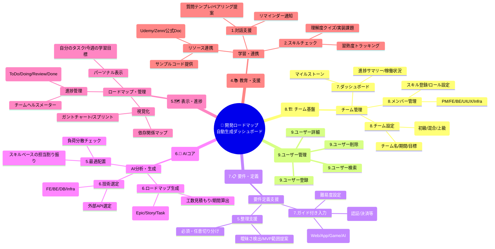
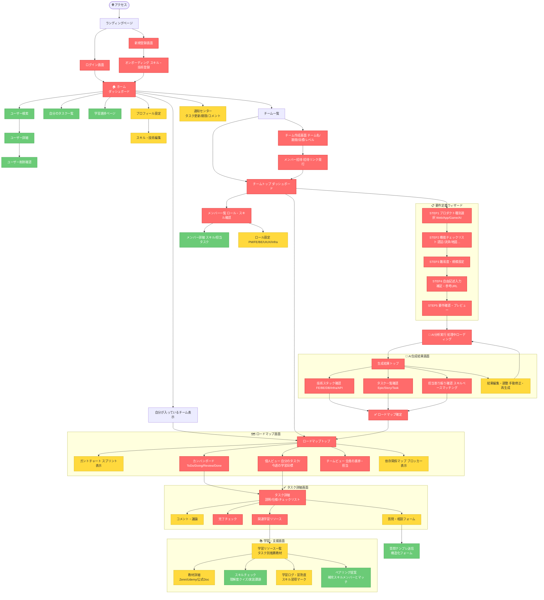
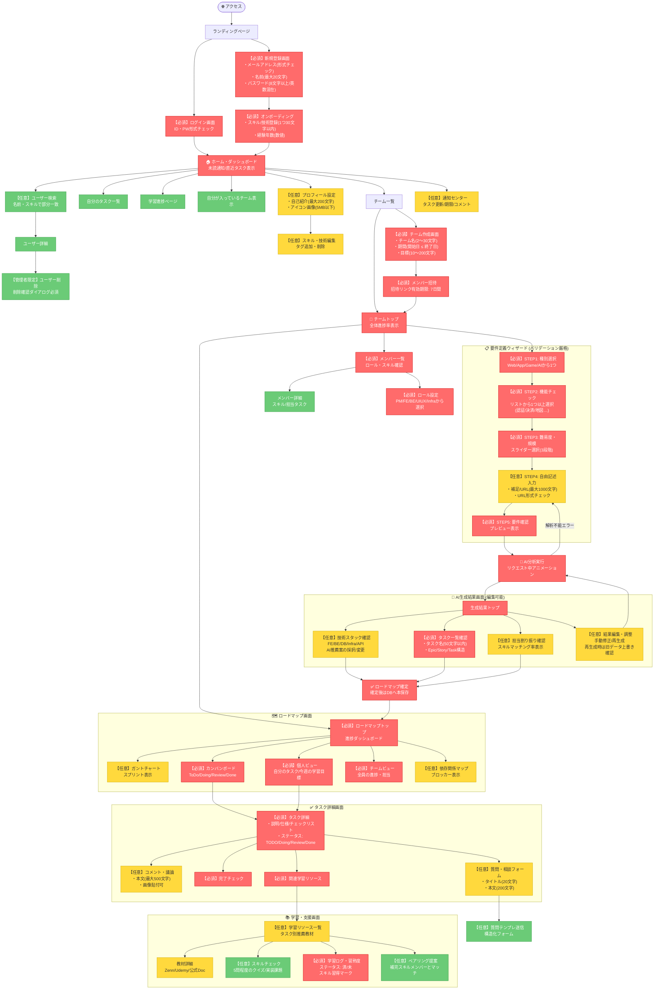
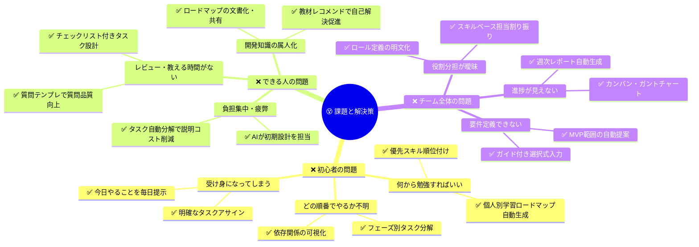

# 開発ロードマップ自動生成ダッシュボード

##　mindmap

```mermaid
mindmap
  root((🧭 開発ロードマップ<br/>自動生成ダッシュボード))
    (8.🏗️ チーム基盤)
        ::icon(fa fa-users)
        チーム管理
            8.チーム設定
                チーム名/期間/目標
                レベル選定(初級/混合/上級)
            8.メンバー管理
                スキル登録/ロール設定
                PM/FE/BE/UIUX/Infra
            7.ダッシュボード
                進捗サマリー/稼働状況
                マイルストーン
    
  
    (9.ユーザー管理)
        ::icon(fa fa-clipboard-list)
          9.ユーザー登録
          9.ユーザー検索
          9.ユーザー詳細
          9.ユーザー削除


    (7.📋 要件・定義)
        ::icon(fa fa-clipboard-list)
        要件定義支援
            7.ガイド付き入力
                種別選択(Web/App/Game/AI)
                機能チェックリスト(認証/決済等)
                難易度設定
            5.整理支援
                曖昧さ検出/MVP範囲提案
                必須・任意切り分け

    (6.🤖 AIコア)
        ::icon(fa fa-robot)
        AI分析・生成
            6.技術選定
                Stack推薦(FE/BE/DB/Infra)
                外部API選定
            6.ロードマップ生成
                タスク分解(Epic/Story/Task)
                工数見積もり/期間算出
            5.最適配置
                スキルベースの担当割り振り
                負荷分散チェック

    (5.🗺️ 表示・進捗)
        ::icon(fa fa-map)
        ロードマップ・管理
            視覚化
                ガントチャート/スプリント
                依存関係マップ
            進捗管理
                カンバン(ToDo/Doing/Review/Done)
                チームヘルスメーター
            パーソナル表示
                自分のタスク/今週の学習目標

    (4.📚 教育・支援)
        ::icon(fa fa-book)
        学習・連携
            リソース連携
                教材推薦(Udemy/Zenn/公式Doc)
                サンプルコード提供
            2.スキルチェック
                理解度クイズ/実装課題
                習熟度トラッキング
            1.対話支援
                質問テンプレ/ペアリング提案
                リマインダー通知

```

## 画面フロー

```mermaid
flowchart TD
    %% ===== 認証 =====
    START([🌐 アクセス]) --> LP[ランディングページ]
    LP --> LOGIN[ログイン画面]
    LP --> REGISTER[新規登録画面]
    REGISTER --> ONBOARD[オンボーディング スキル・技術登録]
    LOGIN --> HOME
    ONBOARD --> HOME

    %% ===== ホーム =====
    HOME[🏠 ホーム\nダッシュボード]
    HOME --> TEAM_LIST[チーム一覧]
    HOME --> MY_TASK[自分のタスク一覧]
    HOME --> MY_LEARN[学習進捗ページ]
    HOME --> MY_TEAM[自分が入っているチーム表示]
    MY_TEAM --> ROADMAP_TOP

    %% ===== 1. ユーザー管理 =====
    HOME --> USER_SEARCH[ユーザー検索]
    USER_SEARCH --> USER_DETAIL[ユーザー詳細]
    USER_DETAIL --> USER_DELETE[ユーザー削除確認]

    HOME --> MY_PROFILE[プロフィール設定]
    MY_PROFILE --> SKILL_EDIT[スキル・技術編集]

    %% ===== 2. チーム基盤 =====
    TEAM_LIST --> TEAM_CREATE[チーム作成画面 チーム名/期間/目標/レベル]
    TEAM_LIST --> TEAM_TOP

    TEAM_CREATE --> TEAM_INVITE[メンバー招待 招待リンク発行]
    TEAM_INVITE --> TEAM_TOP[チームトップ ダッシュボード]
    TEAM_TOP --> ROADMAP_TOP

    TEAM_TOP --> MEMBER_LIST[メンバー一覧 ロール・スキル確認]
    MEMBER_LIST --> MEMBER_DETAIL[メンバー詳細 スキル/担当タスク]
    MEMBER_LIST --> ROLE_EDIT[ロール設定 PM/FE/BE/UIUX/Infra]

    %% ===== 3. 要件定義 =====
    TEAM_TOP --> REQ_WIZARD

    subgraph REQ["📋 要件定義ウィザード"]
        REQ_WIZARD[STEP1 プロダクト種別選択 Web/App/Game/AI]
        --> REQ_CHECK[STEP2 機能チェックリスト 認証/決済/地図…]
        --> REQ_LEVEL[STEP3 難易度・規模設定]
        --> REQ_FREE[STEP4 自由記述入力\n補足・参考URL]
        --> REQ_CONFIRM[STEP5 要件確認・プレビュー]
    end

    REQ_CONFIRM --> AI_EXEC[🤖 AI分析実行 処理中ローディング]

    %% ===== 4. AI生成結果 =====
    AI_EXEC --> AI_RESULT

    subgraph AI["🤖 AI生成結果画面"]
        AI_RESULT[生成結果トップ]
        AI_RESULT --> STACK_VIEW[技術スタック確認 FE/BE/DB/Infra/API]
        AI_RESULT --> TASK_VIEW[タスク一覧確認 Epic/Story/Task]
        AI_RESULT --> ASSIGN_VIEW[担当割り振り確認 スキルベースマッチング]
        AI_RESULT --> ROADMAP_EDIT[結果編集・調整 手動修正・再生成]
    end

    ROADMAP_EDIT --> AI_EXEC
    STACK_VIEW --> ROADMAP_CONFIRM[✅ ロードマップ確定]
    TASK_VIEW --> ROADMAP_CONFIRM
    ASSIGN_VIEW --> ROADMAP_CONFIRM

    %% ===== 5. ロードマップ・進捗 =====
    ROADMAP_CONFIRM --> ROADMAP_TOP

    subgraph ROAD["🗺️ ロードマップ画面"]
        ROADMAP_TOP[ロードマップトップ]
        ROADMAP_TOP --> GANTT[ガントチャート スプリント表示]
        ROADMAP_TOP --> KANBAN[カンバンボード ToDo/Doing/Review/Done]
        ROADMAP_TOP --> PERSONAL[個人ビュー 自分のタスク/今週の学習目標]
        ROADMAP_TOP --> TEAM_VIEW[チームビュー 全員の進捗・担当]
        ROADMAP_TOP --> DEP_MAP[依存関係マップ ブロッカー表示]
    end

    KANBAN --> TASK_DETAIL
    PERSONAL --> TASK_DETAIL

    subgraph TASK["✅ タスク詳細画面"]
        TASK_DETAIL[タスク詳細\n説明/仕様/チェックリスト]
        TASK_DETAIL --> TASK_COMMENT[コメント・議論]
        TASK_DETAIL --> TASK_DONE[完了チェック]
        TASK_DETAIL --> TASK_LEARN[関連学習リソース]
        TASK_DETAIL --> TASK_HELP[質問・相談フォーム]
    end

    %% ===== 6. 学習・支援 =====
    TASK_LEARN --> LEARN_TOP

    subgraph LEARN["📚 学習・支援画面"]
        LEARN_TOP[学習リソース一覧\nタスク別推薦教材]
        LEARN_TOP --> MATERIAL[教材詳細\nZenn/Udemy/公式Doc]
        LEARN_TOP --> SKILL_CHECK[スキルチェック\n理解度クイズ/実装課題]
        LEARN_TOP --> SKILL_LOG[学習ログ・習熟度\nスキル習得マーク]
        LEARN_TOP --> PAIR[ペアリング提案\n補完スキルメンバーとマッチ]
    end

    TASK_HELP --> QUESTION[質問テンプレ送信\n構造化フォーム]

    %% ===== 通知 =====
    HOME --> NOTIFY[通知センター\nタスク更新/期限/コメント]

    %% ===== スタイル =====
    classDef p0 fill:#ff6b6b,color:#fff,stroke:#cc0000
    classDef p1 fill:#ffd93d,color:#333,stroke:#ccaa00
    classDef p2 fill:#6bcb77,color:#fff,stroke:#339944
    classDef neutral fill:#4d96ff,color:#fff,stroke:#0055cc
    classDef sub fill:#f8f9fa,color:#333,stroke:#999

    class LOGIN,REGISTER,ONBOARD,HOME p0
    class TEAM_CREATE,TEAM_INVITE,TEAM_TOP,MEMBER_LIST p0
    class REQ_WIZARD,REQ_CHECK,REQ_LEVEL,REQ_FREE,REQ_CONFIRM p0
    class AI_EXEC,AI_RESULT,STACK_VIEW,TASK_VIEW,ASSIGN_VIEW p0
    class ROADMAP_CONFIRM,ROADMAP_TOP,KANBAN,PERSONAL,TEAM_VIEW p0
    class TASK_DETAIL,TASK_DONE,TASK_LEARN p0

    class MY_PROFILE,SKILL_EDIT,ROLE_EDIT,ROADMAP_EDIT p1
    class GANTT,DEP_MAP,TASK_COMMENT,TASK_HELP p1
    class LEARN_TOP,MATERIAL,SKILL_LOG,NOTIFY p1

    class USER_SEARCH,USER_DETAIL,USER_DELETE p2
    class SKILL_CHECK,PAIR,QUESTION p2
    class MEMBER_DETAIL,MY_TASK,MY_LEARN p2
  
```

---

## 画面フロー概要

```mermaid
flowchart TD
    %% ===== 認証 =====
    START([🌐 アクセス]) --> LP[ランディングページ]
    LP --> LOGIN["【必須】ログイン画面\nID・PW形式チェック"]
    LP --> REGISTER["【必須】新規登録画面\n・メールアドレス(形式チェック)\n・名前(最大20文字)\n・パスワード(8文字以上/英数混在)"]
    REGISTER --> ONBOARD["【必須】オンボーディング\n・スキル/技術登録(1つ30文字以内)\n・経験年数(数値)"]
    LOGIN --> HOME
    ONBOARD --> HOME

    %% ===== ホーム =====
    HOME["🏠 ホーム・ダッシュボード\n未読通知/直近タスク表示"]
    HOME --> TEAM_LIST[チーム一覧]
    HOME --> MY_TASK[自分のタスク一覧]
    HOME --> MY_LEARN[学習進捗ページ]
    HOME --> MY_TEAM[自分が入っているチーム表示]

    %% ===== 1. ユーザー管理 =====
    HOME --> USER_SEARCH["【任意】ユーザー検索\n名前・スキルで部分一致"]
    USER_SEARCH --> USER_DETAIL[ユーザー詳細]
    USER_DETAIL --> USER_DELETE["【管理者限定】ユーザー削除\n削除確認ダイアログ必須"]

    HOME --> MY_PROFILE["【任意】プロフィール設定\n・自己紹介(最大200文字)\n・アイコン画像(5MB以下)"]
    MY_PROFILE --> SKILL_EDIT["【任意】スキル・技術編集\nタグ追加・削除"]

    %% ===== 2. チーム基盤 =====
    TEAM_LIST --> TEAM_CREATE["【必須】チーム作成画面\n・チーム名(2〜30文字)\n・期間(開始日 ≤ 終了日)\n・目標(10〜200文字)"]
    TEAM_LIST --> TEAM_TOP

    TEAM_CREATE --> TEAM_INVITE["【必須】メンバー招待\n招待リンク有効期限: 7日間"]
    TEAM_INVITE --> TEAM_TOP["🚩 チームトップ\n全体進捗率表示"]
    TEAM_TOP --> ROADMAP_TOP

    TEAM_TOP --> MEMBER_LIST["【必須】メンバー一覧\nロール・スキル確認"]
    MEMBER_LIST --> MEMBER_DETAIL["メンバー詳細\nスキル/担当タスク"]
    MEMBER_LIST --> ROLE_EDIT["【必須】ロール設定\nPM/FE/BE/UIUX/Infraから選択"]

    %% ===== 3. 要件定義 =====
    TEAM_TOP --> REQ_WIZARD

    subgraph REQ["📋 要件定義ウィザード (バリデーション厳格)"]
        REQ_WIZARD["【必須】STEP1: 種別選択\nWeb/App/Game/AIから1つ"]
        --> REQ_CHECK["【必須】STEP2: 機能チェック\nリストから1つ以上選択\n(認証/決済/地図…)"]
        --> REQ_LEVEL["【必須】STEP3: 難易度・規模\nスライダー選択(3段階)"]
        --> REQ_FREE["【任意】STEP4: 自由記述入力\n・補足/URL(最大1000文字)\n・URL形式チェック"]
        --> REQ_CONFIRM["【必須】STEP5: 要件確認\nプレビュー表示"]
    end

    REQ_CONFIRM --> AI_EXEC["🤖 AI分析実行\nリクエスト中アニメーション"]

    %% ===== 4. AI生成結果 =====
    AI_EXEC --> AI_RESULT
    AI_EXEC -- "解析不能エラー" --> REQ_FREE

    subgraph AI["🤖 AI生成結果画面 (編集可能)"]
        AI_RESULT[生成結果トップ]
        AI_RESULT --> STACK_VIEW["【任意】技術スタック確認\nFE/BE/DB/Infra/API\nAI推薦案の採択/変更"]
        AI_RESULT --> TASK_VIEW["【必須】タスク一覧確認\n・タスク名(50文字以内)\n・Epic/Story/Task構造"]
        AI_RESULT --> ASSIGN_VIEW["【任意】担当割り振り確認\nスキルマッチング率表示"]
        AI_RESULT --> ROADMAP_EDIT["【任意】結果編集・調整\n手動修正/再生成\n再生成時は旧データ上書き確認"]
    end

    ROADMAP_EDIT --> AI_EXEC
    STACK_VIEW --> ROADMAP_CONFIRM["✅ ロードマップ確定\n確定後はDBへ本保存"]
    TASK_VIEW --> ROADMAP_CONFIRM
    ASSIGN_VIEW --> ROADMAP_CONFIRM

    %% ===== 5. ロードマップ・進捗 =====
    ROADMAP_CONFIRM --> ROADMAP_TOP

    subgraph ROAD["🗺️ ロードマップ画面"]
        ROADMAP_TOP["【必須】ロードマップトップ\n進捗ダッシュボード"]
        ROADMAP_TOP --> GANTT["【任意】ガントチャート\nスプリント表示"]
        ROADMAP_TOP --> KANBAN["【必須】カンバンボード\nToDo/Doing/Review/Done"]
        ROADMAP_TOP --> PERSONAL["【必須】個人ビュー\n自分のタスク/今週の学習目標"]
        ROADMAP_TOP --> TEAM_VIEW["【必須】チームビュー\n全員の進捗・担当"]
        ROADMAP_TOP --> DEP_MAP["【任意】依存関係マップ\nブロッカー表示"]
    end

    KANBAN --> TASK_DETAIL
    PERSONAL --> TASK_DETAIL

    subgraph TASK["✅ タスク詳細画面"]
        TASK_DETAIL["【必須】タスク詳細\n・説明/仕様/チェックリスト\n・ステータス: TODO/Doing/Review/Done"]
        TASK_DETAIL --> TASK_COMMENT["【任意】コメント・議論\n・本文(最大500文字)\n・画像貼付可"]
        TASK_DETAIL --> TASK_DONE["【必須】完了チェック"]
        TASK_DETAIL --> TASK_LEARN["【必須】関連学習リソース"]
        TASK_DETAIL --> TASK_HELP["【任意】質問・相談フォーム\n・タイトル(20文字)\n・本文(200文字)"]
    end

    %% ===== 6. 学習・支援 =====
    TASK_LEARN --> LEARN_TOP

    subgraph LEARN["📚 学習・支援画面"]
        LEARN_TOP["【任意】学習リソース一覧\nタスク別推薦教材"]
        LEARN_TOP --> MATERIAL["教材詳細\nZenn/Udemy/公式Doc"]
        LEARN_TOP --> SKILL_CHECK["【任意】スキルチェック\n5問程度のクイズ/実装課題"]
        LEARN_TOP --> SKILL_LOG["【必須】学習ログ・習熟度\nステータス: 済/未\nスキル習得マーク"]
        LEARN_TOP --> PAIR["【任意】ペアリング提案\n補完スキルメンバーとマッチ"]
    end

    TASK_HELP --> QUESTION["【任意】質問テンプレ送信\n構造化フォーム"]

    %% ===== 通知 =====
    HOME --> NOTIFY["【任意】通知センター\nタスク更新/期限/コメント"]

    %% ===== スタイル =====
    classDef p0 fill:#ff6b6b,color:#fff,stroke:#cc0000
    classDef p1 fill:#ffd93d,color:#333,stroke:#ccaa00
    classDef p2 fill:#6bcb77,color:#fff,stroke:#339944
    classDef neutral fill:#4d96ff,color:#fff,stroke:#0055cc
    classDef sub fill:#f8f9fa,color:#333,stroke:#999

    class LOGIN,REGISTER,ONBOARD,HOME p0
    class TEAM_CREATE,TEAM_INVITE,TEAM_TOP,MEMBER_LIST p0
    class REQ_WIZARD,REQ_CHECK,REQ_LEVEL,REQ_CONFIRM p0
    class AI_EXEC,AI_RESULT,TASK_VIEW p0
    class ROADMAP_CONFIRM,ROADMAP_TOP,KANBAN,PERSONAL,TEAM_VIEW p0
    class TASK_DETAIL,TASK_DONE,TASK_LEARN,ROLE_EDIT p0
    class SKILL_LOG p0

    class MY_PROFILE,SKILL_EDIT,ROADMAP_EDIT,REQ_FREE p1
    class GANTT,DEP_MAP,TASK_COMMENT,TASK_HELP p1
    class LEARN_TOP,MATERIAL,NOTIFY p1
    class STACK_VIEW,ASSIGN_VIEW p1

    class USER_SEARCH,USER_DETAIL,USER_DELETE p2
    class SKILL_CHECK,PAIR,QUESTION p2
    class MEMBER_DETAIL,MY_TASK,MY_LEARN,MY_TEAM p2
```

---

## 解決する課題マップ

```mermaid
mindmap
  root((😵 課題と解決策))
    ❌ 初心者の問題
      何から勉強すればいい
        ✅ 個人別学習ロードマップ自動生成
        ✅ 優先スキル順位付け
      どの順番でやるか不明
        ✅ フェーズ別タスク分解
        ✅ 依存関係の可視化
      受け身になってしまう
        ✅ 明確なタスクアサイン
        ✅ 今日やることを毎日提示

    ❌ できる人の問題
      負担集中・疲弊
        ✅ AIが初期設計を担当
        ✅ タスク自動分解で説明コスト削減
      開発知識の属人化
        ✅ ロードマップの文書化・共有
        ✅ 教材レコメンドで自己解決促進
      レビュー・教える時間がない
        ✅ チェックリスト付きタスク設計
        ✅ 質問テンプレで質問品質向上

    ❌ チーム全体の問題
      進捗が見えない
        ✅ カンバン・ガントチャート
        ✅ 週次レポート自動生成
      役割分担が曖昧
        ✅ スキルベース担当割り振り
        ✅ ロール定義の明文化
      要件定義できない
        ✅ ガイド付き選択式入力
        ✅ MVP範囲の自動提案
```
