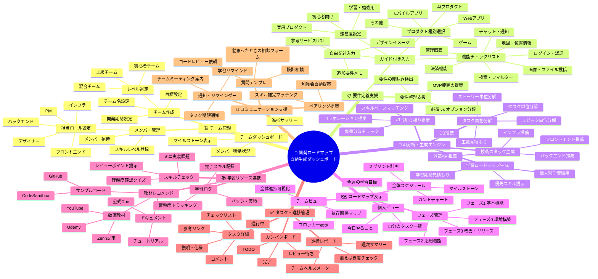
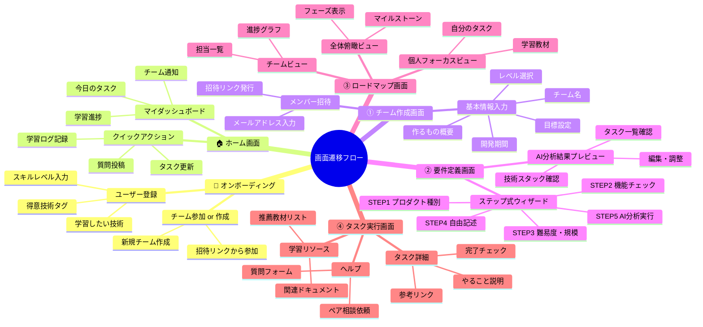
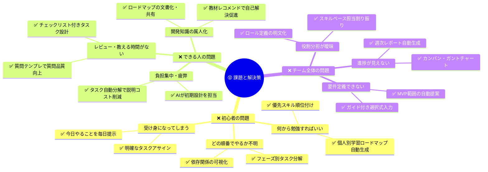

# 開発ロードマップ自動生成ダッシュボード
## システム全体機能群・サブ機能関係図

```mermaid
mindmap
  root((🧭 開発ロードマップ<br/>自動生成ダッシュボード))
    🏗️ チーム管理
      チーム作成
        チーム名設定
        開発期間設定
        目標設定
        レベル選定
          初心者チーム
          混合チーム
          上級チーム
      メンバー管理
        メンバー招待
        スキルレベル登録
        担当ロール設定
          PM
          フロントエンド
          バックエンド
          デザイナー
          インフラ
      チームダッシュボード
        進捗サマリー
        メンバー稼働状況
        マイルストーン表示

    📋 要件定義支援
      ガイド付き入力
        プロダクト種別選択
          Webアプリ
          モバイルアプリ
          ゲーム
          AIプロダクト
          その他
        機能チェックリスト
          ログイン・認証
          チャット・通知
          地図・位置情報
          決済機能
          画像・ファイル投稿
          検索・フィルター
          管理画面
        難易度設定
          初心者向け
          学習・勉強用
          実用プロダクト
        自由記述入力
          追加要件メモ
          参考サービスURL
          デザインイメージ
      要件整理支援
        要件の曖昧さ検出
        必須 vs オプション分類
        MVP範囲の提案

    🤖 AI分析・生成エンジン
      技術スタック生成
        フロントエンド推薦
        バックエンド推薦
        DB推薦
        インフラ推薦
        外部API推薦
      学習ロードマップ生成
        個人別学習順序
        優先スキル提示
        学習期間見積もり
      タスク自動分解
        エピック単位分解
        ストーリー単位分解
        タスク単位分解
        工数見積もり
      担当割り振り提案
        スキルベースマッチング
        負荷分散チェック
        コラボレーション提案

    🗺️ ロードマップ表示
      全体スケジュール
        ガントチャート
        マイルストーン
        スプリント計画
      フェーズ管理
        フェーズ0 環境構築
        フェーズ1 基本機能
        フェーズ2 応用機能
        フェーズ3 改善・リリース
      個人ビュー
        自分のタスク一覧
        今日やること
        今週の学習目標
      チームビュー
        全体進捗可視化
        ブロッカー表示
        依存関係マップ

    📚 学習リソース連携
      教材レコメンド
        動画教材
          YouTube
          Udemy
          Zenn記事
        ドキュメント
          公式Doc
          チュートリアル
        サンプルコード
          GitHub
          CodeSandbox
      スキルチェック
        理解度確認クイズ
        ミニ実装課題
        レビューポイント提示
      学習ログ
        完了スキル記録
        習熟度トラッキング
        バッジ・実績

    ✅ タスク・進捗管理
      カンバンボード
        TODO
        進行中
        レビュー待ち
        完了
      タスク詳細
        説明・仕様
        参考リンク
        チェックリスト
        コメント
      進捗レポート
        週次サマリー
        燃え尽き度チェック
        チームヘルスメーター

    💬 コミュニケーション支援
      質問テンプレ
        詰まったときの相談フォーム
        コードレビュー依頼
        設計相談
      ペアリング提案
        スキル補完マッチング
        勉強会自動提案
      通知・リマインダー
        タスク期限通知
        学習リマインド
        チームミーティング案内
```

---

## 画面フロー概要

```mermaid
mindmap
  root((画面遷移フロー))
    🚀 オンボーディング
      ユーザー登録
        スキルレベル入力
        得意技術タグ
        学習したい技術
      チーム参加 or 作成
        招待リンクから参加
        新規チーム作成

    🏠 ホーム画面
      マイダッシュボード
        今日のタスク
        学習進捗
        チーム通知
      クイックアクション
        タスク更新
        質問投稿
        学習ログ記録

    ① チーム作成画面
      基本情報入力
        チーム名
        作るもの概要
        レベル選択
        開発期間
        目標設定
      メンバー招待
        メールアドレス入力
        招待リンク発行

    ② 要件定義画面
      ステップ式ウィザード
        STEP1 プロダクト種別
        STEP2 機能チェック
        STEP3 難易度・規模
        STEP4 自由記述
        STEP5 AI分析実行
      AI分析結果プレビュー
        技術スタック確認
        タスク一覧確認
        編集・調整

    ③ ロードマップ画面
      全体俯瞰ビュー
        フェーズ表示
        マイルストーン
      個人フォーカスビュー
        自分のタスク
        学習教材
      チームビュー
        担当一覧
        進捗グラフ

    ④ タスク実行画面
      タスク詳細
        やること説明
        参考リンク
        完了チェック
      学習リソース
        推薦教材リスト
        関連ドキュメント
      ヘルプ
        質問フォーム
        ペア相談依頼
```

---

## 解決する課題マップ

```mermaid
mindmap
  root((😵 課題と解決策))
    ❌ 初心者の問題
      何から勉強すればいい
        ✅ 個人別学習ロードマップ自動生成
        ✅ 優先スキル順位付け
      どの順番でやるか不明
        ✅ フェーズ別タスク分解
        ✅ 依存関係の可視化
      受け身になってしまう
        ✅ 明確なタスクアサイン
        ✅ 今日やることを毎日提示

    ❌ できる人の問題
      負担集中・疲弊
        ✅ AIが初期設計を担当
        ✅ タスク自動分解で説明コスト削減
      開発知識の属人化
        ✅ ロードマップの文書化・共有
        ✅ 教材レコメンドで自己解決促進
      レビュー・教える時間がない
        ✅ チェックリスト付きタスク設計
        ✅ 質問テンプレで質問品質向上

    ❌ チーム全体の問題
      進捗が見えない
        ✅ カンバン・ガントチャート
        ✅ 週次レポート自動生成
      役割分担が曖昧
        ✅ スキルベース担当割り振り
        ✅ ロール定義の明文化
      要件定義できない
        ✅ ガイド付き選択式入力
        ✅ MVP範囲の自動提案
```
