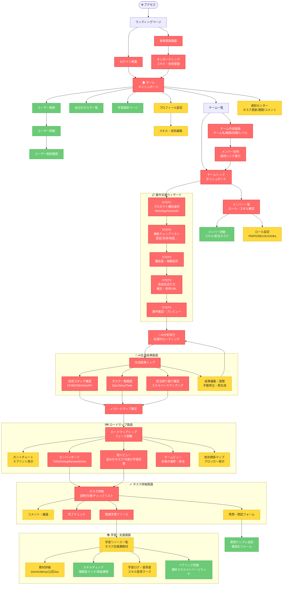
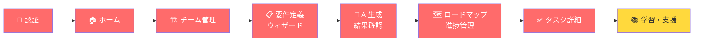

# 画面遷移図

```mermaid
flowchart TD
    %% ===== 認証 =====
    START([🌐 アクセス]) --> LP[ランディングページ]
    LP --> LOGIN[ログイン画面]
    LP --> REGISTER[新規登録画面]
    REGISTER --> ONBOARD[オンボーディング\nスキル・技術登録]
    LOGIN --> HOME
    ONBOARD --> HOME

    %% ===== ホーム =====
    HOME[🏠 ホーム\nダッシュボード]
    HOME --> TEAM_LIST[チーム一覧]
    HOME --> MY_TASK[自分のタスク一覧]
    HOME --> MY_LEARN[学習進捗ページ]

    %% ===== 1. ユーザー管理 =====
    HOME --> USER_SEARCH[ユーザー検索]
    USER_SEARCH --> USER_DETAIL[ユーザー詳細]
    USER_DETAIL --> USER_DELETE[ユーザー削除確認]

    HOME --> MY_PROFILE[プロフィール設定]
    MY_PROFILE --> SKILL_EDIT[スキル・技術編集]

    %% ===== 2. チーム基盤 =====
    TEAM_LIST --> TEAM_CREATE[チーム作成画面\nチーム名/期間/目標/レベル]
    TEAM_LIST --> TEAM_TOP

    TEAM_CREATE --> TEAM_INVITE[メンバー招待\n招待リンク発行]
    TEAM_INVITE --> TEAM_TOP[チームトップ\nダッシュボード]

    TEAM_TOP --> MEMBER_LIST[メンバー一覧\nロール・スキル確認]
    MEMBER_LIST --> MEMBER_DETAIL[メンバー詳細\nスキル/担当タスク]
    MEMBER_LIST --> ROLE_EDIT[ロール設定\nPM/FE/BE/UIUX/Infra]

    %% ===== 3. 要件定義 =====
    TEAM_TOP --> REQ_WIZARD

    subgraph REQ["📋 要件定義ウィザード"]
        REQ_WIZARD[STEP1\nプロダクト種別選択\nWeb/App/Game/AI]
        --> REQ_CHECK[STEP2\n機能チェックリスト\n認証/決済/地図…]
        --> REQ_LEVEL[STEP3\n難易度・規模設定]
        --> REQ_FREE[STEP4\n自由記述入力\n補足・参考URL]
        --> REQ_CONFIRM[STEP5\n要件確認・プレビュー]
    end

    REQ_CONFIRM --> AI_EXEC[🤖 AI分析実行\n処理中ローディング]

    %% ===== 4. AI生成結果 =====
    AI_EXEC --> AI_RESULT

    subgraph AI["🤖 AI生成結果画面"]
        AI_RESULT[生成結果トップ]
        AI_RESULT --> STACK_VIEW[技術スタック確認\nFE/BE/DB/Infra/API]
        AI_RESULT --> TASK_VIEW[タスク一覧確認\nEpic/Story/Task]
        AI_RESULT --> ASSIGN_VIEW[担当割り振り確認\nスキルベースマッチング]
        AI_RESULT --> ROADMAP_EDIT[結果編集・調整\n手動修正・再生成]
    end

    ROADMAP_EDIT --> AI_EXEC
    STACK_VIEW --> ROADMAP_CONFIRM[✅ ロードマップ確定]
    TASK_VIEW --> ROADMAP_CONFIRM
    ASSIGN_VIEW --> ROADMAP_CONFIRM

    %% ===== 5. ロードマップ・進捗 =====
    ROADMAP_CONFIRM --> ROADMAP_TOP

    subgraph ROAD["🗺️ ロードマップ画面"]
        ROADMAP_TOP[ロードマップトップ\nフェーズ俯瞰]
        ROADMAP_TOP --> GANTT[ガントチャート\nスプリント表示]
        ROADMAP_TOP --> KANBAN[カンバンボード\nToDo/Doing/Review/Done]
        ROADMAP_TOP --> PERSONAL[個人ビュー\n自分のタスク/今週の学習目標]
        ROADMAP_TOP --> TEAM_VIEW[チームビュー\n全員の進捗・担当]
        ROADMAP_TOP --> DEP_MAP[依存関係マップ\nブロッカー表示]
    end

    KANBAN --> TASK_DETAIL
    PERSONAL --> TASK_DETAIL

    subgraph TASK["✅ タスク詳細画面"]
        TASK_DETAIL[タスク詳細\n説明/仕様/チェックリスト]
        TASK_DETAIL --> TASK_COMMENT[コメント・議論]
        TASK_DETAIL --> TASK_DONE[完了チェック]
        TASK_DETAIL --> TASK_LEARN[関連学習リソース]
        TASK_DETAIL --> TASK_HELP[質問・相談フォーム]
    end

    %% ===== 6. 学習・支援 =====
    TASK_LEARN --> LEARN_TOP

    subgraph LEARN["📚 学習・支援画面"]
        LEARN_TOP[学習リソース一覧\nタスク別推薦教材]
        LEARN_TOP --> MATERIAL[教材詳細\nZenn/Udemy/公式Doc]
        LEARN_TOP --> SKILL_CHECK[スキルチェック\n理解度クイズ/実装課題]
        LEARN_TOP --> SKILL_LOG[学習ログ・習熟度\nスキル習得マーク]
        LEARN_TOP --> PAIR[ペアリング提案\n補完スキルメンバーとマッチ]
    end

    TASK_HELP --> QUESTION[質問テンプレ送信\n構造化フォーム]

    %% ===== 通知 =====
    HOME --> NOTIFY[通知センター\nタスク更新/期限/コメント]

    %% ===== スタイル =====
    classDef p0 fill:#ff6b6b,color:#fff,stroke:#cc0000
    classDef p1 fill:#ffd93d,color:#333,stroke:#ccaa00
    classDef p2 fill:#6bcb77,color:#fff,stroke:#339944
    classDef neutral fill:#4d96ff,color:#fff,stroke:#0055cc
    classDef sub fill:#f8f9fa,color:#333,stroke:#999

    class LOGIN,REGISTER,ONBOARD,HOME p0
    class TEAM_CREATE,TEAM_INVITE,TEAM_TOP,MEMBER_LIST p0
    class REQ_WIZARD,REQ_CHECK,REQ_LEVEL,REQ_FREE,REQ_CONFIRM p0
    class AI_EXEC,AI_RESULT,STACK_VIEW,TASK_VIEW,ASSIGN_VIEW p0
    class ROADMAP_CONFIRM,ROADMAP_TOP,KANBAN,PERSONAL,TEAM_VIEW p0
    class TASK_DETAIL,TASK_DONE,TASK_LEARN p0

    class MY_PROFILE,SKILL_EDIT,ROLE_EDIT,ROADMAP_EDIT p1
    class GANTT,DEP_MAP,TASK_COMMENT,TASK_HELP p1
    class LEARN_TOP,MATERIAL,SKILL_LOG,NOTIFY p1

    class USER_SEARCH,USER_DETAIL,USER_DELETE p2
    class SKILL_CHECK,PAIR,QUESTION p2
    class MEMBER_DETAIL,MY_TASK,MY_LEARN p2
```

---

## 遷移サマリー

```mermaid
flowchart LR
    A[🚀 認証] --> B[🏠 ホーム]
    B --> C[🏗️ チーム管理]
    C --> D[📋 要件定義\nウィザード]
    D --> E[🤖 AI生成\n結果確認]
    E --> F[🗺️ ロードマップ\n進捗管理]
    F --> G[✅ タスク詳細]
    G --> H[📚 学習・支援]

    style A fill:#ff6b6b,color:#fff
    style B fill:#ff6b6b,color:#fff
    style C fill:#ff6b6b,color:#fff
    style D fill:#ff6b6b,color:#fff
    style E fill:#ff6b6b,color:#fff
    style F fill:#ff6b6b,color:#fff
    style G fill:#ff6b6b,color:#fff
    style H fill:#ffd93d,color:#333
```

> 🔴 赤 = P0 MVP　🟡 黄 = P1 早期追加　🟢 緑 = P2 中期
