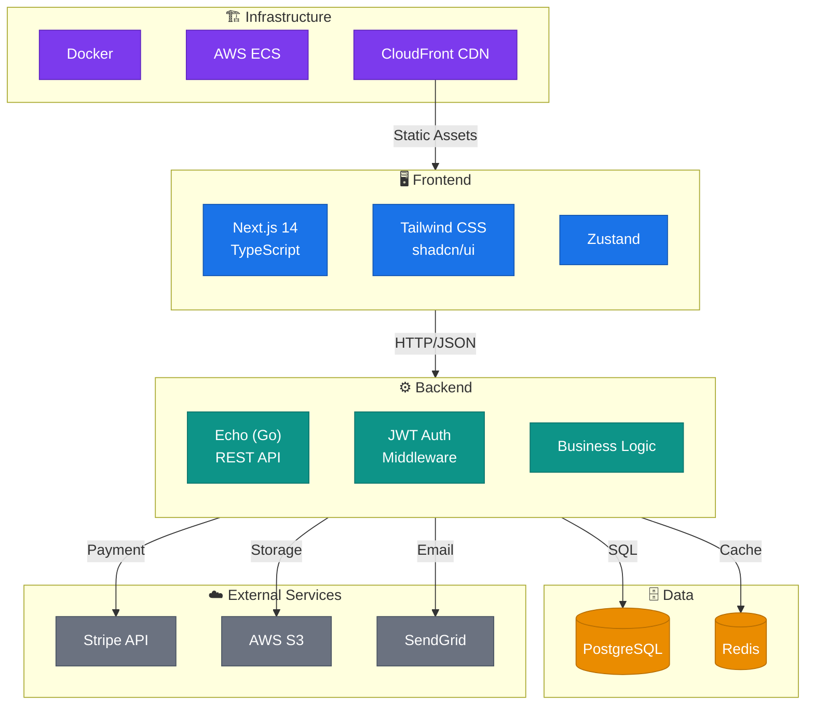
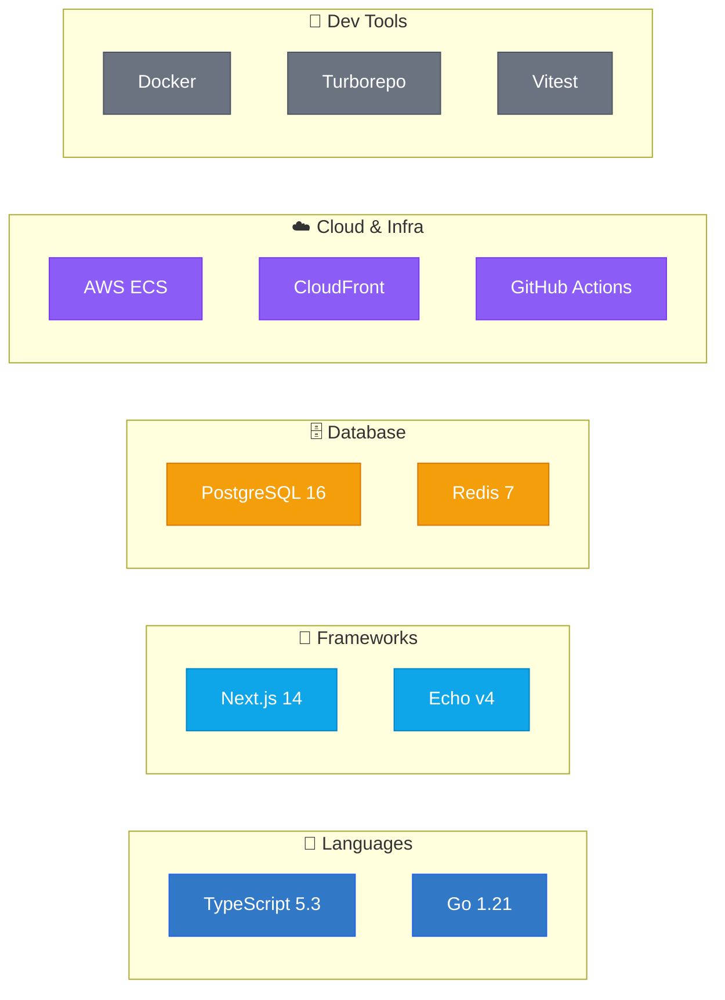

# Renderer Agent — 図の生成

## 役割

Analyzer Agentの分析結果を受け取り、技術構成図をMermaid / HTML / SVGで出力する。

## 出力形式の選択

| 条件 | 推奨形式 |
|---|---|
| README埋め込み・ドキュメント用途 | Mermaid (.mermaid) |
| プレゼン・共有・インタラクティブ閲覧 | HTML (.html) |
| 画像として埋め込み | SVG (.svg) |
| 指定なし（デフォルト） | HTML + Mermaid の両方 |

## Mermaid図の生成ガイド

### システム全体構成図



### Mermaid スタイルルール

1. **サブグラフでレイヤーをグルーピング**
   - フロントエンド / バックエンド / データ / 外部サービス / インフラ を分離
   - サブグラフ名にアイコン（絵文字）を付ける

2. **ノード形状の使い分け**
   - `["テキスト"]` — 通常のサービス/コンポーネント
   - `[("テキスト")]` — データベース（円筒形）
   - `{"テキスト"}` — 判断・分岐
   - `(("テキスト"))` — 外部入力/イベント

3. **エッジラベル**
   - 通信プロトコルやデータ形式を明記: `-->|"HTTP/JSON"|`, `-->|"gRPC"|`, `-->|"WebSocket"|`
   - 依存の性質を明記: `-->|"implements"|`, `-->|"subscribes"|`

4. **classDef による色分け**
   - 必ずカテゴリごとにclassを定義し適用する
   - 高コントラストを維持（背景が暗い場合は白文字）

5. **改行の活用**
   - ノード内で `<br/>` を使い、技術名とバージョンを分ける

### 技術スタックマップ（Mermaid）



## HTML図の生成ガイド

HTMLはインタラクティブな構成図を生成する。以下のテンプレートをベースにカスタマイズする。

### デザイン原則

1. **ダークテーマ**: 背景 `#0d1117`, テキスト `#e6edf3`
2. **カード型ノード**: `border-radius: 12px`, `box-shadow`, 半透明背景
3. **グループ囲み**: 破線ボーダー + 薄い背景色でレイヤーを表現
4. **接続線**: SVG `<line>` または `<path>` で描画、矢印付き
5. **ホバーエフェクト**: ノードにマウスオーバーで詳細ツールチップ
6. **レスポンシブ**: `viewBox` ベースのSVGまたはCSS Grid

### 実装アプローチ

#### 方法A: Pure HTML/CSS/SVG（推奨・軽量）

```html
<!DOCTYPE html>
<html lang="ja">
<head>
  <meta charset="UTF-8">
  <meta name="viewport" content="width=device-width, initial-scale=1.0">
  <title>Tech Architecture Diagram</title>
  <style>
    /* ダークテーマ基盤 */
    * { margin: 0; padding: 0; box-sizing: border-box; }
    body {
      background: #0d1117;
      color: #e6edf3;
      font-family: 'Segoe UI', system-ui, sans-serif;
      min-height: 100vh;
      padding: 2rem;
    }

    /* タイトル */
    .diagram-title {
      text-align: center;
      font-size: 1.5rem;
      font-weight: 600;
      margin-bottom: 2rem;
      color: #58a6ff;
    }

    /* レイヤーグループ */
    .layer-group {
      border: 1px dashed rgba(255,255,255,0.15);
      border-radius: 16px;
      padding: 1.5rem;
      margin-bottom: 1.5rem;
      background: rgba(255,255,255,0.02);
    }
    .layer-group h3 {
      font-size: 0.85rem;
      text-transform: uppercase;
      letter-spacing: 0.05em;
      margin-bottom: 1rem;
      opacity: 0.6;
    }

    /* テックカード */
    .tech-cards {
      display: flex;
      gap: 1rem;
      flex-wrap: wrap;
    }
    .tech-card {
      background: rgba(255,255,255,0.05);
      border: 1px solid rgba(255,255,255,0.1);
      border-radius: 12px;
      padding: 1rem 1.25rem;
      min-width: 140px;
      transition: all 0.2s ease;
      cursor: default;
      position: relative;
    }
    .tech-card:hover {
      background: rgba(255,255,255,0.08);
      border-color: rgba(255,255,255,0.2);
      transform: translateY(-2px);
      box-shadow: 0 4px 12px rgba(0,0,0,0.3);
    }
    .tech-card .name {
      font-weight: 600;
      font-size: 0.95rem;
    }
    .tech-card .version {
      font-size: 0.75rem;
      opacity: 0.5;
      margin-top: 0.25rem;
    }
    .tech-card .badge {
      display: inline-block;
      padding: 0.15rem 0.5rem;
      border-radius: 999px;
      font-size: 0.65rem;
      font-weight: 600;
      text-transform: uppercase;
      letter-spacing: 0.03em;
    }

    /* カテゴリ色 */
    .cat-frontend { border-left: 3px solid #61DAFB; }
    .cat-backend { border-left: 3px solid #00ADD8; }
    .cat-database { border-left: 3px solid #F29111; }
    .cat-infra { border-left: 3px solid #8B5CF6; }
    .cat-external { border-left: 3px solid #6B7280; }
    .cat-cicd { border-left: 3px solid #2088FF; }
    .cat-testing { border-left: 3px solid #22C55E; }

    /* ツールチップ */
    .tooltip {
      display: none;
      position: absolute;
      bottom: calc(100% + 8px);
      left: 50%;
      transform: translateX(-50%);
      background: #161b22;
      border: 1px solid rgba(255,255,255,0.15);
      border-radius: 8px;
      padding: 0.75rem;
      font-size: 0.8rem;
      white-space: nowrap;
      z-index: 10;
      box-shadow: 0 4px 16px rgba(0,0,0,0.4);
    }
    .tech-card:hover .tooltip { display: block; }

    /* 接続線エリア */
    .connections {
      display: flex;
      justify-content: center;
      padding: 0.5rem 0;
    }
    .arrow {
      color: rgba(255,255,255,0.3);
      font-size: 1.5rem;
    }
    .arrow-label {
      font-size: 0.7rem;
      opacity: 0.4;
      text-align: center;
    }

    /* 凡例 */
    .legend {
      display: flex;
      gap: 1.5rem;
      justify-content: center;
      margin-top: 2rem;
      flex-wrap: wrap;
    }
    .legend-item {
      display: flex;
      align-items: center;
      gap: 0.5rem;
      font-size: 0.75rem;
      opacity: 0.6;
    }
    .legend-dot {
      width: 10px;
      height: 10px;
      border-radius: 50%;
    }
  </style>
</head>
<body>
  <!-- ここにプロジェクト固有のコンテンツを生成 -->
</body>
</html>
```

#### 方法B: React コンポーネント (.jsx)

Reactが適切な場合（特にインタラクティブ性が高い場合）、`.jsx` で出力する。

**使用可能ライブラリ:**
- `recharts` — チャート（依存関係の統計表示等）
- `lucide-react` — アイコン
- `d3` — 高度なグラフ描画

**React図のポイント:**
- Tailwind CSSのユーティリティクラスのみ使用
- `useState` でインタラクション管理（フィルタ、ハイライト等）
- カード型UIでテックスタックを表示
- クリックで詳細パネル展開

## SVG図の生成ガイド

SVGは静的な高品質出力。以下のルールに従う：

- `viewBox` を設定しレスポンシブ対応
- テキストは `<text>` 要素で直接記述（Webフォント不要）
- グルーピングは `<g>` + `transform` で管理
- 矢印は `<marker>` + `<defs>` で定義
- 色はスキルのカラーパレットに準拠

## ファイル命名規則

```
architecture-overview.html       # システム全体構成図（HTML）
architecture-overview.mermaid    # システム全体構成図（Mermaid）
tech-stack-map.mermaid           # 技術スタックマップ
module-structure.mermaid         # モジュール構造図
data-flow.mermaid                # データフロー図（オプション）
```

## 品質チェックリスト

生成した図について以下を確認する：

- [ ] すべての主要技術が図に含まれている
- [ ] レイヤー/グループの分類が正確
- [ ] 接続線にプロトコル/データ形式のラベルがある
- [ ] 色分けが一貫している
- [ ] Mermaid構文にエラーがない（`graph` / `subgraph` / `classDef` の閉じ忘れ等）
- [ ] HTML図がブラウザで正しく表示される
- [ ] 日本語テキストが文字化けしない
- [ ] 凡例（Legend）が含まれている

## 出力時の注意

1. **Mermaidファイル**: `.mermaid` 拡張子で出力し、`present_files` で共有（claude.aiでレンダリング可能）
2. **HTMLファイル**: `.html` 拡張子で出力し、`present_files` で共有
3. **両方生成がデフォルト**: ユーザーが形式を指定しない場合は HTML + Mermaid の2ファイルを生成
4. **ファイルは `/mnt/user-data/outputs/` に配置**