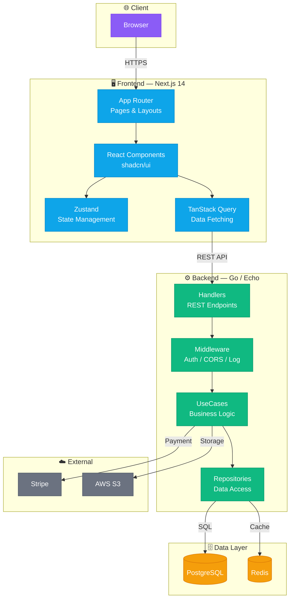
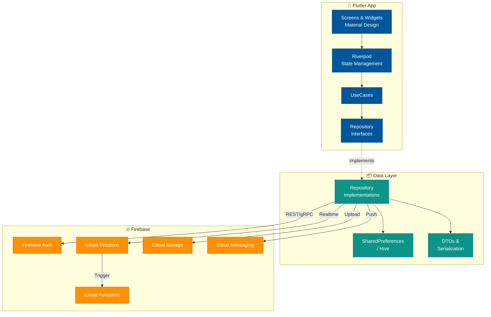
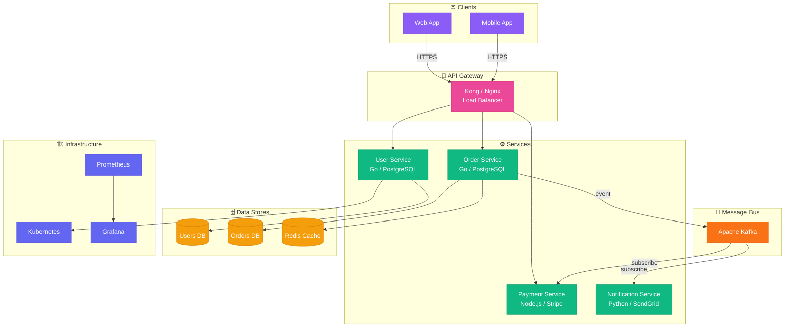
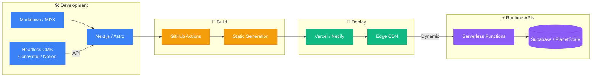
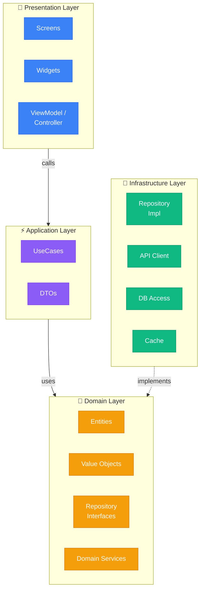
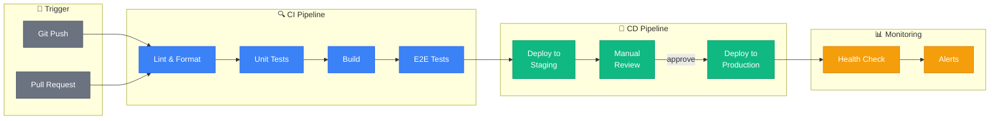

# Mermaid テンプレート集

プロジェクトタイプ別のMermaidテンプレート。Renderer Agentがプロジェクトに合わせてカスタマイズして使用する。

---

## 1. フルスタック Web アプリ（Next.js + Go + PostgreSQL）

---

## 2. Flutter + Firebase モバイルアプリ

---

## 3. マイクロサービス構成

---

## 4. 静的サイト / JAMstack

---

## 5. Clean Architecture レイヤー図

---

## 6. CI/CD パイプライン図

---

## カスタマイズのポイント

1. テンプレートはそのまま使わず、プロジェクトの実態に合わせて修正する
2. 存在しない技術/サービスのノードは削除する
3. プロジェクト固有の特徴（独自のミドルウェア、カスタムツール等）を追加する
4. ノード内のテキストはプロジェクトで実際に使われている技術名・バージョンに置き換える
5. 接続線のラベルはプロジェクトの実際の通信方式に合わせる