# 技術構成設計書 v2

> v2変更点：バックエンドを **Go（Gin）** に変更、インフラを **Google Cloud Run** に変更
> サークル開発（初心者〜中級混合・6〜8名）を前提とした現実解

---

## 1. 技術スタック全体像

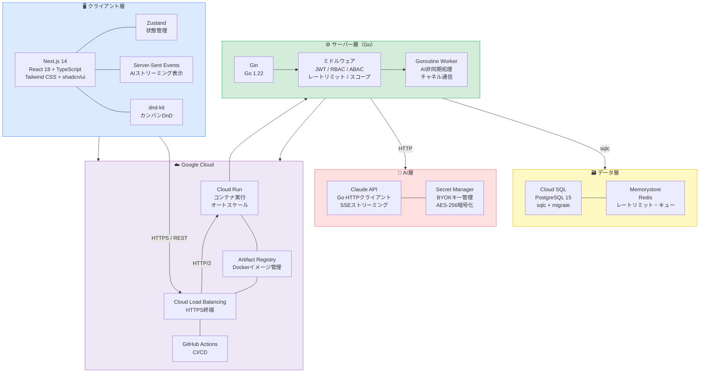

---

## 2. バックエンド構成（Go + Gin）

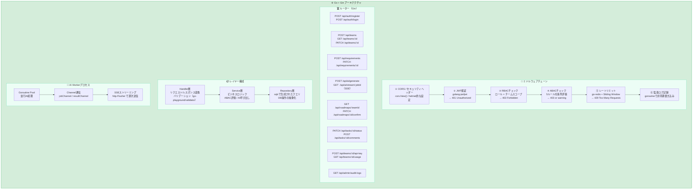

---

## 3. Go パッケージ構成

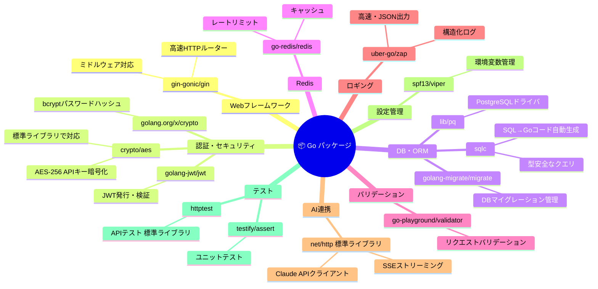

---

## 4. DBスキーマ設計（sqlc + PostgreSQL）

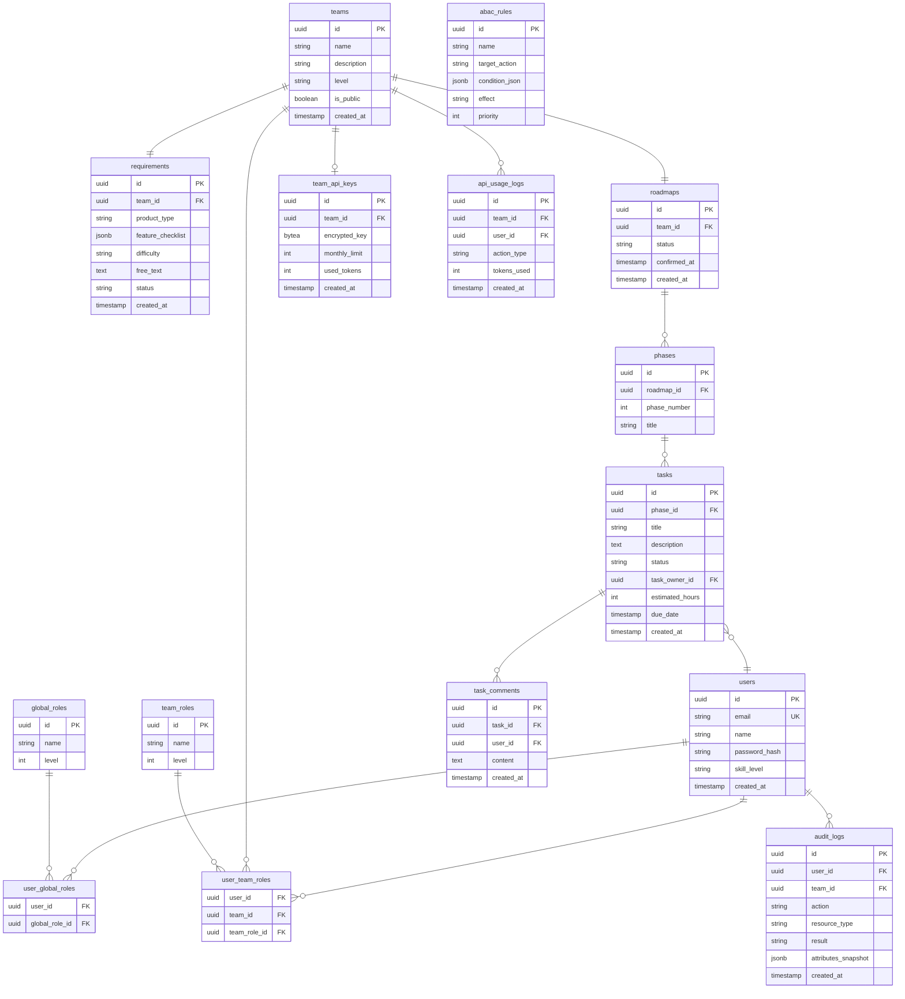

---

## 5. AI生成フロー（Goroutine + SSE）

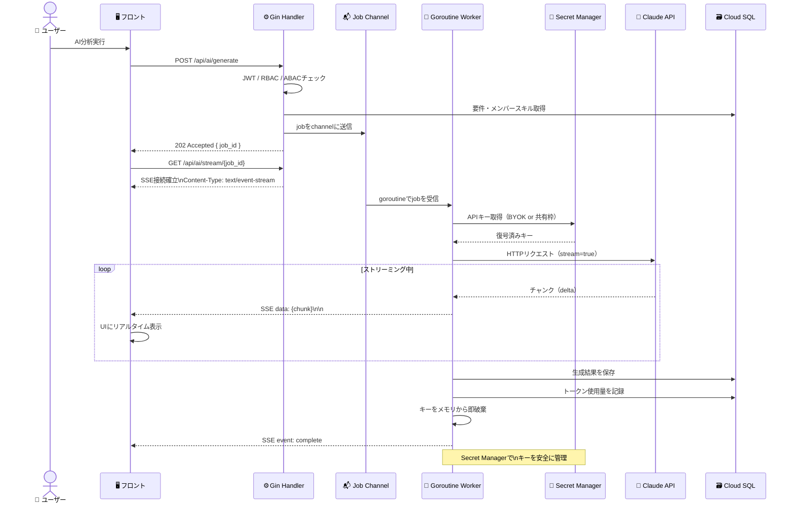

---

## 6. Google Cloud インフラ構成

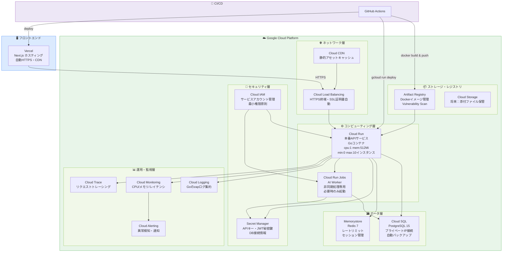

---

## 7. Cloud Run デプロイ設計

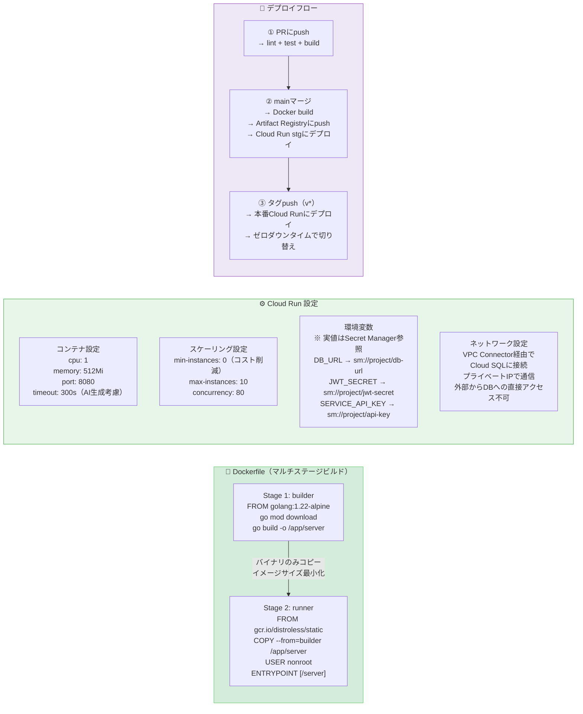

---

## 8. Express vs Go（Gin）比較・選定理由

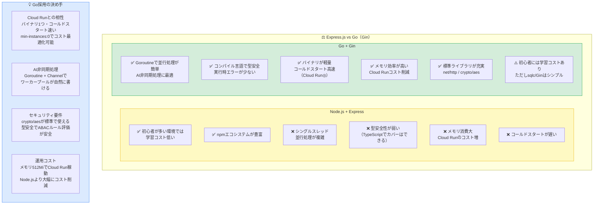

---

## 9. Railway vs Google Cloud Run 比較・選定理由

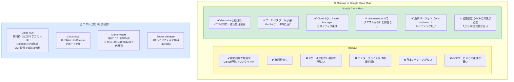

---

## 10. フェーズ別技術導入ロードマップ

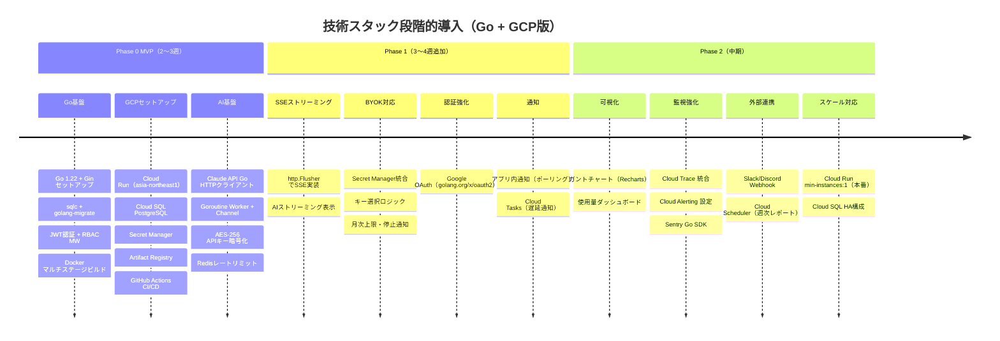

---

## 11. ディレクトリ構成（Go）

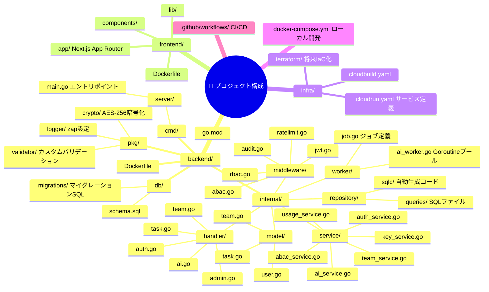

---

## 12. 技術選定サマリー

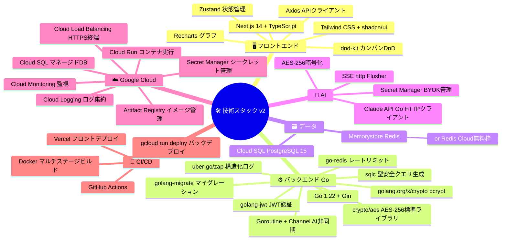
