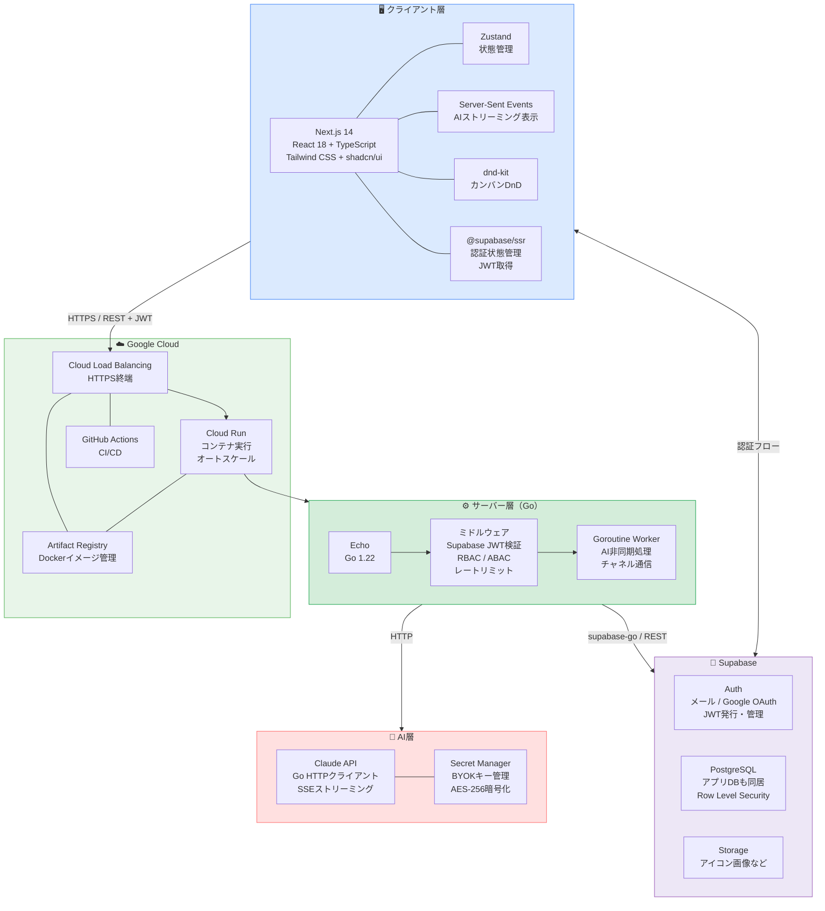
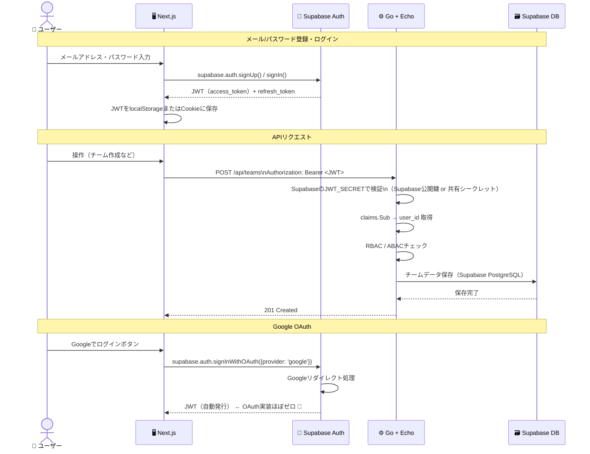
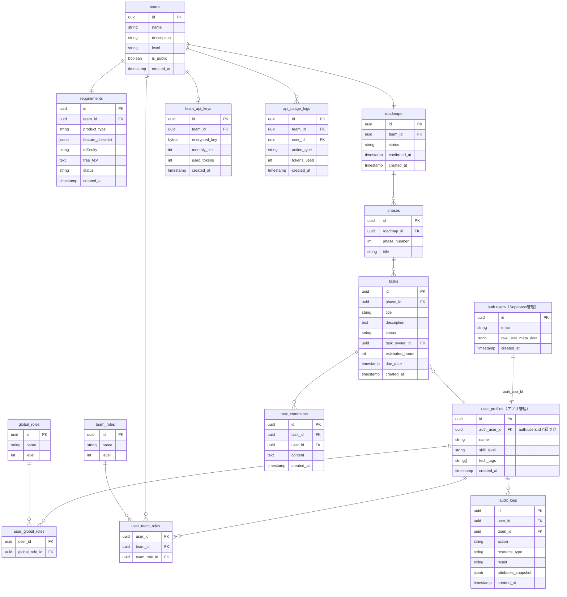
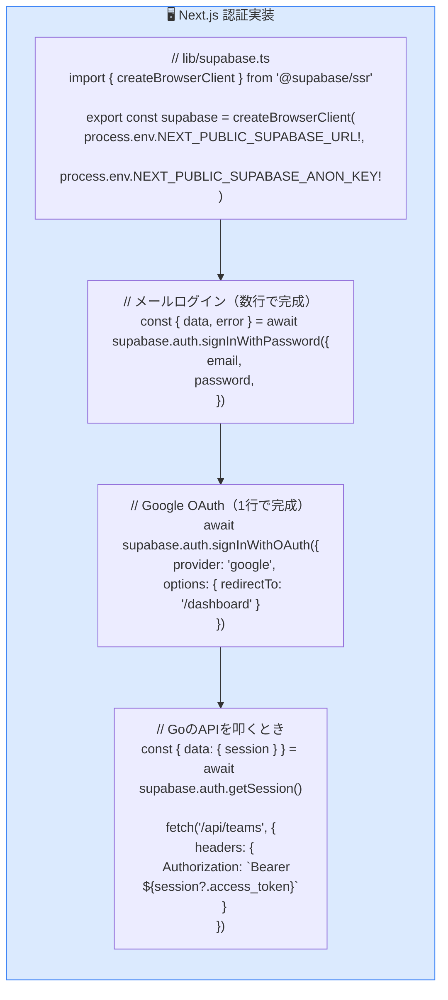
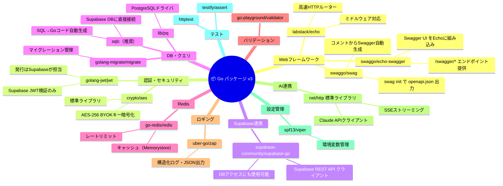
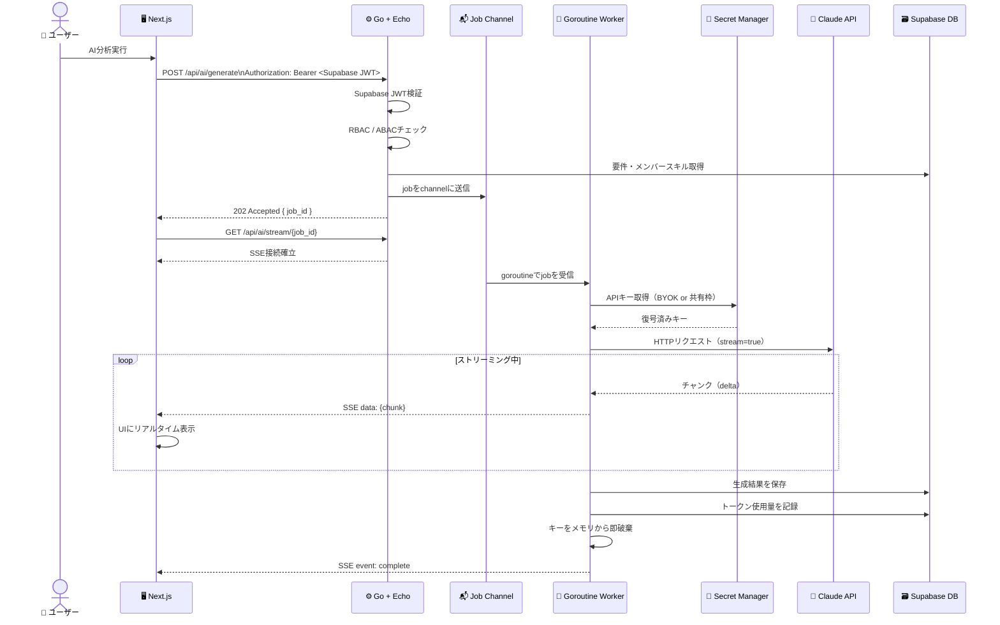
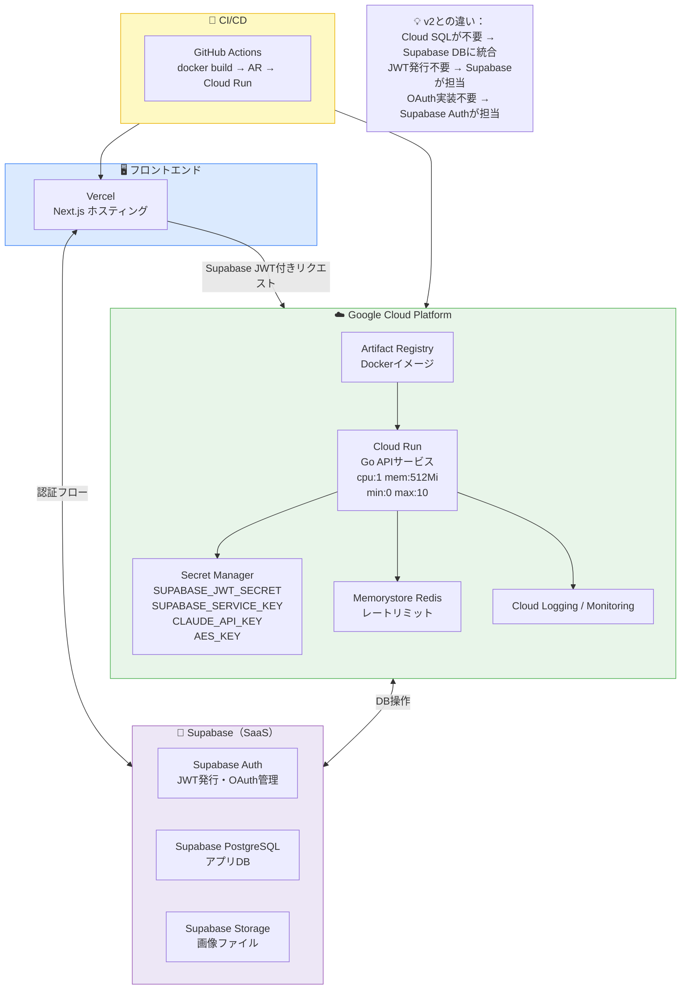
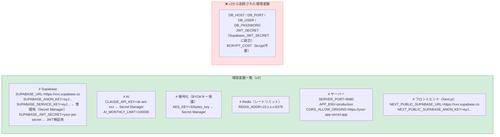
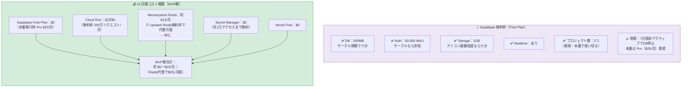
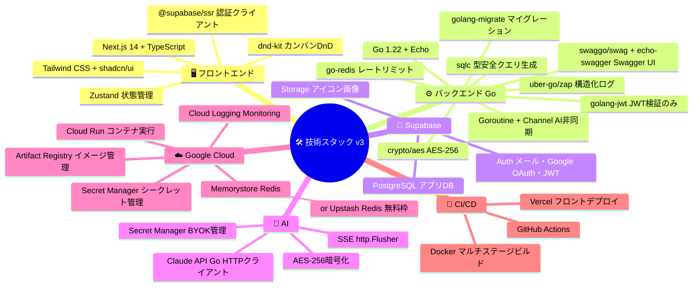

# 技術構成設計書 v3
---

## 1. 技術スタック全体像




---

## 3. 認証フロー（Supabase）



---

## 4. Go側 Supabase JWT検証（シンプルになる）

```mermaid
flowchart TB
    subgraph GO_AUTH["⚙️ GoのJWT検証（v3）"]
        direction TB

        OLD["❌ v2 自前実装\n・bcryptでパスワード検証\n・JWTを自前で発行・署名\n・refreshトークン管理\n・OAuthフロー実装\n→ 約 30h"]

        NEW["✅ v3 Supabase検証のみ\n・SupabaseのJWT_SECRETで署名検証\n・claims.Sub を user_id として使用\n・それ以外はSupabaseが全部やってくれる\n→ 約 2〜3h"]

        CODE["// middleware/jwt.go\nfunc AuthMiddleware() echo.MiddlewareFunc {\n  return func(next echo.HandlerFunc) echo.HandlerFunc {\n    return func(c echo.Context) error {\n      tokenStr := extractBearerToken(c)\n      \n      // Supabaseの公開鍵/シークレットで検証するだけ\n      token, err := jwt.Parse(tokenStr,\n        func(t *jwt.Token) (interface{}, error) {\n          return []byte(os.Getenv(\"SUPABASE_JWT_SECRET\")), nil\n        })\n      \n      if err != nil {\n        return c.JSON(401, map[string]string{\"error\": \"unauthorized\"})\n      }\n      \n      claims := token.Claims.(jwt.MapClaims)\n      c.Set(\"user_id\", claims[\"sub\"]) // Supabaseのuser.id\n      return next(c)\n    }\n  }\n}"]
    end

    OLD -.->|"Supabaseに置き換え"| NEW
    NEW --> CODE

    style OLD  fill:#ffe0e0,stroke:#ff6b6b
    style NEW  fill:#d4edda,stroke:#16a34a
    style CODE fill:#f8f9fa,stroke:#aaa
```

---

## 5. DBスキーマ設計（Supabase PostgreSQL）



> **ポイント：** `auth.users` はSupabaseが管理。アプリ側は `user_profiles` テーブルで独自データを管理し、`auth_user_id` で紐づける。

---

## 6. フロントエンド認証実装（Next.js + Supabase）



---

## 7. Go パッケージ構成（v3）



---

## 8. Swagger（OpenAPI）設計

```mermaid
flowchart TB
    subgraph SWAGGER["📄 Swagger / OpenAPI 構成"]
        direction TB

        subgraph SETUP["セットアップ"]
            S1["swaggo/swag\nコメントアノテーションから\nopenapi.json を自動生成\n$ swag init -g cmd/server/main.go"]
            S2["swaggo/echo-swagger\nEchoルーターに\nSwagger UIを組み込み\nGET /swagger/*"]
            S1 --> S2
        end

        subgraph ANNOTATION["コメントアノテーション例"]
            A1["// main.go\n// @title           Roadmap Dashboard API\n// @version         1.0\n// @description     サークル開発ロードマップ自動生成API\n// @host            localhost:8080\n// @BasePath        /api\n// @securityDefinitions.apikey BearerAuth\n// @in header\n// @name Authorization"]

            A2["// handler/team.go\n// @Summary      チーム作成\n// @Description  新しいチームを作成しOWNERロールを付与\n// @Tags         teams\n// @Accept       json\n// @Produce      json\n// @Param        body body CreateTeamRequest true \"チーム情報\"\n// @Success      201  {object} TeamResponse\n// @Failure      400  {object} ErrorResponse\n// @Failure      401  {object} ErrorResponse\n// @Security     BearerAuth\n// @Router       /teams [post]"]
        end

        subgraph ROUTES["Swagger UIアクセス"]
            R1["開発環境\nhttp://localhost:8080/swagger/index.html"]
            R2["本番環境\n※ APP_ENV=production のとき\nSwagger UI を無効化推奨\n（機密情報漏洩防止）"]
        end

        subgraph FLOW["自動生成フロー"]
            direction LR
            F1["① Goハンドラーに\nコメント記述"]
            F2["② $ swag init\ndocs/ フォルダに\nopenapi.json 生成"]
            F3["③ echo-swagger が\n/swagger/* で\nSwagger UI を配信"]
            F4["④ フロントチームが\nAPIドキュメントを参照\n手動同期不要"]
            F1 --> F2 --> F3 --> F4
        end
    end

    style SWAGGER    fill:#fef9c3,stroke:#eab308
    style SETUP      fill:#fffbeb,stroke:#f59e0b
    style ANNOTATION fill:#f8f9fa,stroke:#aaa
    style ROUTES     fill:#dbeafe,stroke:#3b82f6
    style FLOW       fill:#d4edda,stroke:#16a34a
```

---

## 10. AI生成フロー（変更なし・Goroutine + SSE）



---

## 9. インフラ構成（v3）



---

## 11. 環境変数設計（v3）



---

## 12. Supabase 無料枠・コスト



---

## 13. 技術選定サマリー（v3）



